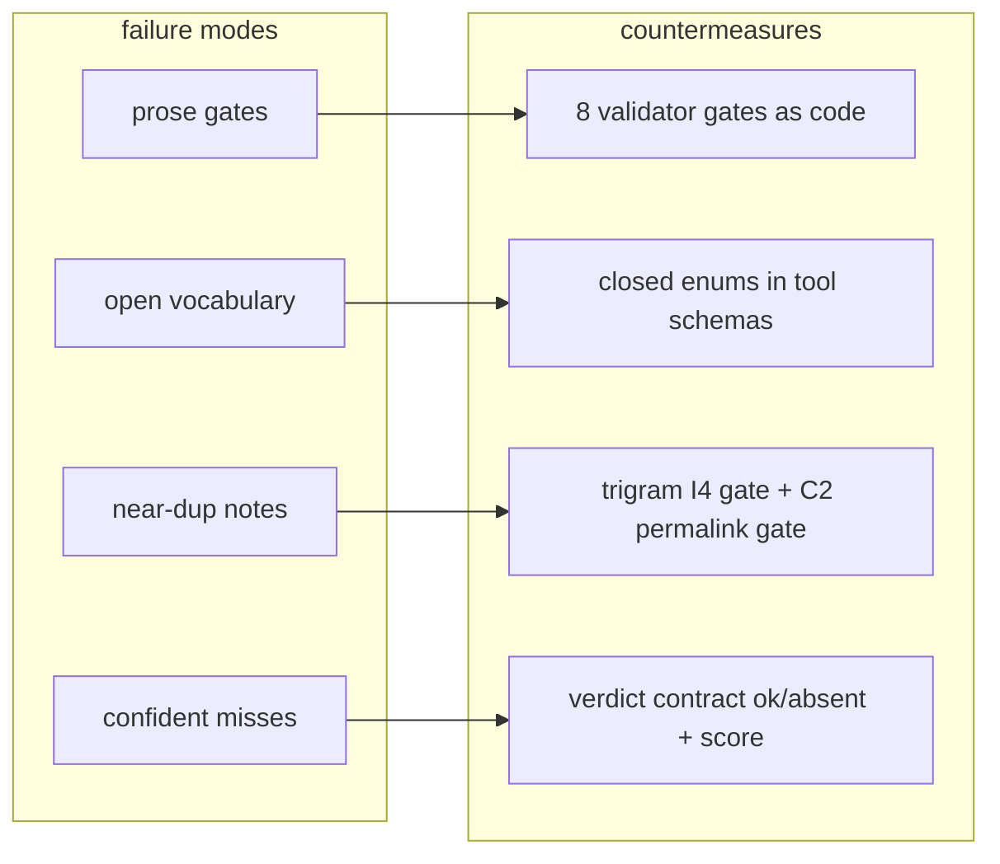
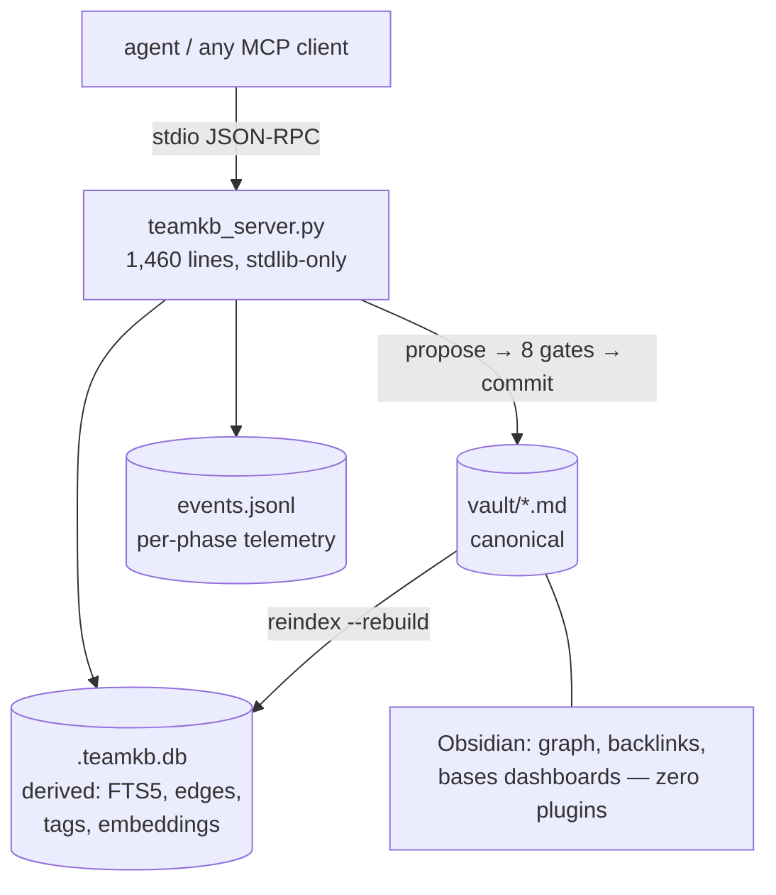

# team-kb — technical walkthrough & justification

Audience: principal engineer. Every claim in this document traces to a
committed artifact (test output, telemetry stream, git commit) and every
number is re-runnable live — see `02-demo-runbook.md`.

**The claim in one sentence:** the system is operational and complete for its
current scope, it proves that about itself with instrumentation rather than
assertion, and the remaining roadmap is optional capability, not unfinished
work.

---

## 1. The problem — why not a wiki, and why not off-the-shelf RAG

The predecessor (master-kb, a basic-memory vault) died a documented death.
Its empirical failure audit and formal post-mortem model are themselves
documents in this KB (`knowledge/artifact/master-kb-empirical-failure-audit`,
`master-kb-formal-post-mortem-model`). Failure modes, verbatim:

- **Prose gates.** Rules ("don't duplicate", "always cite a source") stated in
  documents that no tool enforced. Compliance decayed to zero.
- **Uncontrolled vocabulary.** Free-text types/tags/relations diverged until
  retrieval by category was meaningless.
- **Duplicate & near-duplicate notes** under suffixed permalinks (`-v2`,
  `-final`), each partially true.
- **Confident wrong answers.** Retrieval always returned *something*; a miss
  was indistinguishable from a hit.

A wiki re-creates all four by construction. Off-the-shelf RAG fixes none of
them: it is a retrieval layer over an ungoverned corpus, so garbage-in
persists, and its failure mode on a miss is a plausible hallucination — the
exact "confident wrong answer" that killed the predecessor.

Design principle (constitution `_meta/constitution.md`): **a rule not enforced
by code does not exist.**

## 2. Architecture

- **Markdown canonical, index derived.** The database can be deleted and
  rebuilt from markdown alone: 29 notes + 22 edges in 22 ms, identical BM25
  scores after rebuild (demo 4). What we own is a folder of readable text.
- **One write path.** Agents get no filesystem write on the vault. Every write
  is `propose_note` → 8 gates → `commit_note` (re-validated at commit).
  Constraint by tool shape, not by prompt.
- **Closed vocabularies** (10 entity classes, 14 relation verbs, 12
  observation kinds, 5 tag namespaces) live as JSON-Schema enums in the tool
  contracts *and* are re-checked server-side, so no caller — well-behaved or
  not — can introduce a new category (demo 2, step 6).
- **Gates as code:** C2 permalink uniqueness, C3 verb signatures, C4
  referential integrity, I1 connectivity, I4 near-duplicate (trigram Jaccard
  θ=0.85), PROV placeholder-provenance rejection, HYP hypothesis-confidence
  coupling, TAG closed registry. Each rejection message names the gate and the
  remedy (demo 2). The acceptance tests replay *actual master-kb defects* as
  fixtures.
- **Zero-dependency runtime.** Python stdlib only; the optional local-embedding
  path lazy-imports two wheels. No services, no containers, no daemon.

## 3. Retrieval — four independent channels, honest verdicts

| Channel | Mechanism | Demo |
|---|---|---|
| Lexical | SQLite FTS5/BM25, porter tokenizer, quoted-token hardening | 3.1 |
| Semantic | cosine over L2-normalized vectors, chunk + doc granularity | 3.2 |
| Tag | closed-namespace exact + `kb/<class>` plane prefix | 3.3 |
| Graph | 1-hop edges with computed inverse verbs (backlinks) | 3.4 |

Channels are deliberately not fused at this stage: independent scoring makes a
per-channel regression visible instead of hiding it inside a rank-fusion
blend. (RRF fusion is a ~20-line M1 item once the corpus is larger.)

**Verdict honesty contract:** every retrieval returns `ok` or `absent`, and
`absent` carries the top score as evidence (`top score 0.156` vs θ). The agent
contract on `absent` is *report the gap and stop* — no synonym-retry loop, no
plausible noise. This is the direct countermeasure to failure mode F4.

θ is calibrated per embedding model from measured score distributions (nomic:
true-match floor ~0.30 vs absent ceiling ~0.17; bge-micro: 0.704 vs 0.680) and
seeded per model family, overridable per vault.

## 4. Embeddings — swappable, including fully local

`TEAMKB_EMBED_BACKEND=http` (any Ollama-shaped endpoint) or `onnx` — an
in-process ONNX Runtime path: 17 MB quantized model, 384-d, ~20 ms/chunk on a
laptop CPU, **no network at all** (demo 1 runs entirely on it). A
**vector-space guard** stamps the model identity into the vault db and
disables the semantic channel with an explanatory error on mismatch — vectors
from different models can never silently mix.

## 5. State of completeness — the evidence table

| Claim | Evidence (committed) |
|---|---|
| Unit coverage | 55/55 tests green — gate defect-replay fixtures, serializer byte-parity, parser round-trip, rebuild, telemetry, protocol, ONNX math, report parity (`plugin/mcp/test_teamkb_server.py`) |
| Full pipeline works (hosted) | Battery 2026-08-12: 13 docs × 4 modalities PASS, GA mean 0.99 (`docs/test-battery/run-2026-08-12/`) |
| Telemetry catches real defects | Instrumented run 2026-08-13: structured events exposed a live θ-seeding bug the prose report had missed (`docs/test-battery/run-2026-08-13/`) |
| Full pipeline works (local, no network) | Battery 2026-08-14 on ONNX: **first-run PASS, zero rework** — 16/16 committed, 0 gate failures, GA 10/10, 0 embed retries, server-side pipeline 5.9 s (`docs/test-battery/run-2026-08-14-onnx/`) |
| Index is re-derivable | md-only clone → rebuild → identical BM25 (demo 4; commit 6a021dd) |
| Corpus is live | Repo vault: 29 notes, 22 edges, 291 chunks, 13 doc embeddings, parity fts 29/29, md 29/29 (`kb_report`) |
| Docs are executable | Every command in the 8-document agent manual was run before being written; doing so caught a real unreachable-error defect (commit 7c24e2d) |

Total maintenance surface: **one server file (1,460 lines) + one test file
(704 lines)**, both stdlib. 33 commits from empty repo to this package.

### What is deliberately NOT built (and why that's not debt)

| Deferred (M1+) | Why deferral is correct now |
|---|---|
| RRF rank fusion | Hides per-channel failures during bring-up; ~20-line wrapper when corpus grows |
| ANN vector index | Brute-force scan is fine to ~50k chunks; corpus is 291 |
| 4-value verdict, decay/MemRL, consolidation daemon | Self-learning layer; needs months of episode data to be meaningful |
| Neo4j mirror | Obsidian graph + SQLite edges cover current graph needs |
| C4 auto-stub, tag-registry migrations, submission GC | Ergonomics, not correctness; each is small and independent |

None of these block ingestion, curation, or retrieval today. The system is in
production shape for its stated job: **collecting and governing team
documents now.**

## 6. Cost model

- **Run cost:** python3 + SQLite (already everywhere). Optional local
  embeddings: two pip wheels + 17 MB model. No services to operate, no GPU,
  no external accounts required (hosted embedding endpoint is optional).
- **Ingest cost:** whole 16-document corpus in one command; server-side
  pipeline ~6 s locally (demo 1).
- **Marginal maintenance:** the failure modes that consumed maintenance time
  in the predecessor (dedup sweeps, taxonomy cleanups, provenance archaeology)
  are rejected at write time by the gates — that labor is structurally gone.
- **Exit cost:** near zero. The asset is plain markdown, readable in any
  editor, fully functional in stock Obsidian; the index rebuilds from it in
  milliseconds. No lock-in to this tooling.

## 7. Observability

Built: per-phase structured event stream (`events.jsonl` — gate/chunk/embed/
tool/agent events with run/seq/doc correlation), per-document rollups,
corpus aggregates, `kb_report` (health + run stats, demo 5), and the
regenerable HTML evidence dashboard (`dashboard/kb-dashboard.html`).
Remaining gaps are specced with estimates in `03-observability-tasks.md` —
all quality-of-life, none required for operation.
