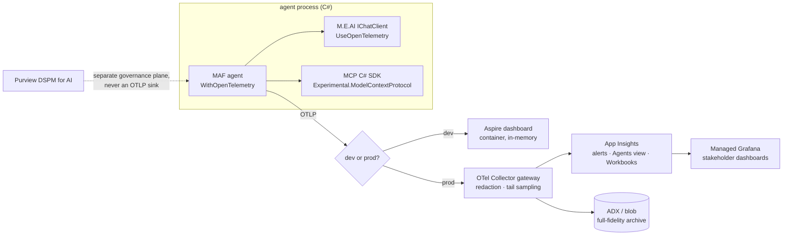

# Zero-to-Azure roadmap — OTel for agentic AI in C#

Distillation of docs 01–07 into a phased implementation path with decision
points. This is the document the implementation team starts from; every claim
here is elaborated (with sources) in the referenced doc. Compiled 2026-08-15
from research current to that date.

## The one-page mental model

## Phase 0 — foundations in the agent code (doc 02, 03)

1. One `ActivitySource` + one `Meter` per component; only in-box types in
   libraries (`System.Diagnostics`), OTel SDK only in the host.
2. Attach the framework instrumentation: MAF `WithOpenTelemetry` + M.E.AI
   `UseOpenTelemetry` (pick ONE layer for content capture or you get
   duplicates), MCP via `AddSource("Experimental.ModelContextProtocol")`.
3. Adopt gen_ai semconv attribute names from day one (doc 01) — every Azure
   surface (Agents view, Grafana prebuilt dashboards, Foundry) keys off them.
4. **Decision D0:** content capture. Default OFF in every environment above
   dev. The switch is `OTEL_INSTRUMENTATION_GENAI_CAPTURE_MESSAGE_CONTENT` /
   `EnableSensitiveData`.
5. **Pin the semconv commit SHA** (doc 01: the genai conventions repo has no
   tagged release; everything is Development stability). Keep attribute names
   in one shared constants class so a rename lands in one file.

## Phase 1 — local loop (doc 05)

Aspire dashboard standalone container; bare `.AddOtlpExporter()` hits it with
zero config. In-memory only — never a production plan. Exit criterion: a full
agent session renders as one trace tree (invoke_agent → chat → execute_tool →
MCP server span) with token usage visible.

**Decision D1:** trace unit. One trace per *session* (steps as children) vs
per *step* + `session.id`/`gen_ai.conversation.id` attribute. Choose here —
it determines tail-sampling design in Phase 2 (doc 07 §3) and cannot be
changed cheaply later. Recommendation: per-session unless sessions exceed
minutes; long sessions → per-step + session-hash sampling.

## Phase 2 — collector gateway (doc 06)

contrib distro (pin version; ocb custom build later), two tiers on AKS
(DaemonSet→gateway) or sidecar→gateway on Container Apps. Processor order:
`memory_limiter → redaction(allowlist) → transform → filter → tail_sampling →
batch`. Health check + zpages extensions; never public.

**Decision D2:** platform (ACA vs AKS) — follow wherever the agent workloads
already run; the collector config is identical.
**Decision D3:** sampling policy set. Start: errors-always + slow-steps +
token-spend-outliers + 5% baseline (doc 07 has the YAML).

## Phase 3 — Azure Monitor (doc 04)

Azure Monitor OTel Distro (`UseAzureMonitor`) or collector `azuremonitor`
exporter (gateway path — preferred once Phase 2 exists). Entra auth +
local-auth-disabled. Know the table mapping (agent spans → `dependencies`,
gen_ai attrs → `customDimensions`, metrics → `customMetrics`, never sampled).
Stand up the KQL recipe set (waterfall, token aggregation, per-tool
error/latency percentiles). Alerts: error-rate, p95 latency, token budget,
silence detection, daily-cap warning — all patterns in doc 04 §7.

**Decision D4:** workspace + cost posture. Workspace-based resource,
commitment tier at sustained ≥100 GB/day, bulk archive to ADX/blob (cents/GB)
with App Insights holding only the curated subset. Biggest cost lever in the
design.

## Phase 4 — stakeholder-visible LIVE display (docs 04, 07)

Ladder: built-in **Agents view** (zero effort, preview) → **Workbooks**
(Azure-native RBAC, dashboard-as-code) → **Managed Grafana** (best visuals,
prebuilt Agent Framework dashboards, audience outside the portal).
Recommendation: Workbooks for engineering, one locked Grafana folder
(Viewer-only) for executives. Wallboard rules in doc 07 §6: ≤7 tiles,
pre-aggregated queries, no content, no identifiers, degrades red-not-blank.

## Phase 5 — governance with Purview (doc 06 §5–6)

Purview DSPM for AI is a **separate governance plane** — it is NOT an OTLP
sink and consumes none of your OTel data. It captures prompts/responses via
the M365 audit pipeline for Copilots, Foundry apps, and Entra-registered
agents. Wiring: register agents in Foundry/Entra so Purview sees them;
keep prompt *content* OUT of OTel entirely (redaction allowlist) — Purview's
governed store is the single content store; correlate incidents across planes
via `session.id`/conversation id stamped on spans. This split is the
GDPR/DPIA story.

## Standing risks the team must track

- gen_ai semconv is experimental end-to-end; frameworks emit mixed schema
  generations (`gen_ai.system` vs `gen_ai.provider.name`). Re-verify on every
  package upgrade (docs 01, 03).
- Hosted/provider-managed MCP connectors break trace continuity — only
  client-opened MCP transports propagate `_meta` traceparent (doc 03).
- Tail sampling requires trace-affinity routing at scale (doc 06/07).
- Live dashboards driven from sampled tables must use `sum(itemCount)`
  or unsampled metrics (doc 04).

## Reading order for the implementation team

01 (vocabulary) → 02 (C# primitives) → 03 (framework wiring) → 05 (see it
locally) → 06 (pipeline) → 04 (Azure Monitor) → 07 (hardening) → this
roadmap for sequencing and the D0–D4 decisions, which are the user's calls.
