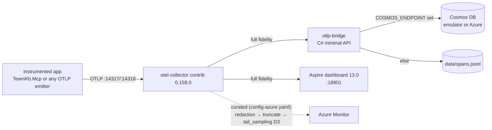

# 09 — Local deployment runbook (Phases 1–2, portable)

Turn-key local loop for the D0 topology on **any machine with Docker** (the
"team machine"). No machine-specific assumptions: every port, image tag, and
credential lives in `deploy/otel/.env`. Written 2026-08-16; image/package
versions verified current that day (sources at bottom).

## What you get



Decisions implemented (roadmap doc 08, locked 2026-08-16): D0 triple fan-out
(Cosmos full-fidelity + Monitor curated + Aspire dev), D1 session stamping,
D3 tail-sampling starter set. The bridge closes the "Cosmos has no OTLP
exporter" gap: collector `otlphttp` (encoding **json**) → bridge → Cosmos SDK.

## Files

| Path | Role |
|---|---|
| `deploy/otel/.env.example` | SSoT for every port/image/credential — copy to `.env` |
| `deploy/otel/docker-compose.yml` | aspire-dashboard + otel-collector + otlp-bridge (+ cosmos-emulator profile) |
| `deploy/otel/collector/config.yaml` | local pipelines (full → bridge + Aspire) |
| `deploy/otel/collector/config-azure.yaml` | adds curated pipeline (redaction allowlist → truncate → D3 tail sampling → Azure Monitor) |
| `deploy/otel/otel-stack.sh` | lifecycle: up / down / status / logs / validate / smoke |
| `src/TeamKb.OtlpBridge/` | bridge source + Dockerfile (compose builds it; standalone, not in TeamKb.sln) |

## Prerequisites

- Docker Engine or Desktop with the `docker compose` plugin.
- Outbound pulls from `mcr.microsoft.com` and Docker Hub (first run only).
- ~1 GB disk for images.

## Quick start

```bash
cd deploy/otel
cp .env.example .env          # defaults work out of the box (file sink, no Azure)
./otel-stack.sh -a validate   # collector config sanity (runs otelcol validate in-container)
./otel-stack.sh -a up         # builds the bridge image, starts the stack
./otel-stack.sh -a smoke      # sends one synthetic span end-to-end
./otel-stack.sh -a status     # compose ps + collector/bridge health probes
```

`smoke` PASS criteria: script prints `SMOKE PASS` (span reached the bridge
file sink) and the trace `smoke-step` is visible in the Aspire UI at
`http://localhost:18901` (Traces tab), carrying `session.id=smoke-session`.

## Pointing the real app at it

The instrumented MCP host (`src/TeamKb.Mcp`) enables telemetry **only** when
the standard OTLP env var is present — absent means bit-identical prior
behavior:

```bash
export OTEL_EXPORTER_OTLP_ENDPOINT=http://localhost:14317   # collector gRPC
export TEAMKB_SESSION_ID="$(uuidgen)"                        # D1 grouping key
export TEAMKB_SESSION_NAME="nightly-battery"                 # human-readable group
# then launch the MCP server as usual
```

Every span (ours + the MCP SDK's `Experimental.ModelContextProtocol` spans)
arrives stamped with `session.id`/`session.name`; in Aspire, filter traces by
the `session.name` attribute to see one session as a group. Phase 1 exit
criterion: one tool call renders as a single trace tree.

## Cosmos sink

Two options:

**a) Local emulator** (profile `cosmos`):

```bash
./otel-stack.sh -a up -p cosmos
# then in .env:
#   COSMOS_ENDPOINT=https://cosmos-emulator:8081
#   COSMOS_KEY=<the emulator's published well-known key>
./otel-stack.sh -a up -p cosmos    # restart bridge with the sink configured
```

The emulator's well-known development key is published in Microsoft's
emulator docs; it is not a secret but is also not duplicated here — put it in
`.env` (gitignored). The `vnext-preview` Linux image is lighter and starts
faster than the legacy emulator; it is preview software — acceptable for a
dev loop, never for retention you care about.

**b) Real Azure Cosmos** — set `COSMOS_ENDPOINT`/`COSMOS_KEY` in `.env` to
the account values. The bridge auto-creates database `teamkb-telemetry` and
container `spans` (partition key `/sessionId`).

Document shape (one document per span, full fidelity — the raw OTLP span is
embedded whole):

```json
{
  "id": "<traceId>-<spanId>",
  "sessionId": "…", "sessionName": "…",
  "traceId": "…", "name": "…",
  "startTimeUnixNano": "…", "endTimeUnixNano": "…",
  "span": { /* verbatim OTLP JSON span */ }
}
```

Purview linkage (Phase 5) governs this container; content is deliberately
NOT sent to Azure Monitor (redaction allowlist strips everything unlisted).

## Azure Monitor (curated pipeline)

```bash
# .env: set AZURE_MONITOR_CONNECTION_STRING=<App Insights connection string>
./otel-stack.sh -a up -c collector/config-azure.yaml
```

This adds `traces/curated`: `redaction(allowlist)` → `transform` (1 KB
attribute cap) → `tail_sampling` (D3: errors-always, >5 s latency,
`gen_ai.usage.output_tokens` ≥ 4000, 5% baseline, 30 s decision wait) →
`azuremonitor` exporter. The allowlist mirrors `src/TeamKb.Core/Telemetry.cs`
— **keep the two in sync** when adding attributes.

Scaling caveat (doc 06/07): tail sampling holds whole traces in memory and
needs trace-affinity routing once you run >1 collector replica. One replica =
no issue.

## Troubleshooting

| Symptom | Check |
|---|---|
| `validate` fails | typo in a collector YAML; the error names the key |
| Aspire UI empty | app env `OTEL_EXPORTER_OTLP_ENDPOINT` unset, or wrong port — must be the **collector** gRPC port, not Aspire's |
| `smoke` sends but no SMOKE PASS | `./otel-stack.sh -a logs` — look at `teamkb-otlp-bridge`; a 400 means the exporter lost `encoding: json` |
| bridge exits at startup | `COSMOS_ENDPOINT` set but `COSMOS_KEY` empty |
| curated pipeline: nothing in App Insights | tail sampling delays export by ≥30 s; also App Insights ingest lag is minutes |
| port already bound | change the port in `.env` — nothing else references it |

## Known limitations (deliberate, Phase-2-complete criteria)

- Bridge parses OTLP/**JSON** only (collector exporter must keep
  `encoding: json`); protobuf support = add `OpenTelemetry.Proto` when a
  non-collector producer needs to hit the bridge directly.
- Bridge writes sequentially per batch (bulk `Task.WhenAll` when ingest lags).
- Compose stack is single-replica; ACA/AKS deployment (Phase 2 proper) reuses
  the same collector YAML unchanged.

## Sources (verified 2026-08-16)

- Aspire dashboard standalone: https://learn.microsoft.com/en-us/dotnet/aspire/fundamentals/dashboard/standalone
- OTLP + Aspire example: https://learn.microsoft.com/en-us/dotnet/core/diagnostics/observability-otlp-example
- Collector releases (v0.158.0): https://github.com/open-telemetry/opentelemetry-collector-releases/releases
- Microsoft.Azure.Cosmos 3.62.0: https://www.nuget.org/packages/Microsoft.Azure.Cosmos
- OpenTelemetry .NET 1.17.0: https://www.nuget.org/packages/OpenTelemetry.Exporter.OpenTelemetryProtocol
- Processor order / redaction / tail sampling rationale: docs 06 and 07 in this folder.
