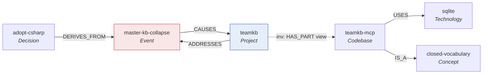
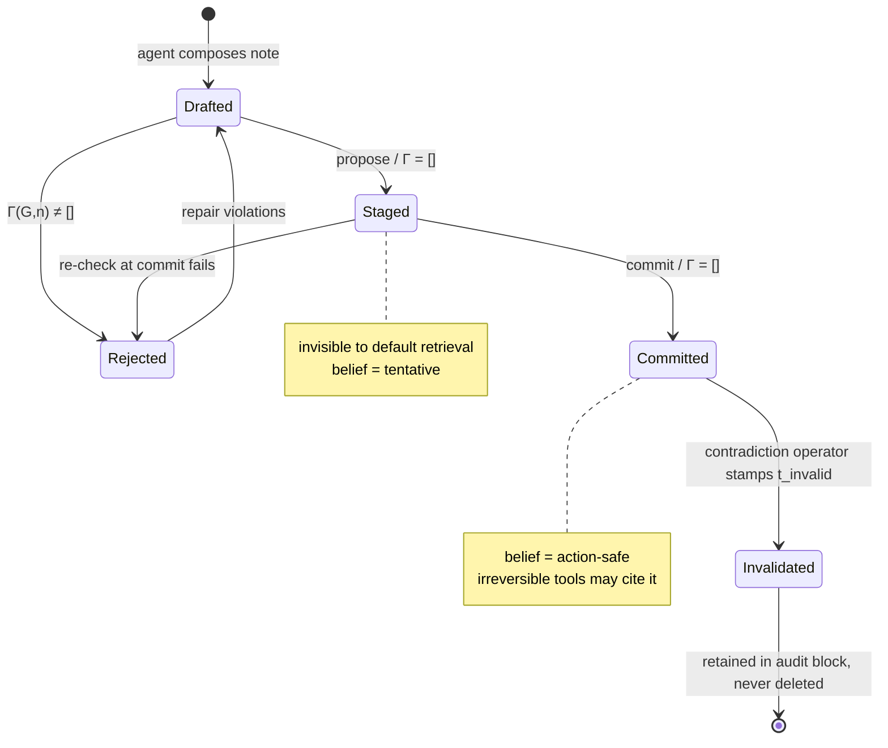
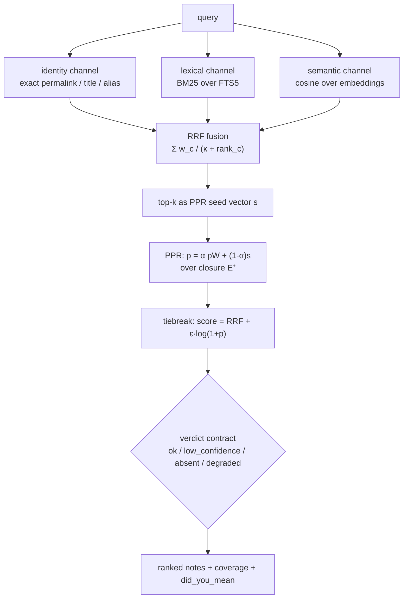

# The Formal Theory of the team-kb Knowledge Graph

## 0. Preface: why a knowledge base deserves equations

The predecessor system, `master-kb`, was a directory of 653 markdown files that everyone
described as a knowledge graph. A full census on 2026-08-11 found that 35.2% of its wikilinks
pointed at nothing, 53.8% of its notes had no inbound link at all, a single note type carried
roughly 120 distinct observation kinds and 60 distinct relation predicates, and three mutually
incompatible relation syntaxes coexisted in the same corpus. It was not a graph. It was a folder
of documents with decorative links.

The instructive part of that post-mortem is not the numbers but the root cause. The tool it ran on
(`basic-memory`) shipped a machine-checkable validation layer — Picoschema, with a
`settings.validation: warn|error` switch. Zero schemas were ever declared. The gate existed in the
code and was never armed. Every rule that governed the corpus lived in prose, and prose does not
reject a write.

This paper is the counter-move. It states the knowledge base as a mathematical object, states the
rules as predicates over that object, states writing as a transition relation that must preserve
those predicates, and then maps every one of those statements onto a concrete C# artifact that
executes it. The organising slogan of the rebuild is: *a rule that is not enforced by code does not
belong in the constitution.* The purpose of the formalism is to make that slogan checkable.

The paper is progressive. Each formal object appears three times: first as intuition, then as a
definition, then as a worked example drawn from a small running knowledge base.

### The running example

Throughout, we use a six-note vault, $G^\star$, describing this very project:

| Note | Class | Role in the example |
|---|---|---|
| `teamkb` | `Project` | the rebuild project |
| `master-kb-collapse` | `Event` | the 2026-08-11 post-mortem incident |
| `closed-vocabulary` | `Concept` | the design principle |
| `teamkb-mcp` | `Codebase` | the C# server |
| `sqlite` | `Technology` | the index substrate |
| `adopt-csharp` | `Decision` | the stack decision |

---

## Part I — The knowledge base as a typed property graph

### 1. Intuition

A note is a node. A wikilink with a verb on it is a directed, labelled edge. The note's frontmatter
is a property map. The bullet lines in the note body — "`- [fact] SQLite WAL gives single-writer
concurrency`" — are typed, repeatable attachments to the node; they are not properties, because a
node may carry many of the same kind, and they are not edges, because they point at prose rather
than at another node.

Three distinct labelling mechanisms, therefore, and each is drawn from a **closed** finite
alphabet. Closure is the whole design. In an open vocabulary, "related-to", "relates_to",
"RELATED_TO" and `` `RELATED_TO `` are four predicates; in a closed one, three of them cannot be
typed into the tool at all.

### 2. Definition (the graph)

**Definition 2.1 (Vault graph).** A *vault* is a structure

$$
G \;=\; \bigl(V,\; E,\; \tau,\; \pi,\; \omega\bigr)
$$

where

- $V$ is a finite set of **notes** (nodes);
- $T$ is a fixed, closed set of **entity classes** with $|T| = 10$;
- $\tau : V \to T$ is the **typing function**;
- $P$ is a fixed, closed set of **verbs** (edge predicates) with $|P| = 14$;
- $E \subseteq V \times P \times V$ is the **edge set**, written $(u, p, v)$;
- $\pi : V \to \mathrm{Props}$ is the **property map**;
- $K$ is a fixed, closed set of **observation kinds** with $|K| = 12$;
- $\omega : V \to \mathcal{M}(K \times \Sigma^\ast)$ maps each note to a finite **multiset** of
  typed observations over text.

The multiset is deliberate: $\omega(v)$ may contain $(\texttt{fact}, s_1)$ and
$(\texttt{fact}, s_2)$ with $s_1 \neq s_2$, and may even contain the same pair twice without the
structure collapsing. Writing $\omega : V \to 2^{K \times \Sigma^\ast}$, as the original
constitution does, quietly forbids duplicate observations; the multiset formulation is the honest
one and matches `IReadOnlyList<Observation>` in the implementation.

**Definition 2.2 (Closed alphabets).** Concretely,

$$
T = \{\,\texttt{Person}, \texttt{Org}, \texttt{Project}, \texttt{Codebase}, \texttt{Technology},
\texttt{Artifact}, \texttt{Concept}, \texttt{Event}, \texttt{Decision}, \texttt{Agent}\,\}
$$

$$
\begin{aligned}
P = \{\,&\texttt{IS\_A}, \texttt{PART\_OF}, \texttt{DEPENDS\_ON}, \texttt{USES}, \texttt{CAUSES},
\texttt{PRECEDES}, \texttt{SUPERSEDES}, \\
&\texttt{DERIVES\_FROM}, \texttt{DESCRIBES}, \texttt{GOVERNS}, \texttt{OWNS}, \texttt{ADDRESSES},
\texttt{CONTRADICTS}, \texttt{MENTIONS}\,\}
\end{aligned}
$$

$$
\begin{aligned}
K = \{\,&\texttt{fact}, \texttt{hypothesis}, \texttt{decision}, \texttt{constraint},
\texttt{preference}, \texttt{lesson}, \\
&\texttt{procedure}, \texttt{risk}, \texttt{question}, \texttt{status},
\texttt{contradiction}, \texttt{deprecated}\,\}
\end{aligned}
$$

**Definition 2.3 (Edge signatures).** Each verb carries a signature
$\sigma : P \to 2^{T} \times 2^{T}$, written

$$
\sigma(p) \;=\; \bigl(\mathrm{dom}(p),\, \mathrm{rng}(p)\bigr), \qquad
\mathrm{dom}(p), \mathrm{rng}(p) \subseteq T .
$$

By convention $\mathrm{dom}(p) = T$ (equivalently, `null` in the implementation) means the verb is
unconstrained on that side. For instance

$$
\sigma(\texttt{PRECEDES}) = (\{\texttt{Event}\}, \{\texttt{Event}\}), \qquad
\sigma(\texttt{IS\_A}) = (T, \{\texttt{Concept}\}),
$$

$$
\sigma(\texttt{OWNS}) = (\{\texttt{Person}, \texttt{Org}, \texttt{Agent}\}, T).
$$

**Definition 2.4 (Inverses).** A partial involution $\mathrm{inv} : P \rightharpoonup P$ names, for
each verb, the reading of the same edge from the other end, and satisfies

$$
\mathrm{inv}(\mathrm{inv}(p)) = p \quad \text{wherever defined.}
$$

`CONTRADICTS` is the fixed point: $\mathrm{inv}(\texttt{CONTRADICTS}) = \texttt{CONTRADICTS}$.
Crucially, inverse edges are *derived*, not stored. If $\mathrm{inv}(p) = q$, the pair
$(v, q, u)$ is a **view** over the stored fact $(u, p, v)$; the graph the author writes and the
graph the reader traverses differ by exactly this derivation.

**Definition 2.5 (Properties).** $\pi(v)$ is a total map on the mandatory key set

$$
\mathrm{Mand} = \{\texttt{permalink}, \texttt{title}, \texttt{type}, \texttt{created},
\texttt{modified}, \texttt{provenance}, \texttt{status}, \texttt{confidence}\}
$$

plus optional keys (`aliases`, `tags`, `isolated_justification`). We write $\pi_\texttt{title}(v)$
for the value of a key.

**Definition 2.6 (Bi-temporal stamps).** Every edge $e \in E$ and every fact-bearing observation
carries a quadruple, following Graphiti's four-timestamp model:

$$
\mathrm{stamp}(e) = \bigl(t_{\mathrm{valid}},\, t_{\mathrm{invalid}},\,
t_{\mathrm{created}},\, t_{\mathrm{expired}}\bigr) \in
\mathcal{T} \times (\mathcal{T} \cup \{\infty\}) \times \mathcal{T} \times (\mathcal{T} \cup \{\infty\})
$$

separating *world time* ($t_{\mathrm{valid}}, t_{\mathrm{invalid}}$ — when the fact held) from
*ingest time* ($t_{\mathrm{created}}, t_{\mathrm{expired}}$ — when we believed it). This makes the
point-in-time query well defined:

$$
G|_{T_w, T_i} \;=\; \bigl(V,\; \{\,e \in E : t_{\mathrm{valid}}(e) \le T_w < t_{\mathrm{invalid}}(e)
\;\wedge\; t_{\mathrm{created}}(e) \le T_i < t_{\mathrm{expired}}(e)\,\}, \tau, \pi, \omega\bigr)
$$

— "as of world-time $T_w$, what did we believe at ingest-time $T_i$?" Retraction sets
$t_{\mathrm{invalid}}$; it never deletes. This is the *invalidate-never-delete* rule that Graphiti,
TOKI, TGMS and MemTX arrive at independently.

### 3. Example

The running vault $G^\star$ has $V = \{v_1,\dots,v_6\}$ with

$$
\tau(v_1) = \texttt{Project},\quad \tau(v_2) = \texttt{Event},\quad \tau(v_3) = \texttt{Concept},
$$
$$
\tau(v_4) = \texttt{Codebase},\quad \tau(v_5) = \texttt{Technology},\quad \tau(v_6) = \texttt{Decision}
$$

and edge set

$$
E^\star = \bigl\{\,(v_2, \texttt{CAUSES}, v_1),\; (v_1, \texttt{ADDRESSES}, v_2),\;
(v_4, \texttt{USES}, v_5),\; (v_6, \texttt{DERIVES\_FROM}, v_2),\; (v_4, \texttt{IS\_A}, v_3)\,\bigr\}
$$

Observations, for example, on the incident node:

$$
\omega(v_2) = \{\!\{\,(\texttt{fact}, \text{“35.2\% of wikilinks dangled”}),\;
(\texttt{lesson}, \text{“a gate that ships disarmed is no gate”})\,\}\!\}
$$

Reading $v_1$'s neighbourhood, a traversal sees `CAUSED_BY` pointing back at $v_2$ — an edge that
exists nowhere on disk, because it is $\mathrm{inv}(\texttt{CAUSES})$ applied to a stored edge.

---

## Part II — Constraints and the valid-state space

### 4. Intuition

There are two kinds of rule. Some rules can be made *unrepresentable*: if the verb argument of the
write tool is a C# `enum` surfaced in the tool's JSON Schema, an off-vocabulary verb is not a
rejected write, it is a value the caller cannot express. Other rules are inherently *relational* —
whether a link target exists depends on the rest of the graph — and must be evaluated against $G$
at write time.

Constraints C1, C6 and C7 are of the first kind; C2, C3, C4, C5 and C8 are of the second. The
practical difference is where the error surfaces: a schema error at the protocol boundary versus a
`GateViolation` from the validator.

### 5. Definition (constraints as first-order predicates)

Each constraint is a predicate over the whole structure.

**C1 — Type closure and path derivation.**

$$
\mathrm{C_1}(G) \;\equiv\; \forall v \in V \;\bigl[\, \tau(v) \in T \;\wedge\;
\mathrm{folder}(v) = \mathrm{path}(\tau(v)) \,\bigr]
$$

with $\mathrm{path} : T \to \Sigma^\ast$ a total function. The second conjunct is what kills the
`project/` vs `projects/` twin problem: the folder is a function of the class, so no author can
disagree with another author about where a note lives.

**C2 — Identity key.** Let $\mathrm{norm} : \Sigma^\ast \to \Sigma^\ast$ be the slug normaliser.

$$
\mathrm{C_2}(G) \;\equiv\; \forall v \in V\;\bigl[\, \pi_\texttt{permalink}(v)
= \mathrm{path}(\tau(v)) \,/\, \mathrm{norm}(\pi_\texttt{title}(v)) \,\bigr]
\;\wedge\;
\forall u,v \in V \;\bigl[\, \pi_\texttt{permalink}(u) = \pi_\texttt{permalink}(v) \Rightarrow u = v \,\bigr]
$$

In PG-Keys terminology the permalink key is **exclusive** (identifies at most one node),
**mandatory** (every node has it) and **singleton** (a node has exactly one). The corresponding
failure mode in `master-kb` was 31 colliding basenames resolved by silently appending `-1`.

**C3 — Signature conformance.**

$$
\mathrm{C_3}(G) \;\equiv\; \forall (u,p,v) \in E \;\bigl[\, \tau(u) \in \mathrm{dom}(p)
\;\wedge\; \tau(v) \in \mathrm{rng}(p) \,\bigr]
$$

This is OOPS pitfall P11 (*missing domain/range*) turned into a checked precondition.

**C4 — Referential integrity.**

$$
\mathrm{C_4}(G) \;\equiv\; \forall (u,p,v) \in E \;\bigl[\, u \in V \wedge v \in V \,\bigr]
$$

Equivalently: the dangling set $D(G) = \{(u,p,v) \in E : v \notin V\}$ is empty. The legacy corpus
had $|D| / |E| = 0.352$.

**C5 — Inverse closure.**

$$
\mathrm{C_5}(G) \;\equiv\; \forall p, q \in P \;\bigl[\, \mathrm{inv}(p) = q \Rightarrow
\bigl( (u,p,v) \in E^{+} \Leftrightarrow (v,q,u) \in E^{+} \bigr) \,\bigr]
$$

where $E^{+} = E \cup \{(v, \mathrm{inv}(p), u) : (u,p,v) \in E\}$ is the *closure* — the graph as
read. Note the shape of the guarantee: C5 holds by construction of $E^{+}$, not by inspection of
$E$. Making it a derivation rather than a check is the countermeasure for OOPS P13 (*missing
inverse relationships*), which in the legacy corpus manifested as every relation being one-sided.

**C6 — Vocabulary closure.**

$$
\mathrm{C_6}(G) \;\equiv\; \forall v \in V \;\; \forall (k, s) \in \omega(v) \;\bigl[\, k \in K \,\bigr]
$$

**C7 — Scope.**

$$
\mathrm{C_7}(G) \;\equiv\; \forall v \in V \;\bigl[\, \mathrm{file}(v) \in \mathcal{L}(\texttt{.md})
\;\wedge\; \mathrm{file}(v) \notin \mathcal{L}(\texttt{(\textbackslash.bak|conflict|\textasciitilde|\textbackslash.orig)}) \,\bigr]
$$

A regular-language membership test on the filename. It exists because ≥15 `.md.bak` and
conflict-copy files were indexed as first-class notes in the predecessor.

**C8 — Class non-vacuity.**

$$
\mathrm{C_8}(G) \;\equiv\; \forall t \in T \;\bigl[\, \lvert \tau^{-1}(t) \rvert \ge 2
\;\vee\; \mathrm{deprecated}(t) \,\bigr]
$$

A class with one member is a declaration nobody used. `master-kb` had four such classes
(`person`, `organization`, `goal`, `technology`), each holding exactly one auto-generated
index stub. C8 is checked by a nightly job rather than at write time, because a freshly minted
class legitimately passes through $|\tau^{-1}(t)| = 1$.

**Definition 5.1 (Well-formedness and the valid-state space).**

$$
\mathrm{WF}(G) \;\equiv\; \bigwedge_{i=1}^{8} \mathrm{C_i}(G),
\qquad
\mathcal{G}^{\ast} \;=\; \{\, G \in \mathcal{G} : \mathrm{WF}(G) \,\}
$$

where $\mathcal{G}$ is the set of all structures of Definition 2.1. $\mathcal{G}^\ast$ — the
**valid-state space** — is the set of graphs the system is permitted to be in. Everything in
Part III exists to keep the system inside it.

**Definition 5.2 (Violation count).** For measurement and for the non-regression gate, define

$$
\mathrm{viol}(G) \;=\; \sum_{i=1}^{8} \bigl\lvert \{\, x : x \text{ witnesses } \neg \mathrm{C_i}(G) \,\} \bigr\rvert
$$

so $\mathrm{WF}(G) \Leftrightarrow \mathrm{viol}(G) = 0$, and $\mathrm{viol}$ grades *how far
outside* $\mathcal{G}^\ast$ a legacy import sits.

### 6. The monotone invariants

Well-formedness is a property of a single state. Curation quality is a property of a *trajectory*.
Four invariants constrain consecutive states $G_t \to G_{t+1}$.

$$
\textbf{I}_1: \; \mathrm{orph}(G_{t+1}) \le \mathrm{orph}(G_t)
\qquad
\textbf{I}_2: \; \mathrm{viol}(G_{t+1}) \le \mathrm{viol}(G_t)
$$

$$
\textbf{I}_3: \; \langle T, P, K\rangle_{t+1} \neq \langle T, P, K\rangle_{t} \;\Rightarrow\;
\exists\, \kappa \in \mathrm{KGCL} \text{ with a reverse patch } \kappa^{-1}
$$

$$
\textbf{I}_4: \; \nexists\, u,v \in V,\, u \neq v : \tau(u) = \tau(v) \;\wedge\;
\mathrm{sim}(\pi_\texttt{title}(u), \pi_\texttt{title}(v)) > \theta \;\wedge\;
(u, \texttt{distinct\_from}, v) \notin E
$$

with $\theta = 0.85$ in the implementation. $\mathrm{I}_2$ is the interesting one: it is *weaker*
than $\mathrm{WF}$ and therefore usable on a corpus that starts dirty. A migration from a legacy
vault cannot demand $\mathrm{viol} = 0$ on day one; it can demand that the number never rises.

$\mathrm{I}_3$ deserves emphasis. $T$, $P$ and $K$ are constants in Part I, but over long horizons
they must evolve — no vocabulary chosen in August survives December unchanged. The invariant says
evolution happens through typed, reversible change operations (KGCL), never through a write that
happens to introduce a new value. This is what separates *governed evolution* from *drift*.

---

## Part III — Writes as guarded state transitions

### 7. Intuition

The failure mode of every ungated knowledge base is that "write" and "commit" are the same event.
An agent emits a note, the note lands, and whatever was wrong with it is now everyone's problem.
The TGMS/MemTX line of work makes the separation explicit: a write is *staged*, validated in
isolation, and admitted only if it preserves the invariants.

The consequence for retrieval is that staged material is not visible to default search. A belief
matures from *tentative* to *action-safe*; only action-safe beliefs may ground an irreversible
action.

### 8. Definition (the transition system)

**Definition 8.1 (Configuration).** The system state is a pair

$$
\mathcal{S} \;=\; \bigl(G,\; \Pi\bigr), \qquad
\Pi : \mathrm{Id} \rightharpoonup \mathcal{N}
$$

where $G \in \mathcal{G}$ is the committed graph and $\Pi$ is the **staging area**, a partial map
from proposal identifiers to candidate notes. Notes in $\Pi$ are invisible to default retrieval.

**Definition 8.2 (Actions).** Three action forms:

$$
a \;::=\; \mathsf{propose}(n) \;\mid\; \mathsf{commit}(\iota) \;\mid\; \mathsf{episode}(n)
$$

**Definition 8.3 (Gate).** The gate is a total function returning a violation list,

$$
\Gamma(G, n) \;=\; \bigl[\, \gamma \in \mathrm{Gates} : \neg \gamma(G, n) \,\bigr],
\qquad
\mathrm{Gates} = \{\mathrm{C_2}, \mathrm{C_3}, \mathrm{C_4}, \mathrm{I_1}, \mathrm{I_4},
\mathrm{PROV}, \mathrm{HYP}, \mathrm{TAG}\}
$$

Each $\gamma$ is a *local* predicate: it takes the current committed graph and one candidate note,
and does not require re-checking the whole graph. This locality is what makes the gate cheap enough
to run on every write, and it is the incremental-revalidation idea from the SHACL-under-updates
literature.

The auxiliary gates are:

$$
\mathrm{PROV}(G,n) \equiv \lvert \mathrm{prov}(n) \rvert \ge 1 \;\wedge\;
\forall q \in \mathrm{prov}(n)\;[\, \mathrm{src}(q) \notin \{\texttt{TBD}, \texttt{TODO}, \texttt{unknown}, \varepsilon\} \,]
$$

$$
\mathrm{HYP}(G,n) \equiv \bigl(\exists (k,s) \in \omega(n) : k = \texttt{hypothesis}\bigr)
\Rightarrow \mathrm{conf}(n) < 0.7
$$

$$
\mathrm{TAG}(G,n) \equiv \forall t \in \mathrm{tags}(n) \;[\, t \in R_{\mathrm{tags}} \,]
$$

with $R_{\mathrm{tags}}$ the registry. Note $\mathrm{I_1}$ in gate form is not the global orphan
count but its local sufficient condition:

$$
\mathrm{I_1}^{\mathrm{loc}}(G,n) \equiv \lvert \mathrm{rel}(n) \rvert \ge 1 \;\vee\;
\mathrm{isolated\_justification}(n) \neq \varepsilon
$$

**Definition 8.4 (Transition relation).**

$$
\frac{\Gamma(G, n) = [\,]\qquad \iota \text{ fresh}}
{(G, \Pi) \;\xrightarrow{\;\mathsf{propose}(n)\;}\; (G,\; \Pi[\iota \mapsto n])}
\;\;\textsc{(P-Ok)}
$$

$$
\frac{\Gamma(G, n) \neq [\,]}
{(G, \Pi) \;\xrightarrow{\;\mathsf{propose}(n)\;}\; (G, \Pi)}
\;\;\textsc{(P-Reject)}
$$

$$
\frac{\Pi(\iota) = n \qquad \Gamma(G, n) = [\,]}
{(G, \Pi) \;\xrightarrow{\;\mathsf{commit}(\iota)\;}\; \bigl(G \oplus n,\; \Pi \setminus \iota\bigr)}
\;\;\textsc{(C-Ok)}
$$

where the **merge operator** $\oplus$ is

$$
G \oplus n \;=\; \bigl(V \cup \{n\},\; E \cup \mathrm{rel}(n),\; \tau[n \mapsto \mathrm{class}(n)],\;
\pi[n \mapsto \mathrm{props}(n)],\; \omega[n \mapsto \mathrm{obs}(n)]\bigr).
$$

Two features of \textsc{C-Ok} matter. First, the gate runs **twice** — once at propose, once at
commit — because $G$ may have advanced between the two, and a target that existed at propose time
may have been superseded. Re-validating at commit is what makes the induction in §9 go through.
Second, rejection is a *no-op*, not a partial write: $(G, \Pi)$ is unchanged. There is no state in
which half a note has landed.

### 9. Proof sketch: gates preserve the invariants

**Theorem 9.1 (Gate soundness for the committed graph).** Let $G_0$ be the empty vault. If every
transition is one of \textsc{P-Ok}, \textsc{P-Reject}, \textsc{C-Ok}, then for all $t$,

$$
\mathrm{C_2}(G_t) \wedge \mathrm{C_3}(G_t) \wedge \mathrm{C_4}(G_t)
$$

and additionally $\mathrm{C_1}, \mathrm{C_5}, \mathrm{C_6}, \mathrm{C_7}$ hold vacuously by
representation.

*Proof sketch.* Induction on the number of committed transitions $t$.

**Base.** $G_0 = (\emptyset, \emptyset, \dots)$. All constraints are universally quantified over
$V$ or $E$, both empty; they hold vacuously.

**Step.** Assume the constraints hold at $G_t$. The only rule that changes the committed graph is
\textsc{C-Ok}, giving $G_{t+1} = G_t \oplus n$ with $\Gamma(G_t, n) = [\,]$. Consider each
constraint.

*C2.* $G_{t+1}$ adds exactly the node $n$. By induction, permalinks are pairwise distinct within
$V_t$. The gate $\mathrm{C_2}$ evaluated at commit asserts
$\pi_\texttt{permalink}(n) \notin \{\pi_\texttt{permalink}(v) : v \in V_t\}$, so distinctness
extends to $V_t \cup \{n\}$. The functional half — permalink equals
$\mathrm{path}(\tau(n))/\mathrm{norm}(\mathrm{title}(n))$ — holds because the permalink is a
*computed property* of the note record, not an author-supplied field; no transition can violate
it.

*C3.* Edges added are exactly $\mathrm{rel}(n)$, all with source $n$. The gate checks
$\tau(n) \in \mathrm{dom}(p)$ for each, and $\tau(v) \in \mathrm{rng}(p)$ for each target $v$
resolved in $G_t$. Edges of $E_t$ are untouched and satisfy C3 by induction. ∎(C3)

*C4.* The gate rejects unless every target permalink resolves in $G_t$. Since
$V_{t+1} \supseteq V_t$, resolution is preserved: $\oplus$ is monotone on $V$, and no rule ever
removes a node — retraction stamps $t_{\mathrm{invalid}}$ instead. Hence no previously satisfied
reference can become dangling. ∎(C4)

*C1, C6, C7.* These hold by *representation* rather than by check. $\tau(n)$ has type
`EntityClass`, a C# enum surfaced as a JSON Schema `enum`; there is no inhabitant outside $T$.
Likewise `ObsKind` for C6. The folder is returned by `Ontology.PathFor`, a total function of the
class, so the C1 derivation conjunct is an identity. C7 is enforced by the indexer's scope filter
before a file can become a node at all. ∎

*C5.* $E^{+}$ is defined as a closure over $E$, computed at read time (`VaultStore.Backlinks`).
Any $E$ yields a $E^{+}$ satisfying C5. ∎

*C8* is **not** preserved by this induction and is not claimed to be: a commit that introduces the
second member of a class restores it, but a class may legitimately sit at $|\tau^{-1}(t)| = 1$
between commits. C8 is a *liveness* property checked by the nightly metrics job, not a safety
property checked per write. Conflating the two is a common modelling error and worth naming
explicitly. $\square$

**Corollary 9.2 (I₂ holds for gated writes).** Since $\mathrm{viol}(G_t) = 0$ for all $t$ by
Theorem 9.1, $\mathrm{viol}(G_{t+1}) \le \mathrm{viol}(G_t)$ holds trivially. The invariant only
carries content during *migration*, where $G_0$ is an imported legacy vault with
$\mathrm{viol}(G_0) \gg 0$; there it becomes the CI gate that forbids a bulk import from making
the corpus worse.

**Remark 9.3 (What the theorem does not say).** It says nothing about *truth*. A gated write can be
well-formed and wrong. The constraints are about structural integrity; semantic correctness is the
domain of contradiction detection, provenance and confidence — machinery that runs *on top of* a
graph that is already structurally sound. The whole value of Part II is that it makes the harder
problem well-posed.

### 10. Contradiction as a typed operator

Committing a note that conflicts with an existing belief is not an error; it is an event with a
declared resolution policy. Following TOKI, define a resolution operator per fact class,

$$
\rho : K \to \{\textsf{lww},\; \textsf{evidence-weighted},\; \textsf{await-confirmation}\}
$$

with, in the current policy table, $\rho(\texttt{decision}) = \textsf{await-confirmation}$,
$\rho(\texttt{fact}) = \textsf{lww}$ for benchmark-like facts, and
$\rho(\texttt{lesson}) = \textsf{evidence-weighted}$, where the evidence-weighted rule picks the
claim maximising

$$
w(c) \;=\; \mathrm{conf}(c) \cdot \sum_{q \in \mathrm{prov}(c)} \mathrm{trust}(q)
\cdot e^{-\lambda \,\Delta t(c)}
$$

for a per-class decay rate $\lambda$. The loser is not deleted: it receives
$t_{\mathrm{invalid}} \leftarrow$ now and is retained in an audit block, and a
$\texttt{CONTRADICTS}$ edge is written by the system (this verb is system-writable only).

---

## Part IV — Degradation theory: why ungated systems drift

### 11. Intuition

The post-mortem's numbers are not a story about carelessness. They are what a per-write error
probability does when compounded over a few thousand writes with no restoring force. This section
makes that precise, and then shows exactly which term the write-time gate removes.

### 12. The drift measures

Define four normalised measures on a vault $G$ with $|V| = n$, $|E| = m$.

**Duplicate rate.** With $\theta$ the title-similarity threshold, let

$$
\mathrm{dup}_\theta(G) \;=\; \frac{\bigl\lvert \{\,\{u,v\} \subseteq V : u \neq v,\;
\tau(u) = \tau(v),\; \mathrm{sim}(\pi_\texttt{title}(u), \pi_\texttt{title}(v)) > \theta \,\} \bigr\rvert}
{\binom{n}{2}}
$$

The coarser operational proxy used in the audit — colliding basenames — gave 31 collisions over
653 notes.

**Dangling ratio.**

$$
\delta(G) \;=\; \frac{\lvert \{ (u,p,v) \in E : v \notin V \} \rvert}{\lvert E \rvert},
\qquad \delta(\text{legacy}) = \frac{862}{2451} = 0.352
$$

**Orphan fraction.** With $\deg^{-}(v)$ the in-degree in $E^{+}$,

$$
\mathrm{orph}(G) \;=\; \frac{\lvert \{ v \in V : \deg^{-}(v) = 0 \} \rvert}{\lvert V \rvert},
\qquad \mathrm{orph}(\text{legacy}) = \frac{351}{653} = 0.538
$$

**Ontology divergence.** Let $\hat{K}(G)$ be the multiset of observation kinds actually used and
$K$ the sanctioned set. Two complementary numbers:

$$
\mathrm{div}_{\mathrm{card}}(G) \;=\; \frac{\lvert \mathrm{supp}(\hat{K}(G)) \setminus K \rvert}{\lvert K \rvert}
$$

$$
H(\hat{K}) \;=\; -\sum_{k \in \mathrm{supp}(\hat K)} p_k \log_2 p_k, \qquad
p_k = \frac{\mathrm{count}(k)}{\sum_{k'} \mathrm{count}(k')}
$$

The entropy $H$ is the sharper instrument, because it distinguishes a vocabulary with one dominant
kind and a long singleton tail from a genuinely diverse one. In the measured corpus, `fact`
accounted for 32% of observations with roughly 120 distinct kinds present; taking the head at
$p_{\texttt{fact}} = 0.32$ and the remaining mass spread over ~119 kinds gives

$$
H(\hat K) \;\approx\; -0.32\log_2 0.32 - 0.68 \log_2\!\frac{0.68}{119} \;\approx\; 0.53 + 5.11 \;=\; 5.64 \text{ bits}
$$

against a sanctioned ceiling of $\log_2 12 = 3.58$ bits, and a healthy-vault target closer to 2.5
bits. Excess entropy over the closed-set maximum is, quite literally, vocabulary the schema does
not know about.

**Composite health.** For dashboards, a single scalar

$$
\mathcal{D}(G) \;=\; \alpha\,\mathrm{dup}_\theta(G) + \beta\,\delta(G) + \gamma\,\mathrm{orph}(G)
+ \eta \cdot \frac{\max(0,\, H(\hat K) - \log_2 |K|)}{\log_2 |K|}
$$

with weights summing to one. Lower is better; $\mathcal{D} = 0$ iff the vault is clean on all four
axes.

### 13. Compounding: the ungated model

Model an ungated system as follows. Writes arrive at rate $r$ per unit time. Each write is
independently defective with probability $q$ — a wrong predicate spelling, an unresolvable target,
an invented observation kind. Defects are never repaired. Then after $N = rt$ writes the expected
defect count is

$$
\mathbb{E}[\mathrm{viol}(G_N)] \;=\; qN
$$

and the probability that the corpus is entirely clean is

$$
\Pr[\mathrm{viol} = 0] \;=\; (1-q)^N \;=\; e^{\,N \ln(1-q)} \;\approx\; e^{-qN}
$$

This is the crux. Cleanliness decays **exponentially in the number of writes** for any $q > 0$,
however small. With a modest $q = 0.02$ — one write in fifty introduces a defect, which is
optimistic for an LLM writing free-form markdown — the probability of a clean corpus after 653
notes is

$$
e^{-0.02 \times 653} \;=\; e^{-13.06} \;\approx\; 2.1 \times 10^{-6}
$$

and the expected defect count is $0.02 \times 653 \approx 13$. The measured corpus had far more
than 13, which tells us $q$ was nearer $0.3$–$0.5$: free-form authorship is not a 2%-error process,
it is a coin flip on every structural decision.

**Vocabulary drift under a rich-get-richer process.** Observation kinds are not merely defective,
they *proliferate*. If each write reuses an existing kind with probability proportional to its
past frequency and mints a fresh kind with probability $\alpha$ — a Chinese-restaurant / Heaps'-law
process — the expected number of distinct kinds after $N$ observations grows as

$$
\mathbb{E}[\,|\mathrm{supp}(\hat K_N)|\,] \;\sim\; \alpha \ln N \quad (\text{CRP}),
\qquad\text{or}\qquad \mathbb{E}[\,|\mathrm{supp}(\hat K_N)|\,] \;\sim\; C N^{\beta},\; 0<\beta<1 \quad (\text{Heaps}).
$$

Either way it is *unbounded and monotone*. There is no equilibrium at 12 kinds; there is no
equilibrium at all. The observed ~120 kinds over ~198 notes fits the sub-linear Heaps form with
$\beta \approx 0.9$ — nearly one new kind per note. A closed enum sets
$|\mathrm{supp}(\hat K_N)| \le |K| = 12$ by construction, replacing an unbounded growth law with a
constant.

**Dangling links under random targeting.** If a write emits $\ell$ links and each targets an
existing note with probability $s$ (a "guess the slug" success rate), then

$$
\mathbb{E}[\delta] \;=\; 1 - s,
$$

independent of $N$. The legacy $\delta = 0.352$ implies $s \approx 0.65$: authors guessed the
target slug correctly about two times in three. That is the expected performance of *any* system
where the identifier is invented by the writer rather than resolved against an index.

### 14. Why write-time enforcement bounds the measures

Introduce the gate. Let $\epsilon$ be the residual probability that a defective write passes — the
gate's false-negative rate, a function of gate coverage, not of $N$. Then

$$
\mathbb{E}[\mathrm{viol}(G_N)] \;=\; q\,\epsilon\,N .
$$

Structurally this is the same linear growth, and it is worth being honest that a gate does not
change the *shape* of the law — it changes the constant, sometimes to zero. For the constraints
enforced by representation (C1, C6, C7) we have $\epsilon = 0$ exactly, because the defective write
is not expressible in the tool's input schema. For those we get

$$
\mathbb{E}[\mathrm{viol}_{\mathrm{C1,C6,C7}}(G_N)] \;=\; 0 \quad \text{for all } N .
$$

For the relational constraints (C2, C3, C4) the validator is a decision procedure over the
committed graph, so $\epsilon = 0$ up to implementation bugs: C4 cannot pass with an unresolvable
target because resolution *is* the check. The measures are therefore bounded by construction:

$$
\delta(G_t) = 0, \qquad \mathrm{dup}_\theta(G_t) = 0 \;\; (\theta = 0.85), \qquad
\mathrm{supp}(\hat K(G_t)) \subseteq K \;\Rightarrow\; H(\hat K) \le \log_2 12 .
$$

The orphan fraction is the one measure the gate bounds only *conditionally*. $\mathrm{I_1}$ demands
$\ge 1$ resolvable outbound edge or an explicit justification, which bounds the fraction of notes
with zero *out*-degree, not zero in-degree. A star graph where every note links to one hub
satisfies $\mathrm{I_1}$ while leaving every leaf with in-degree 0 from the perspective of any other
leaf. What saves it is the inverse closure: since $E^{+}$ contains $(v, \mathrm{inv}(p), u)$ for
every stored $(u,p,v)$, any note with out-degree $\ge 1$ has in-degree $\ge 1$ in $E^{+}$. Hence

$$
\mathrm{I_1}^{\mathrm{loc}} \wedge \mathrm{C_5} \;\Longrightarrow\; \mathrm{orph}(G) \le
\frac{\lvert \{v : \mathrm{isolated\_justification}(v) \neq \varepsilon\} \rvert}{\lvert V \rvert}
$$

— the orphan fraction is bounded by the *deliberately isolated* fraction, which is a governance
number a team can look at, rather than an emergent 53.8%.

**The general principle.** Any repair process that runs *after* the write is a race between a
defect-generation rate $qr$ and a repair rate $\mu$. Queueing intuition applies: the backlog is
stable only if $\mu > qr$, and the steady-state backlog scales as $qr/(\mu - qr)$, which diverges
as $\mu \downarrow qr$. Periodic clean-up campaigns have $\mu$ concentrated in rare bursts and
$q r$ running continuously, which is why they always lose. Write-time enforcement sets $q_{\text{eff}} = q\epsilon \approx 0$
and removes the race entirely. That, and not any particular constraint, is the theorem of this
paper.

---

## Part V — The retrieval algebra

### 15. Intuition

Retrieval has three independent signals and no single one is sufficient. Lexical matching (BM25)
finds the note that uses the query's exact words; it fails on paraphrase. Dense embedding
similarity finds the paraphrase; it fails on rare identifiers, version numbers and proper nouns.
Graph proximity finds what the corpus *structurally* associates with the seeds; it fails when it
has no good seeds. The system runs all three, fuses their rankings, and uses graph centrality to
break ties.

### 16. BM25

**Definition 16.1.** For a query $Q = \{q_1, \dots, q_{|Q|}\}$ and document $d$ in a corpus of $N$
documents with average length $\overline{L}$:

$$
\mathrm{BM25}(Q, d) \;=\; \sum_{i=1}^{|Q|} \mathrm{IDF}(q_i) \cdot
\frac{f(q_i, d)\,(k_1 + 1)}{f(q_i, d) + k_1\bigl(1 - b + b\,\frac{|d|}{\overline{L}}\bigr)}
$$

$$
\mathrm{IDF}(q) \;=\; \ln\!\left(\frac{N - n(q) + 0.5}{n(q) + 0.5} + 1\right)
$$

where $f(q,d)$ is the term frequency, $n(q)$ the document frequency, and $k_1 \approx 1.2$,
$b \approx 0.75$ are the saturation and length-normalisation parameters. The $k_1$ term is why
BM25 beats raw TF-IDF: term frequency saturates, so a note repeating "SQLite" forty times does not
outrank a note that says it four times in a more relevant context.

**Worked example.** Query $Q = \{\text{“sqlite”}, \text{“wal”}\}$, corpus $N = 6$ (the running
vault), $\overline{L} = 100$ tokens. Suppose $n(\text{sqlite}) = 2$, $n(\text{wal}) = 1$, and for
$d = v_4$ (`teamkb-mcp`, $|d| = 120$): $f(\text{sqlite}, d) = 5$, $f(\text{wal}, d) = 2$.

$$
\mathrm{IDF}(\text{sqlite}) = \ln\!\left(\frac{6 - 2 + 0.5}{2 + 0.5} + 1\right) = \ln(2.8) = 1.030
$$
$$
\mathrm{IDF}(\text{wal}) = \ln\!\left(\frac{6 - 1 + 0.5}{1 + 0.5} + 1\right) = \ln(4.667) = 1.540
$$

Length term: $1 - b + b\frac{|d|}{\overline L} = 0.25 + 0.75(1.2) = 1.15$, so $k_1 \cdot 1.15 = 1.38$.

$$
\text{sqlite: } 1.030 \cdot \frac{5 \times 2.2}{5 + 1.38} = 1.030 \cdot \frac{11}{6.38} = 1.030 \times 1.724 = 1.776
$$
$$
\text{wal: } 1.540 \cdot \frac{2 \times 2.2}{2 + 1.38} = 1.540 \cdot \frac{4.4}{3.38} = 1.540 \times 1.302 = 2.005
$$
$$
\mathrm{BM25}(Q, v_4) = 1.776 + 2.005 = \mathbf{3.78}
$$

The rarer term contributes more despite lower frequency — exactly the desired behaviour for a
technical corpus where the discriminating token is usually the rare one.

### 17. Embedding cosine similarity

**Definition 17.1.** With $\phi : \Sigma^\ast \to \mathbb{R}^{D}$ an embedding model,

$$
\mathrm{cos}(Q, d) \;=\; \frac{\langle \phi(Q), \phi(d) \rangle}{\lVert \phi(Q) \rVert_2 \, \lVert \phi(d) \rVert_2}
\;=\; \frac{\sum_{j=1}^{D} \phi_j(Q)\,\phi_j(d)}{\sqrt{\sum_j \phi_j(Q)^2}\sqrt{\sum_j \phi_j(d)^2}} \;\in\; [-1, 1]
$$

For $\ell_2$-normalised vectors this reduces to the inner product, and ranking by cosine is
equivalent to ranking by (negated) squared Euclidean distance, since
$\lVert a - b\rVert^2 = 2 - 2\langle a, b\rangle$.

**Worked example.** In a toy $D = 4$ space with axes roughly meaning
(*storage*, *governance*, *retrieval*, *incident*):

$$
\phi(Q) = (0.9,\, 0.1,\, 0.4,\, 0.0), \qquad \phi(v_4) = (0.8,\, 0.3,\, 0.5,\, 0.1)
$$

$$
\langle \phi(Q), \phi(v_4)\rangle = 0.72 + 0.03 + 0.20 + 0.00 = 0.95
$$
$$
\lVert \phi(Q)\rVert = \sqrt{0.81 + 0.01 + 0.16} = \sqrt{0.98} = 0.990, \qquad
\lVert \phi(v_4)\rVert = \sqrt{0.64+0.09+0.25+0.01} = \sqrt{0.99} = 0.995
$$
$$
\mathrm{cos}(Q, v_4) = \frac{0.95}{0.990 \times 0.995} = \frac{0.95}{0.985} = \mathbf{0.964}
$$

### 18. Reciprocal Rank Fusion

**Motivation.** BM25 returns unbounded positive scores; cosine returns $[-1,1]$; PPR returns a
probability distribution. Fusing them by score requires calibration that changes with every corpus
update. RRF sidesteps this by discarding scores and fusing *ranks*.

**Definition 18.1.** Given channels $c \in \mathcal{C}$ with weights $w_c$ and per-channel rank
functions $\mathrm{rank}_c(d) \in \{1, 2, \dots\}$ (or $\infty$ if unranked),

$$
\mathrm{RRF}(d) \;=\; \sum_{c \in \mathcal{C}} \frac{w_c}{\kappa + \mathrm{rank}_c(d)}
$$

with $\kappa = 60$ the standard damping constant. The constant is what makes the fusion robust: it
compresses the difference between ranks 1 and 2 (contributing $1/61$ vs $1/62$, a 1.6% gap) so no
single channel's top hit can dominate, while still separating rank 1 from rank 50
($1/61$ vs $1/110$, a 45% gap).

The channels in this system are $\mathcal{C} = \{\text{identity}, \text{lexical}, \text{semantic}\}$,
where *identity* scores exact and near-exact permalink/title/alias matches — the channel that
recovers the case where a user types a note's name verbatim and neither BM25 nor embeddings put it
first.

**Worked example.** Three candidate notes, $\kappa = 60$, equal weights $w_c = 1$:

| Note | rank(identity) | rank(lexical) | rank(semantic) |
|---|---|---|---|
| $v_4$ `teamkb-mcp` | 2 | 1 | 3 |
| $v_5$ `sqlite` | 1 | 3 | 2 |
| $v_1$ `teamkb` | — ($\infty$) | 2 | 1 |

$$
\mathrm{RRF}(v_4) = \tfrac{1}{62} + \tfrac{1}{61} + \tfrac{1}{63} = 0.016129 + 0.016393 + 0.015873 = 0.048395
$$
$$
\mathrm{RRF}(v_5) = \tfrac{1}{61} + \tfrac{1}{63} + \tfrac{1}{62} = 0.016393 + 0.015873 + 0.016129 = 0.048395
$$
$$
\mathrm{RRF}(v_1) = 0 + \tfrac{1}{62} + \tfrac{1}{61} = 0.016129 + 0.016393 = 0.032522
$$

$v_1$ is cleanly third. But $v_4$ and $v_5$ tie *exactly* at $0.048395$ — they hold the same
multiset of ranks $\{1,2,3\}$, and RRF is symmetric in the channels when weights are equal. Ties of
this kind are not a pathological edge case; with a small $|\mathcal{C}|$ and small candidate sets
they are common. That is precisely why the system needs a principled tiebreak, which is the subject
of §19.

### 19. Personalized PageRank as tiebreak

**Intuition.** PageRank asks "where does a random surfer spend its time?". *Personalized* PageRank
asks the same question of a surfer who, whenever it teleports, always teleports back to the query's
seed notes. The stationary distribution therefore measures structural proximity *to the query*,
not global fame — which is what a tiebreak needs.

**Definition 19.1.** Let $A$ be the adjacency matrix of the closure $E^{+}$ (so backlinks count),
$W$ its row-stochastic normalisation $W_{uv} = A_{uv} / \deg^{+}(u)$, and $\mathbf{s}$ the seed
distribution — uniform over the notes that the RRF top-$k$ surfaced. With damping
$\alpha \in (0,1)$, the PPR vector $\mathbf{p}$ is the unique solution of

$$
\mathbf{p}^\top \;=\; \alpha\, \mathbf{p}^\top W \;+\; (1 - \alpha)\, \mathbf{s}^\top,
\qquad\text{equivalently}\qquad
\mathbf{p}^\top = (1-\alpha)\,\mathbf{s}^\top \bigl(I - \alpha W\bigr)^{-1}.
$$

Existence and uniqueness follow from the Perron–Frobenius theorem applied to the stochastic matrix
$\alpha W + (1-\alpha)\mathbf{1}\mathbf{s}^\top$, which is irreducible and aperiodic for
$\alpha < 1$ and $\mathbf{s} > 0$ on its support. In practice $\mathbf{p}$ is computed by power
iteration,

$$
\mathbf{p}^{(i+1)\top} = \alpha\,\mathbf{p}^{(i)\top} W + (1-\alpha)\mathbf{s}^\top,
$$

which converges geometrically at rate $\alpha$: the error satisfies
$\lVert \mathbf{p}^{(i)} - \mathbf{p} \rVert_1 \le \alpha^{i} \lVert \mathbf{p}^{(0)} - \mathbf{p} \rVert_1$,
so $\alpha = 0.85$ needs about $\lceil \ln(10^{-6}) / \ln(0.85) \rceil = 85$ iterations for
six-digit accuracy — trivial at vault scale.

**The final ranking.**

$$
\mathrm{score}(d) \;=\; \mathrm{RRF}(d) \;+\; \varepsilon \cdot \log\bigl(1 + \mathbf{p}_d\bigr),
\qquad 0 < \varepsilon \ll \tfrac{1}{\kappa + 1}
$$

The magnitude condition on $\varepsilon$ is what makes this a *tiebreak* rather than a fourth
channel: the perturbation must be smaller than the smallest possible RRF gap between distinct rank
profiles, so PPR can reorder exact ties and nothing else. The $\log$ compresses the heavy tail of
the PPR distribution, so a single hub cannot swamp the ordering.

**Worked example.** Resolve the $v_4$/$v_5$ tie. Take the sub-vault
$\{v_1, v_2, v_4, v_5\}$ with closure edges

$$
v_4 \to v_5,\; v_5 \to v_4,\; v_2 \to v_1,\; v_1 \to v_2,\; v_1 \to v_4,\; v_4 \to v_1
$$

giving out-degrees $\deg^{+}(v_1) = 2$, $\deg^{+}(v_2) = 1$, $\deg^{+}(v_4) = 2$,
$\deg^{+}(v_5) = 1$. Seed on the query-matched note $v_1$: $\mathbf{s} = (1, 0, 0, 0)$ over
$(v_1, v_2, v_4, v_5)$. With $\alpha = 0.85$, start $\mathbf{p}^{(0)} = \mathbf{s}$:

$$
\mathbf{p}^{(1)} = 0.85\,(0,\; 0.5,\; 0.5,\; 0) + 0.15\,(1,0,0,0) = (0.150,\; 0.425,\; 0.425,\; 0)
$$

$$
\mathbf{p}^{(2)} = 0.85\bigl(0.425\cdot 1 + 0.425\cdot 0.5,\;\; 0.150\cdot 0.5,\;\;
0.150\cdot 0.5,\;\; 0.425 \cdot 0.5\bigr) + 0.15\,\mathbf{s}
$$
$$
= 0.85\,(0.6375,\; 0.075,\; 0.075,\; 0.2125) + (0.15, 0, 0, 0)
= (0.692,\; 0.064,\; 0.064,\; 0.181)
$$

Iterating to convergence gives approximately

$$
\mathbf{p} \;\approx\; (0.396,\; 0.204,\; 0.229,\; 0.171).
$$

So $\mathbf{p}_{v_4} = 0.229 > \mathbf{p}_{v_5} = 0.171$: with $\varepsilon = 10^{-3}$,

$$
\mathrm{score}(v_4) = 0.048395 + 10^{-3}\ln(1.229) = 0.048395 + 0.000206 = 0.048601
$$
$$
\mathrm{score}(v_5) = 0.048395 + 10^{-3}\ln(1.171) = 0.048395 + 0.000158 = 0.048553
$$

$v_4$ wins, because it sits one hop from the query seed on the link graph while $v_5$ sits two.
The tie is broken by structure — which is available only because C4 and C5 guarantee the link graph
is real. In a vault with $\delta = 0.352$ and $\mathrm{orph} = 0.538$, the PPR channel is noise:
a third of the transitions lead nowhere and half the nodes are unreachable from any seed. **The
integrity constraints of Part II are a precondition for the retrieval mathematics of Part V**, and
this is the single most important structural claim in the paper.

### 20. The verdict contract

Retrieval returns not only a ranking but a *verdict*, borrowed from the jcodemunch honesty
contract. Let $\mathrm{score}_{(1)}$ be the top score and $\mathrm{cov}$ the fraction of the
candidate pool that was actually scored (rather than truncated by budget). Then

$$
\mathrm{verdict} =
\begin{cases}
\texttt{ok} & \mathrm{score}_{(1)} \ge \vartheta_{\mathrm{hi}} \wedge \mathrm{cov} \ge 0.9 \\
\texttt{low\_confidence} & \vartheta_{\mathrm{lo}} \le \mathrm{score}_{(1)} < \vartheta_{\mathrm{hi}} \\
\texttt{absent} & \mathrm{score}_{(1)} < \vartheta_{\mathrm{lo}} \\
\texttt{degraded} & \mathrm{cov} < 0.9
\end{cases}
$$

The point of `absent` is to terminate search. An agent that receives `absent` is instructed not to
re-query with synonyms; the feature genuinely does not exist in the corpus, and further searching
is a token sink. This is the retrieval-side analogue of a closed vocabulary: bounding what the
system will claim, rather than letting it improvise.

---

## Part VI — Implementation mapping

Every formal object above is either already realised in `TeamKb.Core` or scheduled against a
milestone from the teardown-rebuild plan (M1 Retrieval, M2 Graph, M3 Self-learning). Nothing in
this paper is aspirational-without-address.

### 21. Formal object → C# artifact

| Formal object | Notation | Artifact | Status |
|---|---|---|---|
| Entity class set $T$ | $\tau : V \to T$ | `Ontology.cs` → `enum EntityClass` (10 members) | shipped |
| Verb set $P$ | $E \subseteq V \times P \times V$ | `Ontology.cs` → `enum Verb` (14 members) | shipped |
| Observation kinds $K$ | $\omega : V \to \mathcal{M}(K \times \Sigma^\ast)$ | `Ontology.cs` → `enum ObsKind` (12 members) | shipped |
| Tier lattice | — | `Ontology.cs` → `enum Tier` | shipped |
| Path function $\mathrm{path}(t)$ | C1 derivation | `Ontology.PathFor(EntityClass)` | shipped |
| Inverse map $\mathrm{inv}(p)$ | C5 | `Ontology.InverseName(Verb)` | shipped |
| Signature $\sigma(p)$ | C3 | `Ontology.Signature(Verb) → (Dom, Rng)` | shipped |
| Normaliser $\mathrm{norm}$ | C2 | `Ontology.NormalizeTitle(string)` | shipped |
| Scope predicate | C7 | `Ontology.InScope(string fileName)` | shipped |
| Node record $v$ with $\pi(v)$ | Def. 2.1, 2.5 | `Note.cs` → `record Note` | shipped |
| Edge with stamps | Def. 2.6 | `Note.cs` → `record Relation` (`TValid`/`TInvalid`/`TCreated`/`TExpired`) | shipped |
| Observation | $(k, s) \in \omega(v)$ | `Note.cs` → `record Observation(ObsKind, string, string?)` | shipped |
| Provenance | PROV gate | `Note.cs` → `record Provenance` | shipped |
| Computed permalink | C2 functional half | `Note.Permalink` (expression-bodied property) | shipped |
| Isolation escape hatch | $\mathrm{I_1}^{\mathrm{loc}}$ | `Note.IsolatedJustification` | shipped |

### 22. Constraint → enforcement site

| # | Constraint | Enforcement | Mechanism | Status |
|---|---|---|---|---|
| C1 | Type closure + derived path | `EntityClass` enum in tool JSON Schema; `Ontology.PathFor` | unrepresentable ($\epsilon = 0$) | shipped |
| C2 | Identity key | `NoteValidator` → `index.PermalinkExists` | relational check | shipped |
| C3 | Edge signature | `NoteValidator` → `Ontology.Signature` + `index.ClassOf` | relational check | shipped |
| C4 | Referential integrity | `NoteValidator` → `index.PermalinkExists(r.TargetPermalink)` | relational check | shipped |
| C5 | Inverse closure | `VaultStore.Backlinks` (computed, never authored) | derivation | shipped |
| C6 | Vocabulary closure | `ObsKind` enum in tool JSON Schema | unrepresentable ($\epsilon = 0$) | shipped |
| C7 | Scope | `Ontology.InScope` at indexer boundary | regular-language filter | shipped |
| C8 | Class non-vacuity | nightly metrics job over $\lvert\tau^{-1}(t)\rvert$ | **M3** | planned |
| I1 | Connectivity | `NoteValidator` → relation-count-or-justification | local sufficient condition | shipped |
| I2 | Non-regression on $\mathrm{viol}$ | CI gate over the vault repo | pipeline | **M1** |
| I3 | Governed vocabulary evolution | KGCL op tool with reverse patch | evolution surface | **M3** |
| I4 | Identity discipline | `NoteValidator.TitleSimilarity` vs $\theta = 0.85$ | trigram Jaccard | shipped |
| PROV | Non-placeholder provenance | `NoteValidator` PROV block | check | shipped |
| HYP | Hypothesis confidence ceiling | `NoteValidator` HYP block | check | shipped |
| TAG | Registry-enforced tags | `NoteValidator` → `index.TagRegistered` | registry lookup | shipped |

Note the similarity function: $\mathrm{sim}$ in $\mathrm{I_4}$ is realised as normalised-trigram
Jaccard,

$$
\mathrm{sim}(a,b) \;=\; \frac{\lvert \mathcal{T}_3(\mathrm{norm}(a)) \cap \mathcal{T}_3(\mathrm{norm}(b)) \rvert}
{\lvert \mathcal{T}_3(\mathrm{norm}(a)) \cup \mathcal{T}_3(\mathrm{norm}(b)) \rvert}
$$

with $\mathcal{T}_3(s)$ the set of character trigrams, and $\mathrm{sim}(a,b) = 1$ short-circuited
when the normalised forms are equal. The implementation is an $O(n)$ scan over the class; the code
carries an explicit note to swap in an indexed similarity above ~10k notes per class.

### 23. Transition system → storage

| Formal element | Artifact | Status |
|---|---|---|
| Configuration $(G, \Pi)$ | `VaultStore` — `notes` table + `proposals` table | shipped |
| Gate $\Gamma(G, n)$ | `NoteValidator.Validate(Note) → IReadOnlyList<GateViolation>` | shipped |
| \textsc{P-Ok} / \textsc{P-Reject} | `VaultStore.Propose(Note) → ProposalResult` | shipped |
| \textsc{C-Ok} and $\oplus$ | `VaultStore.Commit(string proposalId)` | shipped |
| $\mathsf{episode}$ (append-only path) | `VaultStore.CaptureEpisode(...)` | shipped |
| Closure $E^{+}$ | `VaultStore.Backlinks(permalink)` | shipped |
| Markdown as canonical form | `MarkdownSerializer.ToMarkdown(Note)` | shipped |
| Verb wire format | `MarkdownSerializer.ToScreamingSnake(Verb)` | shipped |
| $\mathrm{WF}$ re-validation at commit | `Commit` re-runs `Validate` against current $G$ | shipped |

### 24. Retrieval equations → milestones

| Equation | Artifact / milestone | Status |
|---|---|---|
| $\mathrm{BM25}(Q,d)$ (§16) | SQLite FTS5 `bm25()` ranking via `VaultStore.Search` | shipped (default $k_1, b$) |
| $\mathrm{cos}(Q,d)$ (§17) | embedding table + vector index | **M1** |
| $\mathrm{RRF}(d)$ (§18) | signal fusion over identity/lexical/semantic, tunable $w_c$ | **M1** |
| Verdict contract (§20) | `plan_turn`-style router: verdict + coverage + `did_you_mean` | **M1** |
| $\mathbf{p} = \alpha\mathbf{p}W + (1-\alpha)\mathbf{s}$ (§19) | Neo4j mirror + GDS PPR over $E^{+}$ | **M2** |
| $\mathrm{score} = \mathrm{RRF} + \varepsilon\log(1+\mathbf{p})$ | tiebreak in the fusion stage | **M2** |
| Drift measures $\delta, \mathrm{orph}, \mathrm{dup}_\theta, H(\hat K)$ (§12) | nightly metrics job; dashboard $\mathcal{D}(G)$ | **M3** |
| Resolution operators $\rho(k)$ (§10) | contradiction operator table + audit blocks | **M3** |
| Retrieval-miss replay (SAGE loop) | failed evidence chains → extraction feedback | **M3** |
| Decay $e^{-\lambda\Delta t}$ with anchor exemption | consolidation daemon; `_meta/**` exempt | **M3** |

### 25. What is deliberately not formalised

Three things are left outside the model, and it is worth saying why.

**Note body prose.** $\omega(v)$ types the *observations*; the free-text overview is unconstrained.
Constraining prose would buy nothing and would make the system unusable.

**Truth.** As §9.3 notes, no constraint asserts that a committed fact is correct. Confidence,
provenance and the contradiction lifecycle manage epistemic quality; they are a separate layer.

**The embedding model.** $\phi$ appears as an opaque function. Swapping models changes the semantic
channel's rankings but not the algebra, which is exactly why RRF fuses ranks rather than scores:
the fusion layer is insulated from the embedding layer's calibration.

---

## 26. Summary

The formal content of this paper is four claims.

1. A knowledge base is a typed property graph $G = (V, E, \tau, \pi, \omega)$ over closed alphabets
   $T$, $P$, $K$, with edge signatures $\sigma$, a partial involution $\mathrm{inv}$, and
   bi-temporal stamps. Closure is not a stylistic preference; it converts an unbounded
   vocabulary-growth law into a constant.

2. Well-formedness is the conjunction $\bigwedge_{i=1}^{8}\mathrm{C_i}$, carving a valid-state
   space $\mathcal{G}^\ast$ out of all possible structures. Curation quality is a property of
   trajectories, captured by the monotone invariants $\mathrm{I}_1$–$\mathrm{I}_4$.

3. Writing is a guarded transition system $(G,\Pi)$ with $\mathsf{propose}$, $\mathsf{commit}$ and
   a gate $\Gamma$. By induction on commits, the gate preserves C2, C3 and C4; C1, C5, C6 and C7
   hold by representation or derivation. Ungated systems lose cleanliness as $e^{-qN}$; gates with
   $\epsilon = 0$ remove the exponent. Post-hoc cleanup is a queue that is stable only while
   $\mu > qr$, which is why it always loses in practice.

4. Retrieval fuses BM25, cosine similarity and PPR through Reciprocal Rank Fusion with a
   centrality tiebreak — and this only works because the constraints of claim 2 guarantee that the
   link graph is real. Integrity is not a hygiene concern separate from retrieval quality; it is
   its precondition.

The predecessor system failed not because these ideas were unknown but because they were written
in prose next to a validation switch nobody turned on. Everything above has an entry in §21–§24
naming the file that executes it, or the milestone that will.
