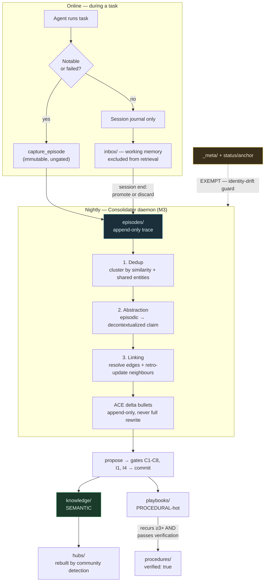
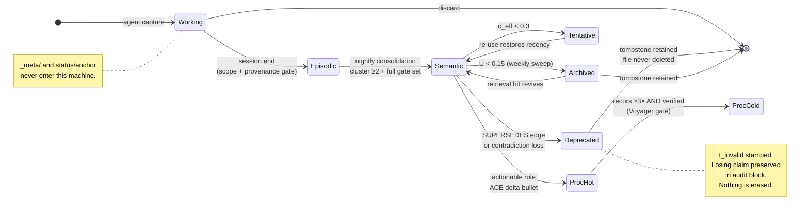
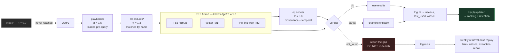

# The Stratified Memory Organism

**A memory model for team-kb, and why its folders are not filing cabinets**

---

## 1. The thesis in one paragraph

Most knowledge bases treat storage location as an administrative convenience: a place to put
things so they can be found again. team-kb treats location as *semantics*. A note's folder
declares what kind of memory it is, and that declaration determines three otherwise-independent
policies at once — who may write it, how retrieval ranks it, and how fast it decays. We call the
resulting architecture the **Stratified Memory Organism**: stratified because memory is layered by
kind rather than by topic, and organism because the layers exchange material continuously —
episodes consolidate upward into semantic knowledge, unused knowledge subsides downward into
archive, and the whole system is expected to change shape over time without a human moving files
by hand.

This paper explains the model: its grounding in cognitive-architecture research, the operational
meaning of "consolidation," the actual arithmetic of decay and utility, why forgetting is a
designed feature rather than an accident, how tier placement biases retrieval, and where each
mechanism lives in the C# implementation — what exists today versus what a milestone still owes.

---

## 2. Why a memory model at all — the master-kb failure

The predecessor system, master-kb, did not fail because anyone stopped caring. Its curation was
demonstrably *active*: 25+ new notes in the final 30 days before the audit. It failed because
nothing ever left, nothing was ever ranked by usefulness, and nothing distinguished a raw session
transcript from a settled architectural fact. The post-mortem census
(`docs/research/2026-08-11-kb-failure-postmortem-v2-formal.md`) measured the end state of that
policy vacuum across 653 legacy notes:

| Symptom | Measurement |
|---|---|
| Orphans (no inbound link) | 351/653 = **53.8%** |
| Dangling wikilinks | 862/2451 = **35.2%** |
| Distinct observation kinds | **189** in legacy; **≈120 within a single note type** in current kb |
| Distinct relation predicates | **≈60**, including case-dialect twins (`part_of` 41 / `PART_OF` 21) |
| Duplicate slugs | **31** colliding basenames (`readme` ×10) |
| Hollow entity classes | `person/`, `org/`, `goal/`, `technology/` — exactly 1 stub note each |
| Indexed junk | ≥15 `.bak` / conflict artifacts treated as notes |

The verdict line from that report is the one worth carrying: *"the graph was never a graph, it was
a folder of documents with decorative links."*

Two lessons follow, and both are load-bearing for everything below.

**First, unbounded accumulation is not neutral.** A store that only grows does not merely get
bigger; it gets *worse* at its job. Every stale note is a competing retrieval candidate, every
abandoned link is a false path, and every one of those 120 singleton observation kinds is a
vocabulary an agent must hold in its head to write compliantly. The cost of accumulation is paid
at read time, forever, by everyone.

**Second, a rule that isn't code isn't a rule.** master-kb's substrate (basic-memory) *shipped* a
machine-checkable gate — Picoschema plus a `validation: error` setting. Zero schema notes were ever
declared. The root cause is not "no gate existed" but "the gate shipped and was never switched on."
Accordingly, the constitution states plainly: *a rule that is not enforced by code does not belong
in this file*. The memory model in this paper is written to the same standard. Where a policy is
not yet executable, this paper says which milestone owes it rather than pretending prose is
enforcement.

---

## 3. Memory taxonomy: from cognitive architecture to folders

### 3.1 The borrowed vocabulary

The psychological literature converged, over roughly fifty years, on four distinctions that turn
out to be the right ones for an agentic knowledge store.

**Working memory** (Atkinson & Shiffrin 1968; Baddeley & Hitch 1974) is small, volatile, and
attention-bound. Its defining property is not speed but that its content is *not yet committed to
anything*. **Episodic memory** (Tulving 1972) records events with their context — indexical,
singular, one trace per occurrence; it answers "what happened on the 11th?" **Semantic memory**
holds decontextualized general knowledge, stripped of the occasion on which it was learned; it
answers "what is true?" Tulving's later SPI model (1985) added the directional claim that matters
most here: semantic knowledge is built *out of* episodic experience, serially, not acquired in
parallel with it. That is the design basis for consolidation. **Procedural memory** (Squire 1992)
holds skills — expressed through use rather than recall, improving with practice.

The bridging mechanism is **systems consolidation**, formalized as Complementary Learning Systems
(McClelland, McNaughton & O'Reilly 1995): a fast hippocampal store captures episodes immediately,
a slow neocortical store extracts regularities across many replayed episodes, and replay happens
offline during rest. The architecture exists because the two learning rates are incompatible in one
system — fast learning overwrites, slow learning generalizes, and you need both. That is precisely
the stability-plasticity tension every agentic memory system hits, and why team-kb has an episodic
tier that is *cheap and immediate* alongside a semantic tier that is *gated and slow*, rather than
one uniform note store.

### 3.2 The mapping

team-kb's vault layout is a direct transcription:

```
team-kb-vault/
├── _meta/          # anchor: constitution, ontology, registries, versions
├── inbox/          # WORKING: untriaged capture; excluded from default retrieval
├── episodes/       # EPISODIC: immutable session/event/incident records, append-only
├── knowledge/      # SEMANTIC: entity notes, per-class subfolders (path computed)
├── playbooks/      # PROCEDURAL-hot: ACE delta-bullet playbooks + per-domain cheatsheets
├── procedures/     # PROCEDURAL-cold: verified parameterized workflows (Voyager-gated)
└── hubs/           # HIERARCHICAL: auto-regenerated community/index notes (curator-owned)
```

| Tier | Folder | Cognitive analogue | Write path | Retrieval | Decay |
|---|---|---|---|---|---|
| Working | `inbox/` + session journal | Short-term store | any agent, ungated | **excluded by default** | session end → episode or discard |
| Episodic | `episodes/` | Hippocampal trace | auto-capture, append-only, immutable | temporal + provenance queries | differential decay in *rank*; never deleted |
| Semantic | `knowledge/` | Neocortical store | curator-gated staged commit | RRF hybrid (FTS+vector) + PPR link-walk | per-class half-life × utility |
| Procedural-hot | `playbooks/` | Skill under practice | ACE delta bullets | **loaded first** (cheatsheet) | usage-based |
| Procedural-cold | `procedures/` | Consolidated skill | verification gate | on-demand by name | usage-based |
| Hierarchical | `hubs/` | Schema / index structure | curator-regenerated only | entry points, progressive disclosure | rebuilt, not decayed |

Two tiers are deliberate additions beyond the psychological four.

`procedures/` splits procedural memory into hot and cold because the two behave differently under
retrieval. A domain cheatsheet is loaded *unconditionally* at task start — it is what Dynamic
Cheatsheet (arXiv:2504.07952) showed can take GPT-4o from 10% to 99% on Game-of-24 with no labels
and no weight updates. A named parameterized procedure is loaded *on demand*, by name, when a task
matches it — the AWM pattern (arXiv:2409.07429). Merging them would either bloat the always-loaded
context or bury the cheatsheet behind a search.

`hubs/` has no clean psychological analogue; it is closest to schema-level organizing structure.
Operationally it exists because a graph with thousands of nodes needs entry points, and community
detection can compute them better than a human can maintain them. Hub notes are *derived
artifacts*: they are rebuilt, never decayed, and never hand-edited.

The critical property of the whole table is that **the three policy columns are not independently
configurable.** Choosing a tier chooses all three. This is the single largest simplification the
model buys, and the reason it can be enforced in code: the server computes a note's folder from its
entity class (`Ontology.PathFor`, constraint C1) and authors never supply a path. There is no
opportunity to file something in the wrong stratum, because filing is not a user-facing operation.

### 3.3 The anchor exemption

One class of content sits outside the organism entirely. `_meta/**` and any note tagged
`status/anchor` are **exempt from all automated consolidation edits**. Only a human, or a
KGCL-typed evolution operation with a reverse patch, may alter them.

This is the identity-drift guard from *Episodic-to-Semantic Consolidation Without Identity Drift*
(arXiv:2607.01988). The failure mode it prevents is subtle and severe: a consolidator that is
allowed to rewrite the document defining what the system *is* will, over enough iterations, drift
that definition toward whatever it has recently been reading. The constitution must not be
summarizable by the summarizer.

---

## 4. The episode lifecycle

### 4.1 Capture

An episode is a record of something that happened, written immediately and cheaply, with no
curation gate. The Reflexion pattern (arXiv:2303.11366) established the value: a task fails, the
agent writes a verbal critique, and that critique is worth more per token than almost any other
artifact the system produces. Its 2026 descendant FORGE (arXiv:2605.16233) adds typing —
rules versus examples versus mixed.

team-kb captures episodes on notable or failed runs, on session end, and on pre-compaction
snapshots. The write is deliberately unguarded except for scope and provenance, because a capture
path with a quality gate is a capture path that doesn't get used.

Episodes are **immutable and append-only**. `VaultStore.CaptureEpisode` bypasses staging entirely
and refuses to overwrite: an identical title captured twice in one day throws. There is no edit
tool for an episode. If an episode was wrong, a later episode says so; the record of what we
believed at the time is itself data.

### 4.2 Consolidation, operationally

"Consolidation" is a word that invites hand-waving. Here it means exactly three operations,
performed by the Consolidator daemon (M3) over the set of episodes written since its last run.

**Dedup.** Cluster episodes by semantic similarity and shared entity references. Where *n*
episodes describe the same underlying occurrence, they consolidate into one claim carrying *n*
provenance entries — not *n* competing notes. This is what makes provenance count meaningful as
evidence weight later (§5.3). The cluster is the unit of promotion, never the individual trace.

**Abstraction.** Extract the decontextualized claim from the contextualized record. "The deploy
failed at 03:12 because the migration held an exclusive lock" is episodic; "migrations on this
schema require the maintenance window because they take an exclusive lock" is semantic. This is
where episodic content earns a `knowledge/` note, and the one step requiring a model rather than a
rule. It is emitted as **ACE delta bullets** (arXiv:2510.04618), never a whole-note rewrite — not a
stylistic preference but ACE's central finding: naive "summarize your notes" curators suffer
*brevity bias* (each pass shortens; detail is lost monotonically) and *context collapse* (repeated
summarization converges on generic mush). Append-only atomic bullets with stable IDs are immune to
both. Every promotion runs the ordinary staged path — `Propose` → gates → `Commit` — so
consolidation cannot bypass a constraint a human author would have to satisfy.

**Linking.** On each promotion, resolve the new note into the graph and *retro-update the notes it
links to* — A-MEM's memory-evolution mechanism (arXiv:2502.12110): writing a note improves the old
notes it connects to, because the new connection is information about them too. Constraint I1 makes
this non-optional (every write carries ≥1 resolvable edge or an explicit `isolated_justification`)
and C5 means the reverse direction is *computed*, never authored. Direction stored once, backlinks
derived — which eliminates master-kb's largest breakage class, where every sampled relation was
one-sided.

Promotion is not automatic on first sight. The AWM/Voyager gate (arXiv:2409.07429 + 2305.16291)
governs the procedural tier: a pattern must recur **≥3 times** *and* pass a real check before it
becomes a named `procedures/` note with `verified: true`. A procedure that has never been run is a
hypothesis wearing a procedure's clothes.

### 4.3 When the daemon runs

Consolidation is **sleep-time compute** (arXiv:2504.13171): it runs nightly, on idle, off the
critical path of any live task. The economics are the point. Consolidation is expensive —
clustering, abstraction, and link resolution over a day's episodes is many model calls — and none
of it is latency-sensitive. Doing it offline converts a recurring online cost into a fixed nightly
one, and every subsequent retrieval reads the consolidated artifact instead of re-deriving it.

The weekly sweep (§5.5) runs on a slower cadence because decay is slower than accumulation.



---

## 5. Decay and utility — the arithmetic

### 5.1 Why score at all

Retention decisions cannot be made by hand at scale, and they cannot be made by age alone. A note
written two years ago that is read every week is not stale; a note written last month that nothing
has ever linked to or retrieved is dead weight regardless of its youth.

The lineage is well-trodden. Anderson & Schooler (1991) showed human retention tracks the
*environmental* probability an item will be needed again — memory estimates need rather than
decaying arbitrarily. Generative Agents (arXiv:2304.03442) operationalized a hand-tuned
`recency × importance × relevance` score; FadeMem (arXiv:2601.18642) generalized it to differential
per-memory rates modulated by relevance, frequency, and temporal pattern; MemRL (arXiv:2601.03192)
made it *learned* from outcome feedback, reporting ~1.5× boost for recently-useful memories against
a 0.3× floor for unused ones. team-kb's v1 score is the hand-tuned form — deliberately simple,
because a scoring function nobody can predict is one nobody will trust.

### 5.2 Recency

Recency uses classical exponential decay:

$$
R(v, t) = e^{-\lambda_{\tau(v)} \cdot \Delta t}, \qquad \Delta t = t - t_{\text{last\_used}}(v)
$$

with the rate derived from a per-class half-life:

$$
\lambda_{\tau(v)} = \frac{\ln 2}{h_{\tau(v)}}
$$

The half-lives are declared per entity class in the ontology, because different kinds of knowledge
genuinely stale at different rates:

| Class | Half-life $h$ | $\lambda$ (per day) | Rationale |
|---|---|---|---|
| `Concept` | 365 d | 0.00190 | Ideas age slowly |
| `Person`, `Org`, `Artifact` | 180 d | 0.00385 | Roles and documents drift |
| `Project`, `Agent` | 90 d | 0.00770 | Active work moves fast |
| `Codebase`, `Technology` | 60 d | 0.01155 | Versions and APIs move fastest |
| `Event`, `Decision` | ∞ (never) | 0 | Immutable historical record |

`Event` and `Decision` are exempt by construction. An episode does not become less true with age —
it becomes less *relevant*, which is a ranking concern, not a retention one; $\lambda = 0$ encodes
exactly that. Note also the argument: $\Delta t$ runs from **last use**, not creation. An old note
still consulted has a small $\Delta t$ and does not decay, which is why `last_used` is a maintained
field rather than a curiosity.

### 5.3 Frequency and centrality

Usage frequency is compressed logarithmically, so one use versus ten matters far more than one
hundred versus one hundred ten:

$$
F(v) = \frac{\ln\!\left(1 + u(v)\right)}{\ln\!\left(1 + u_{\max}\right)}, \qquad u(v) = \text{uses}(v)
$$

A signed variant incorporates outcome feedback — retrievals that *helped* versus retrievals that
misled — Cognee's usage-signal reweighting, the cheapest self-evolution mechanism available:

$$
W(v) = \frac{\text{wins}(v) + 1}{\text{wins}(v) + \text{losses}(v) + 2}
$$

The $+1/+2$ is Laplace smoothing: a note with no recorded outcomes scores $0.5$ — neither rewarded
nor punished for absence of evidence. Centrality is Personalized-PageRank mass over the link graph,
normalized to the corpus maximum:

$$
C(v) = \frac{\mathrm{PPR}(v)}{\max_{w \in V} \mathrm{PPR}(w)}
$$

Centrality stops the score from being purely behavioural: a note that few queries hit directly but
that sits on the path between many others is structurally load-bearing. HippoRAG 2
(arXiv:2502.14802) uses PPR for retrieval; we reuse the same traversal for retention.

### 5.4 The composite utility score

$$
U(v, t) \;=\; \alpha \cdot R(v,t) \;+\; \beta \cdot F(v) \cdot W(v) \;+\; \gamma \cdot C(v)
$$

subject to $\alpha + \beta + \gamma = 1$. The v1 defaults are $\alpha = 0.4$, $\beta = 0.35$,
$\gamma = 0.25$ — recency weighted highest because it is the most reliable signal in a young
corpus, centrality lowest because PPR is noisy until the graph has real density.

Effective confidence, which is what retrieval and gating actually consume, multiplies the note's
asserted confidence by its recency term:

$$
c_{\text{eff}}(v, t) = c_0(v) \cdot e^{-\lambda_{\tau(v)} \Delta t}
$$

with a **floor at $c_{\text{eff}} = 0.3$**: below that, the note's status flips to `tentative` and
it drops out of default retrieval. It is not deleted; it is demoted.

Three thresholds govern movement between states:

| Threshold | Value | Effect |
|---|---|---|
| $\theta_{\text{archive}}$ | $U < 0.15$ | Queue for archival (status change, file stays) |
| $\theta_{\text{floor}}$ | $c_{\text{eff}} < 0.3$ | Demote to `tentative`; exclude from default search |
| $\theta_{\text{promote}}$ | $\Delta U > 0.35$ | Eligible for tier promotion |

The $\Delta > \varepsilon = 0.35$ promotion gate is inherited directly from master-kb's three-tier
promotion daemon — one of the few pieces of that system that was well-specified, and the reason it
survives here.

### 5.5 Promotion and demotion rules

Movement between tiers is not free-form. Each transition has a trigger, a gate, and an audit
record.

**Working → Episodic.** Trigger: session end, or pre-compaction. Gate: scope and provenance only.
Anything in `inbox/` at session end is either promoted to an episode or discarded. Working memory
does not persist across sessions by design — that is what makes it working memory.

**Episodic → Semantic.** Trigger: nightly consolidation finds a cluster of $\geq 2$ episodes
supporting one abstractable claim. Gate: the full staged write path (C1–C8, I1, I4). The episodes
are *not* consumed — they remain in `episodes/` as the promoted note's provenance.

**Semantic → Procedural-hot.** Trigger: a claim expressed as an actionable rule that consolidation
has touched repeatedly. Gate: ACE delta-bullet append into the relevant domain playbook. Cheap and
reversible.

**Procedural-hot → Procedural-cold.** Trigger: pattern recurrence $\geq 3$. Gate: **verification** —
a real check that actually runs. `verified: true` is not a label an author may set; the curator
refuses unverified promotion. This is the strictest gate in the system, and correctly so: a
`procedures/` note is something the team will execute.

**Any → Hierarchical.** Not a promotion. `hubs/` notes are regenerated weekly from community
detection over the link graph. Nothing is *moved* into `hubs/`.

**Semantic → Archive.** Trigger: $U(v) < \theta_{\text{archive}}$ at weekly sweep. Gate: never
applies to `_meta/` or `status/anchor` notes. Effect: status change to `archived`, exclusion from
default retrieval, retention of the file and all its edges.

**Semantic → Deprecated.** Trigger: an explicit `SUPERSEDES` edge, or contradiction resolution.
The loser gets `t_invalid` stamped and is preserved in an audit block. This is Graphiti's
invalidate-never-delete rule (arXiv:2501.13956), and it is unanimous across every system surveyed
in the R1 dossier.



Two of those arrows point backward, and that is deliberate. Archival is reversible: a retrieval hit
on an archived note restores its `last_used`, which restores $R$, which restores $U$. Demotion is a
bet that a note is no longer needed, and the system is willing to be wrong about that bet cheaply.

---

## 6. Forgetting as a feature

### 6.1 Archival is not deletion

team-kb never deletes a note. The distinction it draws is between **archival** — a status change
that removes content from default retrieval while leaving the file, its edges, and its history
intact — and **deletion**, which does not exist as an operation.

The reasons are cumulative. Deletion is irreversible, and the retention decision is made by a
scoring heuristic that will sometimes be wrong. Deletion breaks referential integrity, and
constraint C4 forbids dangling edges categorically. Deletion destroys the record of what the team
believed and when, which is precisely what the bi-temporal model (`t_valid`, `t_invalid`,
`t_created`, `t_expired`, implemented on `Relation` in `Note.cs`) exists to preserve. And deletion
makes the point-in-time query — *"what did we believe as of T?"* — unanswerable, when the
constitution declares it first-class.

### 6.2 Tombstones

A superseded or contradicted claim leaves a **tombstone**: the edge or observation persists with
`t_invalid` stamped, and the losing claim is retained in an audit block on the winning note. It
is excluded from default retrieval (observation kind `deprecated` is excluded by ontology rule) but
remains reachable by explicit temporal query.

Which claim wins is not left to whoever wrote last. The contradiction-operator table in
`_meta/maintenance.md` — adopted from TOKI's bitemporal operator algebra (arXiv:2606.06240) —
declares the resolution operator *per fact class*, at write time:

| Fact class | Operator | Behaviour |
|---|---|---|
| Decision / constraint | await-confirmation | staged; a human resolves; both claims visible |
| Benchmark / version / status | last-writer-wins | new claim commits, old gets `t_invalid` |
| Findings / lessons / facts | evidence-weighted | provenance count + confidence merge; loser audited |
| Identity claims | per-rule + I4 | merge-or-distinguish gate, never a `-1` suffix |

TOKI's framing is the important part: contradiction resolution is **write-time concurrency
control**, not a retrieval-time heuristic. "The agent updates the note" is not a policy. Declaring
which operator applies to which fact class, before the conflict occurs, is.

### 6.3 What unbounded accumulation actually costs

Read the census in §2 as a cost function rather than a defect list. A 53.8% orphan rate means more
than half the corpus is unreachable by traversal — findable only by full-text search, and only if
the searcher guesses the right words. A 35.2% dangling-link rate means a third of the paths
retrieval *does* follow terminate in nothing. Together they describe a store where the retrieval
mechanism and the storage mechanism have come apart.

The vocabulary numbers compound, which is worse. Roughly 120 observation kinds and 60 predicates
*within one note type* is not a rich ontology; it is a vocabulary no agent can hold in context,
which guarantees each new write invents rather than reuses, which grows the vocabulary further —
a positive feedback loop with no damping term. The audit caught it mid-divergence: `part_of`
alongside `PART_OF`, and predicate names corrupted by markdown bleed (`**Related**:`). Hollow
classes are the same pathology at the other end: `person/`, `org/`, `goal/`, `technology/` each
held exactly one stub — a class declared, indexed, surfaced in every schema, populated by nothing.
Constraint C8 (`|τ⁻¹(t)| ≥ 2` or deprecated) now flags these in the nightly metrics job.

The general principle: **retrieval quality is a function of signal-to-noise, and accumulation
raises the denominator monotonically.** Forgetting is the only mechanism that touches it. A memory
system without a forgetting policy is not preserving knowledge; it is diluting it at a rate
proportional to its own activity.

---

## 7. Retrieval interplay

### 7.1 Tier placement as a ranking prior

Tier is not a filter applied after ranking; it is a prior applied to it. The read path is ordered:

1. **Playbook** (hot, ACE) — loaded section-scoped at task start, before any query is issued.
2. **Procedures** — matched by name and parameters when the task shape fits.
3. **Graph walk** — seed on query-matched `knowledge/` notes, walk the link graph with PPR
   weighting into cases and insights.
4. **Episodes** — reached by temporal or provenance query, or as the provenance of a semantic note.
5. **Inbox** — **never**, unless explicitly requested.

The composite retrieval score fuses lexical, semantic, and graph channels by Reciprocal Rank Fusion
— the jcodemunch pattern, and the same fusion HippoRAG 2 validates:

$$
\mathrm{score}(v, q) = \sum_{c \in \{\text{fts},\,\text{vec},\,\text{ppr}\}} \frac{w_c}{k + \mathrm{rank}_c(v)} \;\cdot\; \pi_{\tau(v)} \;\cdot\; U(v,t)
$$

with $k = 60$ (the standard RRF constant) and $\pi$ the tier prior:

| Tier | $\pi$ | Effect |
|---|---|---|
| `playbooks/` | 1.5 | Loaded ahead of search entirely |
| `procedures/` (verified) | 1.3 | Strong preference for checked artifacts |
| `knowledge/` | 1.0 | Baseline |
| `hubs/` | 1.0 | Baseline, but high natural centrality |
| `episodes/` | 0.6 | Present but subordinate to abstraction |
| `inbox/` | 0.0 | Excluded |

The $\pi = 0.6$ on episodes deserves defending. Episodes are *more* specific and *more* evidenced
than the semantic notes derived from them — so why rank them lower? Because specificity is
precisely the problem at retrieval time. A query about migration locking should surface the general
rule, with the three incidents that produced it available as provenance one hop away. Surfacing
the three incidents directly gives the reader the raw material and makes them redo the abstraction
the consolidator already did. The $U(v,t)$ multiplier then does the rest: within the episodic tier,
recent and frequently-consulted episodes still outrank ancient ones.

Note that $U$ appears in the retrieval score *and* in the retention decision. This closes the loop:
a note that ranks well gets retrieved, retrieval updates `uses`/`last_used`, and those updates
raise $U$, which raises its rank. That is a self-reinforcing cycle, and the $\gamma \cdot C(v)$
centrality term plus the archival threshold are the damping that keeps it from collapsing onto a
handful of perennial favourites.

### 7.2 The verdict contract as honest-memory signalling

Every retrieval returns a **verdict**, not just results. The vocabulary is borrowed from
jcodemunch's honesty contract and is already live in `KbTools.SearchNotes`:

| Verdict | Meaning | Correct agent behaviour |
|---|---|---|
| `ok` / `found` | Confident matches | Use them |
| `partial` / `low_confidence` | Weak matches; may not answer the question | Examine critically; do not assume they cover the topic |
| `absent` / `not_found` | **No implementation of this knowledge exists** | Report the gap. Do **not** re-search with synonyms |
| `degraded` | Index stale or a channel unavailable | Results usable but incomplete; flag it |

The `not_found` verdict is the one that matters, and it is the reason the contract exists. Its
purpose is to make *absence* a first-class, trustworthy answer.

Consider the alternative. A search returns the empty set, or three weakly-matching notes. Without
a verdict, an agent's rational move is to try again with different words, and again, and again —
because it cannot distinguish "the corpus doesn't cover this" from "I phrased it badly." Every one
of those retries costs tokens, and the terminal failure mode is worse than the cost: the agent
eventually latches onto a tangentially-related note and treats it as an answer. The post-mortem's
guidance is explicit — a `not_found` means the knowledge does not exist; report the gap, do not
assume a neighbouring file implements it.

A memory that says "I don't know" reliably is more useful than one that always returns its top
three rows. The verdict contract is what converts a ranked list into a claim about coverage, and
coverage claims are what let a downstream agent decide between *using* memory and *writing* to it.

The signal also feeds back. Every retrieval logs hit or miss. `absent` and `low_confidence`
verdicts that a human later resolved become the input to the weekly **retrieval-miss replay** — the
SAGE loop (arXiv:2605.12061), where a failed retrieval becomes a repair instruction for extraction.
Missing links get added, aliases get registered, extraction gets fixed. The reader teaches the
writer.



---

## 8. Implementation mapping

The model above is a specification. This section states, mechanism by mechanism, what is executable
today and what a milestone still owes. The distinction is the whole point of the constitution's
"a rule that is not enforced by code does not belong in this file" clause — so this table does not
round up.

### 8.1 Shipped (M0)

| Mechanism | Where | Status |
|---|---|---|
| Tier vocabulary | `Ontology.cs` — `enum Tier { Inbox, Episode, Knowledge, Playbook, Procedure, Hub }` | ✅ |
| Path derived from class (C1) | `Ontology.PathFor(EntityClass)` — `Event → episodes`, else `knowledge/{class}` | ✅ |
| Permalink = norm(title) (C2) | `Ontology.NormalizeTitle` + `Note.Permalink` computed property | ✅ |
| Edge signatures (C3) | `Ontology.Signature(Verb) → (Dom[], Rng[])` | ✅ |
| Computed inverses (C5) | `Ontology.InverseName(Verb)`; `VaultStore.Backlinks` | ✅ |
| Closed vocabularies (C6) | `EntityClass`/`Verb`/`ObsKind` enums surfaced in MCP tool JSON Schema | ✅ |
| Scope predicate (C7) | `Ontology.InScope` — rejects `.bak\|conflict\|~\|.orig` | ✅ |
| Write ≠ commit | `VaultStore.Propose` → `staged` table → `Commit` with re-validation | ✅ |
| Episode capture, append-only | `VaultStore.CaptureEpisode`; throws on same-title-same-day | ✅ |
| MCP tool surface | `KbTools`: `propose_note`, `commit_note`, `capture_episode`, `search_notes`, `read_note`, `register_tag` | ✅ |
| Verdict contract (partial) | `search_notes` returns `ok` / `absent`; `read_note` returns `absent` | ✅ |
| Bi-temporal fields | `Relation.TValid/TInvalid/TCreated/TExpired` in `Note.cs` | ✅ schema present |
| SQLite WAL index | `VaultStore` — `notes`, `edges`, `staged`, `tags`, `notes_fts` (FTS5, porter) | ✅ |

The bi-temporal row is marked "schema present" deliberately: the fields exist on the record and in
the `edges` table, but nothing yet *stamps* `t_invalid` automatically, because that requires the
contradiction operators (M3).

### 8.2 Owed by milestone

**M1 — Retrieval.** Embeddings via `IEmbeddingGenerator` against the target machine's
OpenAI-compatible endpoint; the vector channel; RRF fusion across FTS + vector; the full four-value
verdict contract (`ok` / `partial` / `not_found` / `degraded`) with a coverage figure and
`did_you_mean`; and a `plan_turn`-style router that returns a confidence level and a read budget.

```csharp
public sealed record Verdict(string Value, double Coverage, IReadOnlyList<string> DidYouMean);
public sealed record ScoredHit(string Permalink, double Rrf, double Utility, Tier Tier)
{ public double Final => Rrf * TierPrior(Tier) * Utility; }
```

Retrieval feedback lands here too: `record_outcome(permalink, helped: bool)` incrementing
`wins`/`losses` and stamping `last_used`. Without it, $U$ has no inputs.

**M2 — Graph.** Neo4j mirror (markdown stays canonical; the graph is derived), Personalized
PageRank for both the retrieval channel and the $C(v)$ centrality term, community detection
driving `hubs/` regeneration, and the class-cardinality / degree-Gini / component-count metrics job
that enforces C8.

**M3 — Self-learning.** This milestone owes most of §4 and §5.

- Consolidator daemon: nightly, cluster → abstract → link, emitting ACE delta bullets through the
  ordinary `Propose`/`Commit` path.
- Utility scoring: the frontmatter fields `uses`, `wins`, `losses`, `last_used` maintained by the
  server on retrieval feedback, and $U(v,t)$ computed at sweep time.
- Decay sweep: weekly, applying $\theta_{\text{archive}}$, $\theta_{\text{floor}}$, and the
  `_meta`/anchor exemption.
- Contradiction operators: the four-row table from `maintenance.md` as executable policy, stamping
  `t_invalid` and writing audit blocks.
- Retrieval-miss replay: the SAGE repair batch.

Schema and tool sketches:

```sql
-- episodic index with consolidation bookkeeping
CREATE TABLE episodes(permalink TEXT PRIMARY KEY, captured_at TEXT NOT NULL,
  cluster_id TEXT,                      -- assigned by nightly dedup
  consolidated_into TEXT REFERENCES notes(permalink));

-- MemRL utility, maintained by the server, never authored
CREATE TABLE utility(permalink TEXT PRIMARY KEY REFERENCES notes(permalink),
  uses INTEGER DEFAULT 0, wins INTEGER DEFAULT 0, losses INTEGER DEFAULT 0,
  last_used TEXT, ppr REAL DEFAULT 0.0,  -- refreshed by the M2 graph job
  score REAL DEFAULT 0.0);               -- U(v,t) at last sweep

-- tombstones: invalidate, never delete
CREATE TABLE audit(id TEXT PRIMARY KEY, winner TEXT NOT NULL,
  loser_json TEXT NOT NULL,              -- the losing claim, preserved verbatim
  operator TEXT NOT NULL, t_invalid TEXT NOT NULL);
```

```
consolidate_episodes(since, dry_run) → { clusters, promotions[], deltas[] }
sweep_decay(dry_run)                 → { archived[], demoted[], exempt, report_episode }
record_outcome(permalink, helped)    → { uses, wins, losses, last_used, utility }
resolve_contradiction(a, b, fact_class) → { operator, winner, audit_id, t_invalid }
```

Every one of those runs writes its report back into the vault as an episode — countermeasure #6
from the post-mortem, whose finding was that master-kb's sweeper existed as a runbook nobody
executed. A maintenance job that leaves no trace is indistinguishable from a maintenance job that
never ran.

**M4 — Specialists.** The MAF agents that own these loops as agents-as-MCP-tools: Consolidator,
Sweeper, Contradiction-Resolver, Librarian (hubs), Ontologist (quarterly AutoSchemaKG re-induction
producing KGCL proposals behind a human gate).

**M5 — Code integration.** Code-Cartographer; codebase symbols ↔ knowledge notes.

### 8.3 What the model deliberately does not do in v1

Utility weights ($\alpha, \beta, \gamma$) are hand-tuned, not learned. MemRL learns them from
outcome feedback, and that is the correct end state — but learning requires a feedback corpus that
does not exist yet, and a learned score on ten data points is worse than a legible constant.
Revisit once the utility table has real traffic.

The HAGE four-view edge decomposition (semantic / temporal / causal / entity) is not implemented.
The 14-verb ontology already carries most of the distinction — `CAUSES` is a causal edge,
`PRECEDES` a temporal one — and a second orthogonal typing axis is complexity without a present
customer.

There is no learned retrieval router. `plan_turn`'s confidence-to-read-budget mapping (M1) is a
lookup table, and that is sufficient.

---

## 9. Closing

The Stratified Memory Organism is one idea applied consistently: **location is policy**. A folder
in team-kb is a declaration about how a note will be written, ranked, and forgotten, and because
the server computes that folder from the note's class, the declaration cannot be evaded.

The mechanisms layered on top — exponential decay by class half-life, utility from usage and
outcome, PPR centrality, tier priors on retrieval, the verdict contract, tombstones instead of
deletion, nightly consolidation with an anchor exemption — are each individually modest. What makes
them work together is that they all read the same tier assignment and the same $U(v,t)$, so there
is exactly one place to look when the system's behaviour surprises you.

master-kb had more folders, more classes, more predicates, and more observation kinds than this
model, and it knew less. The difference is not sophistication. It is that every rule stated here is
either compiled or explicitly owed to a numbered milestone, and none of them is prose hoping to be
obeyed.

---

## References

**Cognitive architecture.** Atkinson & Shiffrin (1968) · Baddeley & Hitch (1974) · Tulving (1972,
1985) · Squire (1992) · McClelland, McNaughton & O'Reilly (1995) · Ebbinghaus (1885) · Anderson &
Schooler (1991).

**Agentic memory.** ACE 2510.04618 · Reflexion 2303.11366 · FORGE 2605.16233 · AWM 2409.07429 ·
Memp 2508.06433 · ExpeL 2308.10144 · Dynamic Cheatsheet 2504.07952 · Voyager 2305.16291 ·
HippoRAG 2 2502.14802 · A-MEM 2502.12110 · Sleep-time Compute 2504.13171 · MemRL 2601.03192 ·
Evo-Memory 2511.20857 · Generative Agents 2304.03442.

**Graph and temporal.** Graphiti/Zep 2501.13956 · SAGE 2605.12061 · TOKI 2606.06240 ·
TGMS 2607.10265 · MemTX 2607.23929 · AutoSchemaKG 2505.23628 · FadeMem 2601.18642 ·
Consolidation-without-identity-drift 2607.01988 · Cognee (memify) · Google OKF v0.1.

**Schema formalism.** Zaveri et al., *Quality Assessment for Linked Data* · Poveda-Villalón et al.,
*OOPS!* (P11, P13) · W3C SHACL · *PG-Schema* (SIGMOD 2023) · *PG-Keys* · Halpin et al., *When
owl:sameAs Isn't the Same* · Galárraga & Suchanek (WSDM 2017) · Matentzoglu et al., *KGCL* (2025).

**Internal.** `_meta/{constitution,ontology,memory-model,maintenance}.md` ·
`docs/plan-2026-08-11-teardown-rebuild.md` · `docs/research/2026-08-11-*.md` ·
`src/TeamKb.Core/` · `src/TeamKb.Mcp/`.
