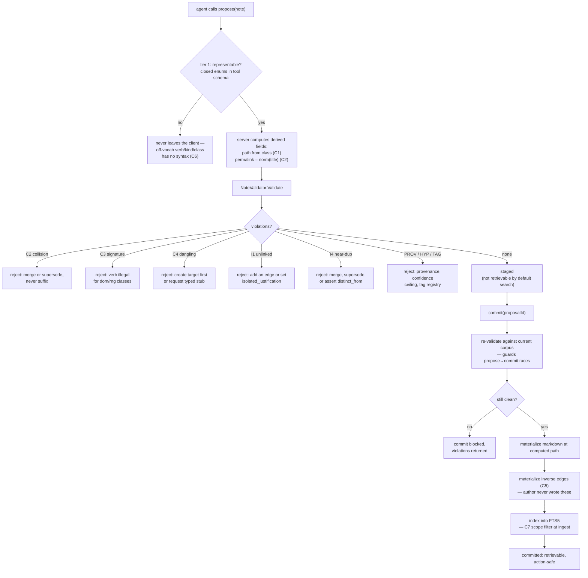

# Curation Tactics

## How team-kb Keeps a Knowledge Base Healthy Where master-kb Rotted

---

## 0. Why this paper exists

On 11 August 2026 two independent audits were run against `master-kb`, a knowledge base in continuous
agent-driven use for roughly four months. It was not abandoned — twenty-five notes had been touched in the
preceding thirty days — and its governance folder held thirty-five documents of carefully written rules:
`quality-gates.md`, `taxonomy.md`, `protocol-grammar.md`, `staleness-policy.md`, a self-healing runbook.

It was also, by measurement, barely a knowledge base. Across the 653-note legacy corpus, 35.2% of wikilinks
pointed at nothing and 53.8% of notes had no inbound link at all. A single note type had accumulated ~120
observation kinds and ~60 relation predicates. Four declared entity classes held exactly one note each —
their own index stub — while `concept/` held ninety.

The gap between the governance folder and the measured corpus is the subject of this paper. Every rule that
failed was written down clearly, by people who meant it. None were enforced by code. That distinction —
prose gate versus code gate — explains nearly the whole failure inventory and is the organizing doctrine of
the rebuilt system, `team-kb`.

What follows is a field manual: the rot patterns measured, the doctrine extracted, the eight gates
implemented as C# predicates, the write-path tactics that make defect classes unrepresentable rather than
discouraged, the curation loops handling what a write gate cannot, and the division of that labour across
the M4 specialist agents.

---

## 1. The anatomy of knowledge-base rot

Rot is not one disease. The audits separated six pathologies, each with its own mechanism and
countermeasure; the tactics in later sections map onto them one-for-one.

### 1.1 Duplication — the same idea, twice, forever

`master-kb` contained `concept/Agent Specialist- Color Theory.md` and
`concept/agent-specialist-color-theory.md`. Both were real notes. Both were written by agents that had, at
different times, decided a note about that topic did not exist. The same twin pattern recurred for
shadcn-theming, tailwind-bridge, ui-design, excellence-corpus, two-layer-design-token-architecture, and four
separate times inside `event/`.

The mechanism is worth naming. The store did not *ignore* the collision — it *resolved* it, appending a `-1`
suffix. The write succeeded; nothing was logged as wrong. A 2026-05-15 healing audit even recorded a
`SUPERSEDE` for one such pair; the losing note was never deleted. Conflict resolution that silently succeeds
is worse than one that fails: a failed write gets attention, a suffixed write gets a permanent second copy.

At the filename layer the legacy corpus showed **31 colliding basenames** — `readme` ten times, `index` six,
`tasks` four — and **378 of 653 files (57.9%)** title-cased with spaces against slugs for the rest. Two
identifier conventions in one store makes every lookup a coin flip.

### 1.2 Dangling links — a graph that was never a graph

Twelve wikilink targets were spot-checked in the first audit; six resolved. The formal re-audit measured the
whole legacy corpus: **862 of 2451 wikilinks (35.2%) unresolvable**.

The causes were mundane and all silent. Bare slugs without folder prefixes
(`hybrid-rag-architecture-sota-2025-2026`) never resolved even when the target existed. Links into
`agent-kb/operations/macos/` survived that subtree's dissolution on 2026-08-02 because the refile pass
rewrote paths but not inbound references. An incident cited `project/docker-deployment` as a `CAUSED ::`
target; no such note ever existed. Nothing in the write path ever asked "does this target exist?" A wikilink
was body text, and body text is never wrong.

### 1.3 Orphans — writes that connect to nothing

**351 of 653 notes (53.8%) had no inbound wikilink at all.** Every relation sampled was one-sided: an edge
A→B, no back-edge on B. The governance docs asked authors to maintain reciprocity by hand; across thousands
of writes, they did not. The audit's verdict is the sentence to remember: *the graph was never a graph, it
was a folder of documents with decorative links.* Half the corpus was unreachable by traversal, so retrieval
degraded to full-text search over a directory tree — to `grep`.

### 1.4 Ontology drift — closed vocabularies that were never closed

The declared vocabulary was fifteen entity classes, ~forty relation types, thirty-six observation kinds. The
measured vocabulary in a *single note type* was **≈120 observation kinds and ≈60 relation predicates**. The
head was healthy (`fact` at 32%); the tail was a wasteland of singletons: `host_binding`, `model_path`,
`ops_tool`, `tool_path`, `working-dir`, `agent-roster`, `dod`, `bail`. Three sub-pathologies fell out of the
same measurement:

- **Case-dialect twins.** `part_of` (41) / `PART_OF` (21); `preceded_by` (17) / `PRECEDED_BY` (1); `relates_to` (12) / `related_to` (5). Same semantics, two names, no way for a query to know.
- **Category confusion.** Relation verbs used as observation kinds — `relates-to` 13, `uses` 11, `implements` 9. Agents had stopped distinguishing edges from properties.
- **Markdown bleed into predicate names.** The parser accepted `` `RELATED_TO ``, `**Related**:`, `**produced_by**:`, `**delivered_by**:` as relations. Formatting characters became schema.

The v1 audit estimated "~14 invented kinds" — understating by an order of magnitude, a useful reminder that
sampling a rotting corpus flatters it.

### 1.5 Junk indexing — the store ate its own backups

`runbooks/` held **14 `.md.bak` files** against 38 real notes — 37% of that folder was backup artifacts
indexed as knowledge. `projects/PROJECT_MANIFEST.md.bak` sat beside the manifest.
`conflict-files-obsidian-git.md` — debris from an Obsidian Git merge conflict — was committed as a
root-level KB note carrying three frontmatter fields.

Note the asymmetry: the legacy corpus had **zero** junk files. Junk was a *current-kb* pathology, introduced
by the tooling generation meant to be better. Nothing in the indexer had an opinion on what a note is.

### 1.6 Phantom stores and hollow classes — declared, never real

`person/`, `organization/`, `goal/`, and `technology/` each held exactly one note: their own "Entity Class —
Index" stub, created 2026-05-08. The `goal/` stub's body literally reads that the folder was missing from
disk. Two taxonomy-declared folders, `relations/` and `_versions/`, did not exist at root at all.

Meanwhile the taxonomy grew a shadow copy of itself. `project/` (14 notes, 9 subdirs) coexisted with
`projects/` (33 subdirs), with **12 project identities in both**. `document/` shadowed `docs/`; `tool/`
shadowed `tools/`; `notes/` shadowed `observations/`. And `project/document/` — a class folder nested inside
an instance folder — showed path doing double duty as type and container, the structural signature of a
taxonomy nobody computes. Twenty-nine notes lived under directories literally named `C:\Users\me\.gemini\…`:
a Windows path materialized as a vault folder, because no layer ever asked whether that was a legal place
for a note to live.

### 1.7 The finding that reframed everything

The most important result in the second audit is one tool call. Running `schema_validate("note")` against
`master-kb` returned **"No schema found."**

basic-memory — the engine underneath `master-kb` — ships Picoschema and a `settings.validation: warn|error`
switch. A machine-checkable gate was in the product the entire time. Zero shape declarations were ever
written. This sharpens v1's root cause from *"gates were prose, never code"* to something more
uncomfortable: **the code gate shipped, and nobody declared a shape.** The failure was not missing
capability. It was the belief that writing a rule down constitutes enforcing it.

---

## 2. The central doctrine

> **A rule not enforced by code does not belong in governance docs.**

This sentence is in `_meta/constitution.md` and it is load-bearing. It is not a style preference; it is a
claim about probability.

### 2.1 Why prose gates fail statistically, not occasionally

A prose gate is a request to a writer, enforced by that writer's compliance. Suppose a rule is unusually
well written and an unusually attentive LLM writer complies 99% of the time — far better than anything the
audits measured. Compliance is not additive; it compounds. Over *n* independent writes, the probability the
corpus is still clean w.r.t. that one rule is 0.99ⁿ:

| Writes | P(zero violations) at 99% per-write compliance |
|---|---|
| 100 | 36.6% |
| 500 | 0.66% |
| 1 000 | 0.004% |
| 5 000 | ~10⁻²² |

`master-kb` accumulated 653 legacy notes and an estimated 600–900 current ones, each carrying multiple
rule-relevant decisions — a permalink, a type, relations, observation kinds. Independent compliance events
number in the tens of thousands. At *any* per-write rate below 1.0, expected violations at that scale are
large. The audits measured 862 dangling links and 351 orphans not because writers were careless but because
0.99²⁰⁰⁰⁰ is indistinguishable from zero.

A code gate has a different shape: enforcement probability 1.0 per write, and 1.0ⁿ = 1.0 for every n. The
rule does not decay with corpus size. That is the only known way to hold an invariant across a corpus that
grows without bound.

### 2.2 The three enforcement tiers

Not all code gates are equal, and team-kb deliberately uses three, in descending order of preference:

1. **Structurally unrepresentable.** The illegal value cannot be expressed at the API. An off-vocabulary predicate is not rejected — it cannot be typed. `Verb` is a C# enum surfacing directly in the MCP tool's JSON Schema, so the model *sees the legal values at call time* and has no syntax for anything else. This tier kills the ~60-predicate sprawl, the ~120-kind sprawl, the case twins, and the markdown-bleed predicates at once.
2. **Computed, never authored.** The value exists but no author supplies it. Folder paths are computed from class; inverse edges are materialized by the server. Whole classes of drift vanish because there is no input to drift.
3. **Validated at commit.** What remains representable and authored is checked by a predicate that can reject the write — `NoteValidator`, the smallest tier by design.

The instinct to cultivate: when writing a rule, ask which tier can enforce it and push as far up as it goes.
If it cannot reach tier 3 it is not a rule, it is a hope, and hopes go in the notes rather than the
constitution.

### 2.3 The corollary about vocabulary size

`master-kb` declared 36 observation kinds and 40 relation types — more than a writer, human or model, can
hold in working memory while composing a note. When the legal set exceeds what the writer can recall, the
writer invents. Invention is not defiance; it is the rational response to a vocabulary that cannot be
consulted at the moment of writing.

team-kb's ontology is an aggressive reset: **10 entity classes, 14 verbs, 12 observation kinds**, down from
15/40/36. Small enough to hold — and surfaced in the tool schema so it need not be held at all. The two
moves address the same failure from opposite directions.

---

## 3. The gate catalog: C1–C8

The constitution defines eight integrity constraints over the vault modelled as a typed property graph `G =
(V, E, τ, π, ω)`. Each maps to a measured defect, an implementation, and a test that replays the original
failure. This section walks them in order.

A note on reading the implementation column: gates marked *structural* are enforced at tier 1 or 2 — there
is no runtime check because there is no illegal input. Gates marked *validated* live in
`NoteValidator.Validate`, which returns a list of `GateViolation` records; a non-empty list means the
proposal is not accepted.

### C1 — Type closure

**Defect it kills:** `project/` vs `projects/`, `document/` vs `docs/`, `tool/` vs `tools/`,
`project/document/` nested class-inside-instance, and the 29 notes filed under `C:\Users\me\.gemini\…`.

**Constraint:** `∀v: τ(v) ∈ T`, and `folder(v) = path(τ(v))` is *derived*.

**Implementation** — `Ontology.PathFor`, tier 2 (computed):

```csharp
public static string PathFor(EntityClass c) => c switch
{
    EntityClass.Event => "episodes",
    _ => $"knowledge/{c.ToString().ToLowerInvariant()}",
};
```

The decisive fact is not this function but that `Note` has no path field: an author supplies a class from a
ten-member enum, and there is no parameter that could carry "put this in `projects/`".

**Test:** `Path_IsDerivedFromClass` commits an `Org` note, asserting the permalink starts `knowledge/org/`
and the file materialized at `knowledge/org/team-alpha.md`.

### C2 — Identity key

**Defect it kills:** the `-1` suffix resolution that created the color-theory twins and the 31 colliding
basenames.

**Constraint:** `permalink` is exclusive ∧ mandatory ∧ singleton (PG-Keys modes), with `permalink =
norm(title)`.

**Implementation** — normalization is deterministic, and collision is a hard stop:

```csharp
public static string NormalizeTitle(string title)
{
    var slug = new string(title.Trim().ToLowerInvariant()
        .Select(ch => char.IsLetterOrDigit(ch) ? ch : '-').ToArray());
    while (slug.Contains("--")) slug = slug.Replace("--", "-");
    return slug.Trim('-');
}
```

```csharp
if (index.PermalinkExists(note.Permalink))
    v.Add(new("C2", $"Permalink '{note.Permalink}' already exists. Merge or supersede — never suffix."));
```

The message does real work: it does not say "duplicate", it names the two legal resolutions. A gate that
rejects without offering the exit is a gate agents route around. Normalization also collapses the
title-case/slug split at the source — `Agent Specialist- Color Theory` and `agent-specialist-color-theory`
normalize identically, so the twin that took `master-kb` two writes takes team-kb one write and one
rejection.

**Test:** `ExactPermalinkCollision_Rejected` commits "Agent Specialist Color Theory", then proposes it again
and asserts `C2`.

### C3 — Edge signature

**Defect it kills:** OOPS pitfall P11, missing domain/range — predicates like `USES` applied to anything at
all, and the relation-verbs-as-observation-kinds category confusion.

**Constraint:** `∀(u,p,v) ∈ E: τ(u) = dom(p) ∧ τ(v) = rng(p)`.

**Implementation** — a signature table plus a two-sided check:

```csharp
Verb.Precedes => (new[] { EntityClass.Event }, new[] { EntityClass.Event }),
Verb.Causes   => (new[] { EntityClass.Event, EntityClass.Decision },
                  new[] { EntityClass.Event, EntityClass.Decision, EntityClass.Project }),
Verb.Owns     => (new[] { EntityClass.Person, EntityClass.Org, EntityClass.Agent }, null),
_             => (null, null), // PartOf, Supersedes, Contradicts, Mentions: unconstrained
```

```csharp
var (dom, rng) = Ontology.Signature(r.Verb);
if (dom is not null && !dom.Contains(note.Class))
    v.Add(new("C3", $"{r.Verb} not valid from class {note.Class} (dom: {string.Join('|', dom)})."));
if (rng is not null)
{
    var targetClass = index.ClassOf(r.TargetPermalink);
    if (targetClass is not null && !rng.Contains(targetClass.Value))
        v.Add(new("C3", $"{r.Verb} target '{r.TargetPermalink}' has class {targetClass} (rng: {string.Join('|', rng)})."));
}
```

`null` means unconstrained, and four verbs deliberately are. Over-constraining is its own failure mode: an
author who cannot express a true relation expresses a false one, or none. `MENTIONS` exists as the weak
always-legal edge so the strong edges can afford strictness.

**Test:** `EdgeSignatureViolation_Rejected` proposes a `Concept` with a `PRECEDES` edge to another `Concept`
— legal syntax, illegal semantics — and asserts `C3`.

### C4 — Referential integrity

**Defect it kills:** the 862 dangling wikilinks (35.2% of the legacy corpus).

**Constraint:** `∀(u,p,v) ∈ E: v ∈ V`. No dangling link, ever.

**Implementation** — resolution happens at write time, not at read time:

```csharp
foreach (var r in note.Relations)
    if (!index.PermalinkExists(r.TargetPermalink))
        v.Add(new("C4", $"Relation target '{r.TargetPermalink}' does not exist. Create it first or request an auto-stub."));
```

The change is architectural, not syntactic. In `master-kb` a wikilink was body text — an uninterpreted
string a renderer might resolve later. In team-kb a relation is a typed API argument with a resolved target,
so there is no moment at which an unresolvable reference exists in the store and therefore no accumulation.
The escape hatch matters as much as the gate: the offered auto-stub converts "I need to link to something
not yet written" from a violation into a two-step operation that leaves an open task behind.

**Test:** `DanglingRelationTarget_Rejected` proposes a relation to `knowledge/concept/does-not-exist` and
asserts `C4`.

### C5 — Inverse closure

**Defect it kills:** every sampled relation being one-sided; the 53.8% orphan rate as measured from the
inbound direction.

**Constraint:** `inv(p) = q ⟹ ((u,p,v) ∈ E ⟺ (v,q,u) ∈ E)`.

**Implementation** — tier 2, computed and materialized by the server:

```csharp
public static string InverseName(Verb v) => v switch
{
    Verb.IsA => "HAS_INSTANCE",      Verb.PartOf => "HAS_PART",
    Verb.DependsOn => "REQUIRED_BY", Verb.Causes => "CAUSED_BY",
    Verb.Precedes => "FOLLOWS",      Verb.Supersedes => "SUPERSEDED_BY",
    Verb.Contradicts => "CONTRADICTS", // symmetric
    ...
};
```

The plan records this as an explicit repeal: the old protocol grammar's invariant I-7 required *authored*
reciprocity, and **authored reciprocity is abolished**. Direction is stored once; backlinks are derived.
This kills `master-kb`'s largest breakage class not by asking authors to try harder but by removing the task
from them.

**Test:** `Backlinks_AreComputed` commits a target, commits a source with a `MENTIONS` edge to it, and
asserts `_store.Backlinks(target)` contains that source with `InverseVerb == "MENTIONED_BY"` — an edge
nobody wrote.

### C6 — Vocabulary closure

**Defect it kills:** ≈120 observation kinds, ≈60 predicates, case-dialect twins, markdown-bleed predicate
names.

**Constraint:** `∀(k,_) ∈ ω(v): k ∈ K`.

**Implementation** — tier 1, structurally unrepresentable:

```csharp
public enum ObsKind
{
    Fact, Hypothesis, Decision, Constraint, Preference, Lesson,
    Procedure, Risk, Question, Status, Contradiction, Deprecated,
}
```

These enums surface directly in the MCP tool JSON Schemas. There is no validation code for C6 because there
is nothing to validate: `part_of` and `PART_OF` are the same enum member, `` `RELATED_TO `` is not a member
at all, and an off-vocabulary value never leaves the client.

**Test:** none — the property is enforced by the type system, so a test would be testing the C# compiler.
What *is* tested is the adjacent registry gate: `UnregisteredTag_Rejected` asserts a free-form tag fails,
because tags are open-ended by nature and need a runtime registry rather than an enum.

### C7 — Scope

**Defect it kills:** ≥15 `.bak` and conflict artifacts indexed as notes, including the 14 in `runbooks/` and
`conflict-files-obsidian-git.md`.

**Constraint:** `v ∈ V ⟺ file(v)` is `.md` ∧ not a backup or conflict artifact.

**Implementation** — an indexer-level predicate, in code, not in a runbook:

```csharp
public static bool InScope(string fileName) =>
    fileName.EndsWith(".md", StringComparison.OrdinalIgnoreCase)
    && !System.Text.RegularExpressions.Regex.IsMatch(
        fileName, @"\.bak|conflict|~|\.orig", System.Text.RegularExpressions.RegexOptions.IgnoreCase);
```

The source comment above this method records why markers match *anywhere* in the name rather than at the end
— real artifacts carry them at either end (`x.md.bak`, `conflict-files-obsidian-git.md`, `y (conflicted
copy).md`). It exists because the first version was anchored and the test suite caught it. See §5.4.

**Test:** `ScopePredicate`, a `[Theory]` with five inline cases from real filenames: `note.md` in;
`note.md.bak`, `note.bak.md`, `conflict-files-obsidian-git.md`, `note.orig.md` out.

### C8 — Class non-vacuity

**Defect it kills:** `person/`, `organization/`, `goal/`, `technology/` holding one stub each while
`concept/` held 90 — the degree skew of a taxonomy declared but never inhabited.

**Constraint:** `∀t ∈ T: |τ⁻¹(t)| ≥ 2` or `t` is marked `deprecated`.

**Implementation:** the one gate that *cannot* live in the write path, because class vacuity is a property
of the corpus, not of any single write. It belongs to the nightly metrics job (`maintenance.md` §7), which
reports per-class cardinality, orphan ratio, component count, and degree Gini, auto-flagging any class with
n ≤ 1 as deprecated.

C8 demarcates the doctrine's boundary. "Enforce it in code" does not mean "enforce it at write time" — it
means *some executing process owns the rule*. A scheduled job that writes its report back into the vault is
code; a runbook describing the same check is not. `master-kb` had the runbook.

---

## 4. Write-path tactics

The gates are what the write path *checks*. How the write path is *shaped* matters at least as much.

### 4.1 Write ≠ commit: the staged proposal

The single most consequential structural decision is that a write is not a commit. The lifecycle, from the
constitution:

`propose(note) → validate(C1–C8, I1, I4) → staged → commit`

`VaultStore.Propose` runs the validator and, if clean, persists the note into a `staged` table with a
proposal ID. `VaultStore.Commit` re-reads the staged JSON, **re-runs validation**, and only then materializes
the file and its derived edges. A staged belief is not retrievable by default search.

Re-validation at commit is not redundancy. Between propose and commit the corpus can change — another agent
claims the permalink, or deletes the note this proposal links to. A gate evaluated only at propose time has
a race condition, and a KB written concurrently by multiple agents will find it.



The staging tier also gives contradiction handling somewhere to happen. A claim that conflicts with an
existing one does not have to be accepted or rejected at the instant of writing; it can sit staged while the
declared operator for its fact class resolves it (§5.1).

### 4.2 Near-duplicate detection: catching what exact matching misses

C2 catches exact permalink collisions. It does not catch "Agent Specialist- Color Theory" versus "agent
specialist color theory v2" — different normalizations, same idea. That is invariant **I4**, identity
discipline, and it needs similarity rather than equality:

```csharp
public const double TitleSimilarityTheta = 0.85;

foreach (var (permalink, title) in index.TitlesInClass(note.Class))
{
    if (permalink == note.Permalink) continue;
    if (TitleSimilarity(title, note.Title) > TitleSimilarityTheta)
        v.Add(new("I4", $"Title too similar to existing '{title}' ({permalink}). Merge, supersede, or assert distinct_from."));
}
```

`TitleSimilarity` is deliberately cheap — normalized trigram Jaccard over `NormalizeTitle` output, exact
match short-circuiting to 1.0. Two design notes. The scan is scoped to the *same entity class*, which is
semantically right (a `Project` "Atlas" and a `Concept` "Atlas" are not duplicates) and keeps an O(n) scan
affordable; the source carries a ponytail marker naming the swap — indexed similarity — if a class exceeds
ten thousand notes. And the three offered resolutions (merge, supersede, assert `distinct_from`) are exactly
the three things that can be true. `master-kb` offered a fourth, the `-1` suffix, which is none of them.

**Test:** `NearDuplicateTitle_TitleCaseVsSlug_Rejected` uses the literal master-kb twin as its fixture and
accepts either `I4` or `C2` as the rejecting gate.

### 4.3 Write-time link resolution

Covered as C4, but the tactic generalizes: **resolve at write, not at read.** Any lazily validated reference
accumulates breakage at the rate the corpus churns, because nothing forces the lazy check to run. The 862
dangling links were not created dangling — most were valid and *became* dangling when the 2026-08-02 refile
moved their targets, and nothing reads every link. The corollary runs in reverse for destructive operations:
before a move or delete, check inbound backlinks and blast radius. Because C5 materializes inverse edges,
that query is cheap and exact — the sense in which the gates compound.

### 4.4 Closed vocabularies in tool schemas, not in docs

The tactic that most directly repudiates `master-kb`'s governance folder: legal values for classes, verbs,
and observation kinds do not live in `ontology.md` for an agent to read and remember. They live in the C#
enums that generate the MCP tool's JSON Schema, so they are *in the model's context at the moment of the
call*. This matters because of where LLM writers actually fail — not at obeying rules they can see, but at
recalling rules read three thousand tokens ago under the pressure of a task about something else. A
vocabulary in a governance document is a memory test at the worst possible moment; a vocabulary in the tool
schema is a menu. `ontology.md` still exists and should — humans need the rationale, the migration shims,
the absorbed-from mappings — but it is documentation *of* the enum, not the definition. When they disagree,
the enum wins, because the enum is what runs.

---

## 5. Ongoing curation

Write gates prevent new defects. They do nothing about inherited ones, facts that were true when written and
are false now, or invariants that are properties of the whole graph. That is the curation loop, and
`maintenance.md` opens with the rule governing all of it: **every procedure is executed by scheduled tooling
— cron, hooks, CI — and each run writes its report back into the vault as an episode note.** That report is
the difference between a sweep and a runbook. `master-kb` had `_governance/playbooks/KB Self-Healing
Runbook.md` and a staleness policy promising attachment within seven days; neither ever ran, and nobody
could tell, because a procedure that produces no artifact produces no evidence of its absence.

### 5.1 Contradiction handling: typed operators, not ad-hoc judgment

When a new claim conflicts with a committed one, the resolution is determined by the **fact class**, not by
the writer's judgment:

| Fact class | Operator | Behavior |
|---|---|---|
| Decision / constraint | await-confirmation | staged; a human resolves; both claims visible |
| Benchmark / version / status | last-writer-wins | new claim commits, old gets `t_invalid` |
| Findings / lessons / facts | evidence-weighted | provenance-count + confidence merge; loser audited |
| Identity claims (who/what) | per-rule + I4 | merge-or-distinguish gate |

Two properties make this work. **The losing claim is always preserved** with `t_invalid` stamped in an audit
block — invalidate, never delete; combined with the bi-temporal record (`t_valid`, `t_invalid`, `t_created`,
`t_expired` on every edge and fact-bearing observation), "what did we believe as of T?" becomes a
first-class query rather than archaeology. And `SUPERSEDES` is a real typed verb in P with a computed
`SUPERSEDED_BY` inverse, while `CONTRADICTS` is system-writable only. `master-kb` recorded a `SUPERSEDE` in
a healing audit and left the superseded note in place, because supersession was narrative rather than an
operator with an effect. Here the operator does something.

### 5.2 The sweep cadences

`maintenance.md` defines the loops. Their most interesting property is how much of the sweeper's classic
workload the write gates have already eliminated:

- **Nightly consolidation** (Consolidator, sleep-time compute). Episodes since the last run are clustered and folded into playbooks as *append-only delta bullets* — never a wholesale rewrite, which is the ACE discipline for avoiding brevity bias and context collapse. Episodic→semantic promotions go through the same staged commit as any other write.
- **Weekly sweep** (Sweeper). Four of its five jobs are now verification rather than repair: staleness applies per-class half-life decay to effective confidence (`Concept` 365d, `Person`/`Org`/`Artifact` 180d, `Project`/`Agent` 90d, `Codebase`/`Technology` 60d, `Event`/`Decision` never — they are immutable); utility decay ages MemRL uses/wins/losses and queues dead weight for archive; **orphans are impossible to create under I1**, so the sweep handles only inherited and edge cases; **junk is unindexable under C7**, so the sweep verifies and reports; **broken links are impossible under C4**, so the sweep is belt-and-suspenders.
- **Retrieval-miss replay** (weekly, SAGE loop). Searches that returned `absent` or `low_confidence` but that a human later resolved become a repair batch — missing links, missing aliases, extraction fixes. This is the only loop that learns from what the KB *failed* to answer, which makes it the only one that can find gaps rather than defects.
- **Usage reweighting** (continuous). Retrievals that helped bump edge weight and note utility, feeding personalized-PageRank ranking, hub selection, and decay.
- **Quarterly schema re-induction** (Ontologist). Induce a schema from the corpus, diff it against T/P/K, emit KGCL evolution proposals with reverse patches. **Never auto-applied** — invariant I3 requires a human gate on any vocabulary change.
- **Hub regeneration** (weekly, Librarian). Community detection over the link graph rebuilds `hubs/`; the report carries class cardinality (C8), degree Gini (the bulk-load signature), and component count.
- **Session hooks.** `sessionStart` primes with a constitution digest; `postWrite` auto-reindexes; `preCompact` snapshots the session into an episode note; CI runs shapes validation and the I2 non-regression gate.

Two invariants tie the loops to the doctrine. **I1** requires `orphans(G_{t+1}) ≤ orphans(G_t)` —
connectivity is monotone. **I2** requires `violations(G_{t+1}) ≤ violations(G_t)` over the shapes graph,
enforced in CI. Neither says "the corpus is clean." Both say "the corpus does not get worse," which is a
claim you can actually enforce against an inherited mess.

### 5.3 Anchor protection

One rule protects curation from itself. `_meta/**` and any note tagged `status/anchor` are **exempt from
automated consolidation edits** — the FadeMem identity-drift guard. A consolidator that can rewrite the
constitution can rewrite the definition of correctness; a system that decays its own axioms is worse than
one with no consolidation. Only humans and KGCL-gated evolution ops touch those files.

### 5.4 Defect-replay testing as the acceptance discipline

The acceptance suite for M0 is not a set of unit tests written from the specification. It is the post-mortem
inventory, replayed. `GateTests` documents itself in exactly those terms: *each of the master-kb post-mortem
failure classes, replayed against the new write path. Every test asserts the defect is REJECTED (or
unrepresentable). Fixtures mirror real defects found in the 2026-08-11 audit.*

The fixtures are literal: the near-duplicate test uses "Agent Specialist- Color Theory" because that note
exists; the scope test uses `conflict-files-obsidian-git.md` because that file was committed to a real KB.
Tests are indexed by countermeasure number in their comments (`// #1 gates-were-prose`, `// #2 free-text
wikilinks`, `// #5 no dedup on create`), so measured failure → enforced gate → passing test is traceable.

**This paid out immediately.** On the first cross-platform bring-up run, the suite caught **two genuine
bugs** — not regressions in hypothetical code, but real defects in the freshly written implementation:

1. **The scope-regex anchor.** The first C7 predicate anchored its junk markers to the end of the filename. It correctly rejected `note.md.bak` and correctly accepted `note.md` — and silently admitted `note.bak.md` and `conflict-files-obsidian-git.md`, which is to say, it admitted the *exact file that was found in master-kb*. The `[Theory]` case list, drawn from real filenames rather than imagined ones, failed on the case that mattered. The fix made the markers unanchored, and the reasoning is now a source comment so the next person does not "tidy" it back.
2. **FTS5 token quoting.** SQLite's FTS5 treats `-`, `:`, and similar characters as query syntax — a search for `a-b` is parsed as a column filter, not a phrase. Hyphenated queries silently returned wrong results rather than erroring. Since every permalink in this system is kebab-case by construction (C2), this was a defect on the primary search path. The fix quotes each token; `VaultStore.Search` carries the explanation inline.

A third defect class surfaced in the same bring-up but sits outside the replay suite: Windows SQLite file
locking during pool teardown, plus AppleDouble pollution and shell-quoting corruption. That is a *platform*
bug class, not a *defect-replay* one, and its recorded insight is separate — budget one bring-up pass per
platform, and never claim "verified" from source-reading alone.

The lesson, recorded in `INSTRUCTIONAL_INSIGHTS.md`: **grow tests from the defect inventory, not from
imagination.** Imagined tests confirm code does what its author thought; replayed defects confirm it does
what the corpus needs.

---

## 6. Curation roles: who owns which tactic

M0–M3 deliver the write path and its gates as library and MCP server code. M4 delivers the specialist
agents — Microsoft Agent Framework (MAF) agents exposed as MCP tools — that own the loops a write gate
cannot. The planned allocation:

| Agent | Owns | Tactics from this paper | Enforces |
|---|---|---|---|
| **Curator** | The gatekeeper. Every staged write passes through it. | §4.1 propose/commit, §4.2 near-duplicate detection, §4.3 write-time resolution, promotion between tiers | C2, C3, C4, I1, I4, provenance, hypothesis ceiling, tag registry |
| **Ontologist** | Schema induction and governed evolution. | §4.4 closed vocabularies; quarterly re-induction, KGCL ops with reverse patches, human-gated diffs | C1, C6, C8; invariant I3 |
| **Sweeper** | Scheduled hygiene. Writes its report back as an episode note. | §5.2 staleness decay, utility decay, orphan queue, junk verification, broken-link belt-and-suspenders | C7, C8, I1 verification |
| **Contradiction-Resolver** | Conflicting claims at commit. | §5.1 typed operators per fact class, bi-temporal invalidation, audit-block preservation | `CONTRADICTS` (system-writable), `SUPERSEDES` DAG |
| **Consolidator** | Sleep-time episodic→semantic promotion. | §5.2 nightly ACE delta bullets; append-only, never wholesale rewrite | §5.3 anchor protection is a hard boundary on its edit scope |
| **Librarian** | Hub and community structure. | §5.2 weekly hub regeneration; class cardinality, degree Gini, component count | C8 reporting |
| **Code-Cartographer** | The jcodemunch mirror: indexes team codebases, links code symbols to knowledge notes. | Keeps `Codebase` and `Technology` classes non-vacuous with real, current content | C8 by population rather than by flag |

Two boundaries in that table encode post-mortem lessons. **The Ontologist proposes; it never applies** —
I3 requires T, P, K to change only through KGCL ops with a reverse patch and a human gate. `master-kb`
reached ~120 observation kinds through individually reasonable local extensions, none reviewed as a schema
change; an agent authorized to extend vocabulary autonomously rebuilds that outcome no matter how carefully
it is prompted. **The Consolidator is the most powerful agent and gets the tightest leash** — it rewrites
notes by design, and §5.3 anchor protection is what keeps that power off `_meta/**` and `status/anchor`.
The agent that improves the knowledge base must not be able to edit the definition of improvement.

---

## 7. What to take away

1. **Measure before you rebuild.** The two audits are the reason team-kb's gate list is eight items and not thirty. Every gate exists because a specific defect was counted. The v1 audit's "~14 invented kinds" versus the v2 audit's ~120 shows that sampling a rotting corpus flatters it — census where you can.
2. **Prose gates fail statistically, not occasionally.** At any per-write compliance below 1.0, violations are certain at corpus scale. 0.99¹⁰⁰⁰ ≈ 0.004%. This is arithmetic, not pessimism about writers.
3. **Push every rule to the highest enforcement tier it will reach.** Unrepresentable beats computed beats validated beats documented. Most of team-kb's constitution never reaches the validator, and that is the design working.
4. **Make the vocabulary small enough to hold and then put it in the tool schema anyway.** 10 classes, 14 verbs, 12 kinds, all visible at call time. Writers invent when they cannot recall.
5. **Resolve at write, not at read.** Links, identity, signatures. A lazy check is a check that never runs.
6. **Compute what you would otherwise ask authors to maintain.** Paths from class, inverses from direction. Authored reciprocity is abolished, and with it the largest single breakage class in the old KB.
7. **A scheduled job that writes a report is code; a runbook is not.** `master-kb` had the self-healing runbook, the staleness policy, and the seven-day attach promise. None of them ran, and nothing recorded that they hadn't.
8. **Replay real defects as your acceptance suite.** Two genuine bugs on first run — the unanchored scope regex and FTS5 hyphen quoting — both caught by fixtures drawn from files that actually existed in a real KB.
9. **Guard the guards.** Anchor protection and the human gate on schema evolution exist because a self-improving system that can edit its own axioms will drift faster than one that cannot improve at all.

The audits' closing line is the right one to end on. A rewrite that puts T, P, and K into tool-schema enums
and computes inverses and paths server-side makes most of the failure inventory **structurally
unrepresentable rather than merely discouraged**. That is the whole difference between a governance folder
and a knowledge base that stays healthy.
