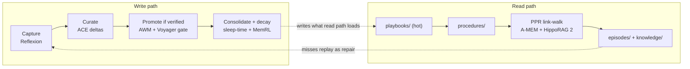
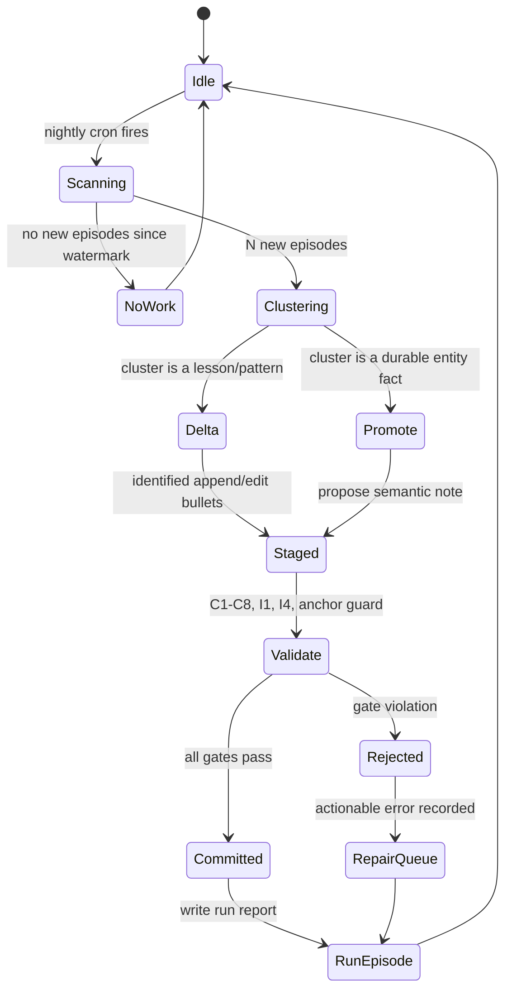
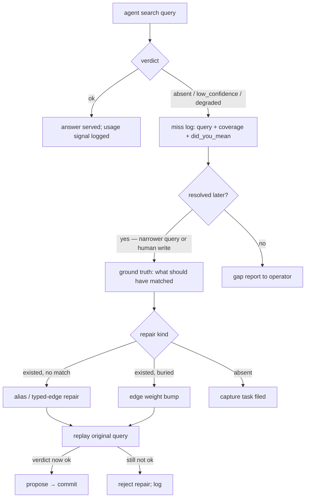
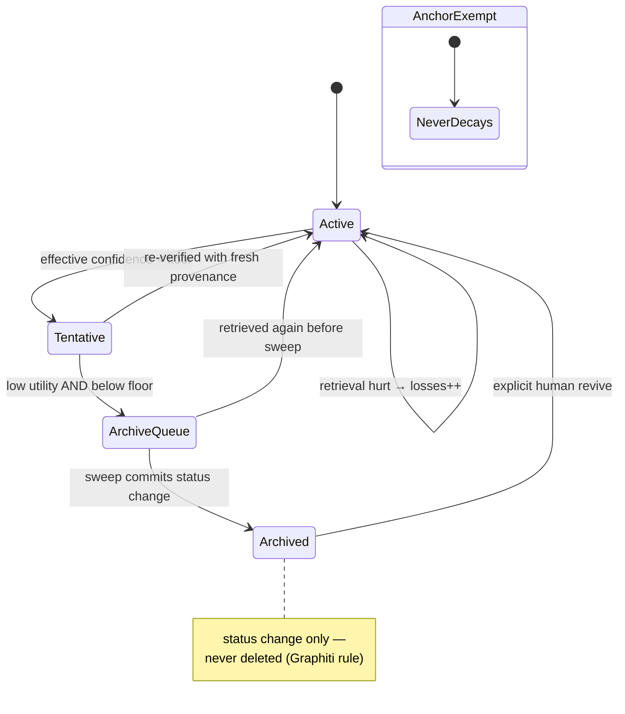
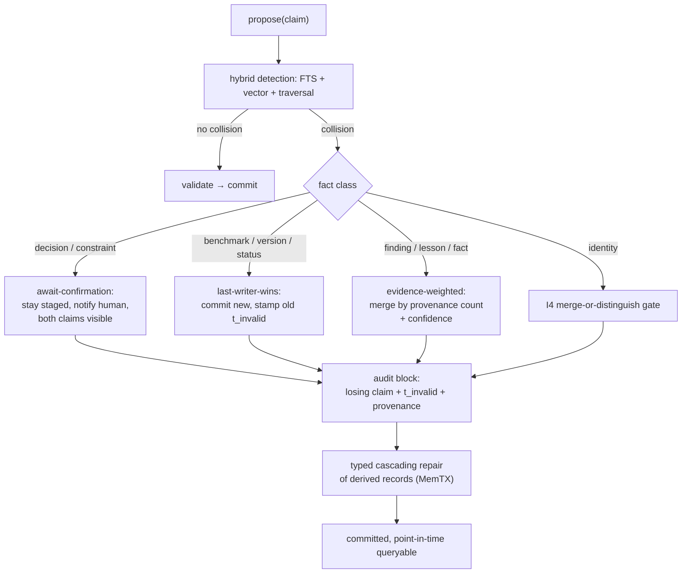
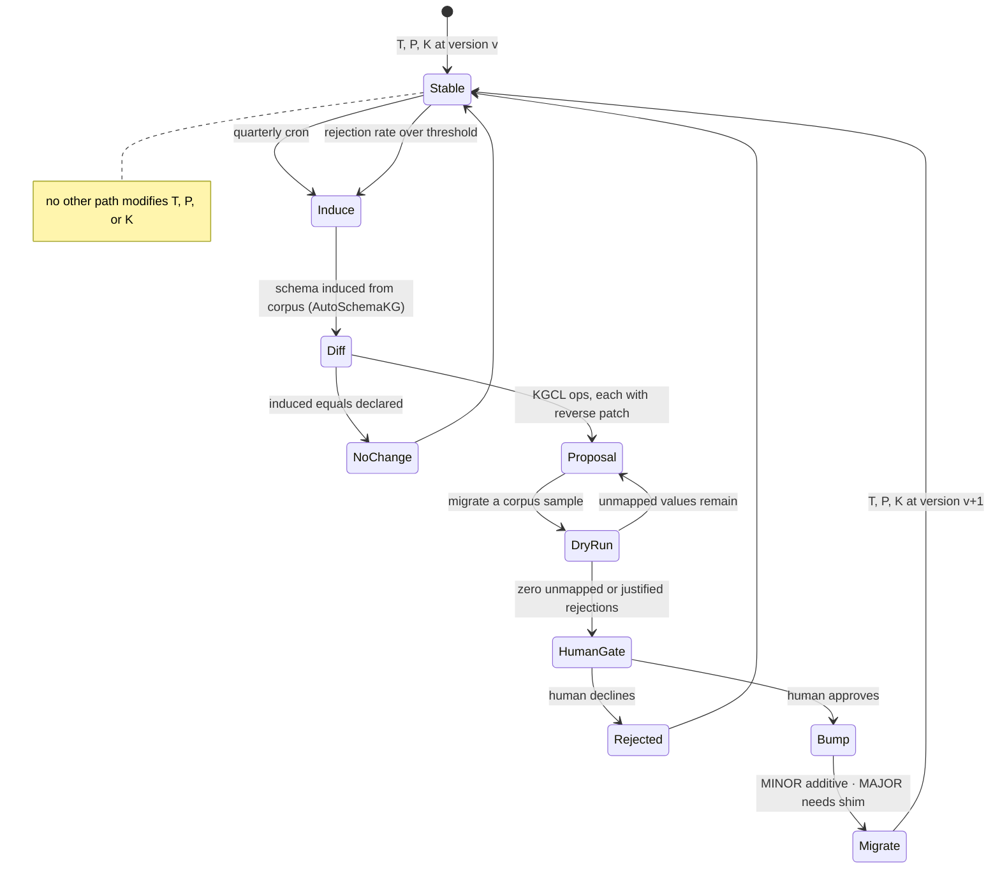
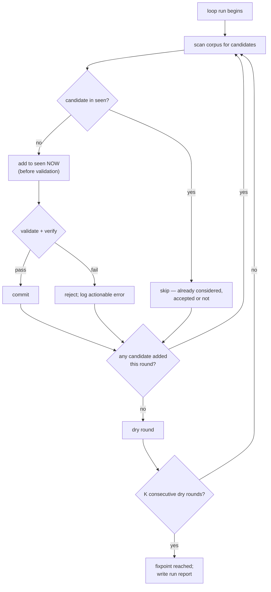

# Self-Learning and Self-Evolution Loops in team-kb

## 1. Purpose and scope

This paper explains how team-kb improves itself over time without anyone retraining a model, and — equally important — what limits are placed on that improvement so the vault cannot quietly corrode into something the team no longer recognises.

"Self-evolving knowledge base" invites two opposite misreadings. The optimistic one imagines a system reasoning its way to better structure unaided. The pessimistic one imagines an agent rewriting its own rules until nothing is verifiable. team-kb is neither. It is a typed property graph over markdown files, with a small number of *named, bounded, scheduled loops* that read what the vault already contains, propose changes through exactly the same gated write path a human uses, and record everything they did. Learning here means artifacts accumulate: an episode becomes a lesson, a lesson recurring three times becomes a verified procedure, a retrieval that failed becomes a repair task. No weights move. Every improvement is a file you can read, diff, and revert.

Sections 2 and 3 ground the design in the surveyed literature. Section 4 specifies the five loops team-kb actually runs. Section 5 covers the safety rails, Section 6 scheduling and convergence, Section 7 the M3/M4 implementation mapping.

All citations are carried over from the two research dossiers dated 2026-08-11. Preprints with 26xx arXiv identifiers are fresh and should be treated as promising rather than settled; the dossiers flag this and this paper inherits the caveat.

## 2. Survey grounding: the loop patterns the field converged on

### 2.1 The canonical five-stage loop

Across the agentic self-improvement literature the same skeleton recurs under different names: **experience → observation → codification → integration → verification.** An agent does something; something notices what happened and what it implies; the observation is written down in a durable retrievable form; the artifact is merged into the existing body of knowledge rather than dumped beside it; and the merged result is checked before it is trusted.

Naming the stages is useful because most published failures are a *missing stage*, not a bad idea. Skip codification and agents learn only within a session. Skip integration and you accumulate near-duplicates. Skip verification and plausible nonsense enters permanent memory. team-kb therefore treats every loop as an instance of this skeleton, and requires each to name its verification step.

### 2.2 Reflection loops

**Reflexion** (arXiv 2303.11366) established the cheapest, highest-signal-per-token mechanism in the field: a task fails, the agent writes a verbal critique of its own trajectory, the critique enters an episodic buffer and is prepended to the next attempt. Reported HumanEval pass@1 of 91% against an 80% baseline. The 2026 descendant **FORGE** (arXiv 2605.16233) sharpens the output by converting failed trajectories into *typed* artifacts — Rules, Examples, or Mixed — broadcast across an agent population. The typing matters: "always check the migration is idempotent" is a rule, "here is the exact ALTER TABLE that broke staging" is an example, and conflating them makes both less useful.

**ExpeL** (arXiv 2308.10144) generalises reflection across tasks rather than within one: pool successes and failures, abstract them into natural-language insights, and at test time retrieve *two channels* — similar past trajectories plus the abstracted guidelines. The durable idea is the dual channel; cases and rules answer different questions and should not share a retrieval slot. A companion case-based-reasoning review (arXiv 2504.06943) frames the same shape as retrieve/reuse/revise/retain.

### 2.3 Curated context and anti-collapse

**ACE — Agentic Context Engineering** (arXiv 2510.04618, ICLR 2026) is the most directly applicable result for a markdown KB. A Generator runs the task, a Reflector diffs trajectory against outcome, and a Curator emits *delta bullets* — append or edit operations carrying stable identifiers — into a structured playbook, with a grow-and-refine step deduplicating. Reported gains: +10.6% on agent benchmarks, +8.6% on finance, ReAct+ACE matching IBM CUGA on AppWorld using DeepSeek-V3.1.

ACE matters more for its diagnosis than its numbers. **Brevity bias** is the drift toward ever-shorter summaries because each regeneration compresses a little more. **Context collapse** is the endpoint: a playbook that held forty concrete specifics now holds six vague platitudes, and nobody noticed because each rewrite looked reasonable. The countermeasure is structural, not stylistic — *never regenerate a note wholesale.* Emit deltas with IDs. team-kb adopts this as a hard rule on consolidation.

**Dynamic Cheatsheet** (arXiv 2504.07952, EACL 2026) is the lighter cousin: after each problem the model rewrites a persistent cheatsheet of strategies and snippets, DC-RS retrieving similar past items first. Reported GPT-4o Game-of-24 went 10% → 99%; Claude 3.5 Sonnet more than doubled on AIME. **Buffer of Thoughts** (NeurIPS 2024) generalises the store into reusable thought templates. The lesson for a large KB: a *hot, short, per-domain* note is a different artifact from the deep archive and must be maintained separately.

### 2.4 Procedural promotion behind a verification gate

**AWM — Agent Workflow Memory** (arXiv 2409.07429, ICML 2025) mines repeated action subsequences from successful trajectories, induces named parameterised workflows, and injects relevant ones into later tasks where they compose on earlier ones. Reported relative gains: +24.6% Mind2Web, +51.1% WebArena, with fewer steps — and the margin *widened* as the train/test gap grew. **Memp** (arXiv 2508.06433) adds the missing third verb: Build / Retrieve / **Update**. Procedural memory never updated rots.

**Voyager** (arXiv 2305.16291) supplies the gate. A curriculum proposes a task, the agent writes executable code, and the code must pass *environment verification* before entering the skill library, where it is indexed by embedded docstring for later retrieval and composition — 3.3× more items, 15.3× faster tech-tree traversal, zero-shot transfer to new worlds. The transferable rule is blunt: **artifacts must pass a test before entering the KB.** team-kb's `verified: true` frontmatter flag exists for this, and the curator refuses promotion without it.

### 2.5 Retrieval-augmented self-improvement and graph memory

Retrieval is not a passive read in the 2026 literature; it is a signal source.

**HippoRAG 2** (arXiv 2502.14802, ICML 2025) extracts triples into a dual-node graph of passages and phrases, seeds Personalized PageRank from the query, and filters irrelevant triples online — +7 F1 on associative and multi-hop retrieval over the best embedding retriever, with fewer tokens, framed explicitly as *non-parametric continual learning*. **A-MEM** (arXiv 2502.12110, NeurIPS 2025) is the Zettelkasten formulation: each memory becomes a structured note, the agent links it to relevant historical notes, and — the unique mechanism — *linking retro-updates the attributes of the notes linked to.* Writing a new note improves old ones. For an Obsidian-shaped vault this is nearly literal guidance: on every write, link, then revise what you linked to.

**SAGE** (arXiv 2605.12061, NeurIPS 2026) closes the loop in the other direction: a memory *writer* builds graph memory from interaction history, and a graph-foundation-model *reader* feeds retrieval outcomes back as training signal to the writer, attacking the failure mode where GraphRAG treats the graph as static retrieval middleware. The mechanism to steal is implementable without the foundation model — log which notes retrieval *should* have surfaced, replay the misses as extraction and linking repair. **Cognee/memify** is the cheapest version of the same principle: rated responses feed back into edge weights, stale nodes are pruned, links are reweighted by usage. **HAGE** (arXiv 2605.09942) trains edge features by policy gradient over four orthogonal relation views (Semantic, Temporal, Causal, Entity); the dossier recommends adopting the four-view *typing* without the reinforcement learning, since a team-KB fact is rarely just "related" — it is caused-by, superseded-by, co-occurred-with, or about-the-same-entity.

### 2.6 Consolidation, utility, and guarded decay

**Sleep-time compute** (arXiv 2504.13171; Letta) runs a background agent during idle periods that re-reads raw episodic traces, clusters them, promotes repeated episodes to durable semantic facts, re-summarises entities, and drops the raw trace, cutting online latency and token cost. **EverMemOS** (arXiv 2601.02163) stages the same pipeline as MemCell → MemScene → reconstructive recall. The dossier's verdict: this scheduler is what makes every other loop durable rather than one-shot.

**MemRL** (arXiv 2601.03192) attaches learned *utility scores* to retrieved memories, updated from outcome feedback, with two-phase retrieval filtering noise and usage-based decay (roughly 1.5× boost for recent use falling to 0.3× for unused) evicting dead weight — targeting the stability–plasticity trade-off directly. Generative Agents' recency × importance × relevance score (arXiv 2304.03442) is the hand-tuned ancestor; **Evo-Memory** (arXiv 2511.20857) is the streaming benchmark for measuring any of it.

**FadeMem** (arXiv 2601.18642) applies differential decay per memory, modulated by semantic relevance × access frequency × temporal pattern. Its companion, *Episodic-to-Semantic Consolidation Without Identity Drift* (arXiv 2607.01988), contributes the single most important guard rail in this paper: an explicit prohibition on consolidation mutating the notes that define who or what the system is. Decay is necessary; unguarded decay is how a KB forgets its own constitution.

### 2.7 Schema evolution in self-evolving KG systems

The last pattern concerns the vocabulary itself. **AutoSchemaKG** (arXiv 2505.23628, ACL 2026) shows an LLM can extract triples and *induce the schema simultaneously* via conceptualisation, clustering, and semantic alignment — 92% semantic alignment with human-crafted schemas at 900M+ nodes, zero manual intervention, events first-class. The recommendation drawn in the dossier is deliberately conservative: do not pre-declare the ontology from imagination, but do not let it drift. Induce it from the corpus, freeze the top-N concepts as the closed frontmatter vocabulary, re-induce quarterly behind a human gate.

Three results constrain how that vocabulary changes. **Graphiti/Zep** (arXiv 2501.13956) establishes the bi-temporal four-timestamp edge — `t_valid`/`t_invalid` (world time), `t_created`/`t_expired` (ingest time) — with the rule *invalidate, never delete*: a contradicted edge is stamped and stays. **TOKI** (arXiv 2606.06240) reframes contradiction resolution as write-time concurrency control, typing the four production heuristics (last-writer-wins, evidence-weighted merge, await-confirmation, per-rule policy) as a family of bitemporal operators, each with a declared isolation precondition and a provenance annotation preserving the losing fact in an audit row. **TGMS** and **MemTX** (arXiv 2607.10265 / 2607.23929) add the staged-belief lifecycle: writes land in snapshot-isolated transactions, beliefs mature from tentative to action-safe, and retraction triggers typed cascading repair.

The converged core, in ten words: bi-temporal, invalidate-never-delete, write ≠ commit, schema induced but human-gated, retrieval feedback rewrites the graph.

## 3. From survey to architecture

team-kb composes five of these into one stack, with write and read paths running in opposite directions through the same tiers.



The tiers are the folders in `_meta/memory-model.md`: `inbox/` as working memory excluded from default retrieval, `episodes/` as append-only episodic record, `knowledge/` as curator-gated semantic memory, `playbooks/` and `procedures/` as hot and cold procedural memory, `hubs/` as regenerated hierarchical entry points, `_meta/` as anchor-protected governance. Tier equals retrieval scope equals decay policy; that identity is what makes the loops specifiable at all.

## 4. team-kb's five loops, specified

Each loop is given as trigger, input, transform, output, verification, and the failure mode it exists to prevent. All five write through `propose → validate → staged → commit`; none has a private write path.

### 4.1 Loop A — Consolidation daemon (episodic → semantic distillation)

**Trigger.** Nightly cron, plus manual invocation. Idle-time by design: the work is expensive and nobody is waiting on it.

**Input.** All `episodes/` notes created since the last successful run, selected by `t_created` rather than file mtime, so a re-index cannot resurrect already-consolidated episodes.

**Transform.** Three stages. Cluster the episode set by entity overlap and embedding similarity. For each cluster emit **ACE delta bullets** — small, identified append-or-edit operations — against the relevant domain playbook. Where a cluster asserts a durable fact about an entity rather than a lesson about a task, propose an episodic→semantic promotion into `knowledge/` carrying the source episodes as provenance.

The prohibition matters as much as the procedure: the consolidator **may not regenerate a playbook.** It may append a bullet or edit a specific identified bullet. This is the ACE anti-collapse rule, and it is enforced by the tool surface — the consolidator is given a `PlaybookDelta` tool, not a `WriteNote` tool, so whole-note replacement is not expressible.

**Output.** Delta bullets in `playbooks/`, staged semantic promotions in `knowledge/`, and one episode note recording the run: which episodes were read, which clusters formed, which deltas were emitted, what was rejected and why.

**Verification.** Constraints C1–C8 and invariants I1/I4 at commit; a non-regression check that playbook bullet count did not *decrease* except via an explicit justified merge delta; and the anchor exemption — `_meta/**` and `status/anchor` notes are untouchable by this loop.

**Prevents.** Episodic sprawl (thousands of session logs nobody reads) on one side, context collapse (playbooks compressed to platitudes) on the other. The two failures pull in opposite directions, which is why the loop needs both a promotion mechanism and a no-wholesale-rewrite rule.



### 4.2 Loop B — Retrieval-miss replay (failed lookups become curation work)

**Trigger.** Event-driven accumulation, weekly batch processing. Every search through `teamkb-mcp` returns a verdict — `ok`, `low_confidence`, `absent`, `degraded` — and every non-`ok` verdict is logged with its query, coverage report, and `did_you_mean` candidates.

**Input.** The miss log, joined against what happened next. A miss followed by a successful narrower query, or by a human writing the missing note, is a *resolved* miss carrying ground truth for what should have been returned. A miss never resolved is a genuine knowledge gap.

**Transform.** Resolved misses become repairs of three kinds. A miss where the right note existed but did not match becomes an **alias or typed-edge repair**. A miss where the right note existed but was buried becomes a **weighting repair** — the edge along the path that should have been traversed gets its weight bumped. A miss with no right note becomes a **capture task** filed for a human or specialist agent. Unresolved misses are aggregated into a gap report rather than guessed at.

**Verification.** Each repair is replayed against the original failing query before commit: if applying it does not turn `absent` into `ok`, the repair is wrong and is rejected. This is the loop's own test, and it is what separates repair from speculation.

**Prevents.** The SAGE failure mode — a graph treated as static middleware, where retrieval quality never informs extraction quality. Without this loop, retrieval performance is fixed at whatever the original ingestion happened to produce.



### 4.3 Loop C — Decay and utility maintenance (scoring and demotion)

**Trigger.** Continuous for the cheap half, weekly for the expensive half. Utility counters update on every retrieval; the sweep acting on them runs weekly.

**Input.** Per-note utility frontmatter maintained by the server and never by an author — `uses`, `wins`, `losses`, `last_used` — plus per-class half-life parameters and the note's declared `confidence`.

**Transform.** Two scores, deliberately separate. **Effective confidence** decays exponentially from asserted confidence at a per-class half-life: a benchmark number ages fast, a design decision slowly, a definition barely at all. Below the confidence floor a note is demoted to `tentative` — a visible status change, not a deletion. **Utility** follows the MemRL shape: recent successful use boosts, prolonged non-use decays toward a floor, losses count against. Dead-weight notes — low utility, low effective confidence, not anchor-protected — enter an archive queue, and archiving is again a status change. Nothing is deleted, ever.

Edge weights participate in the same economy via the Cognee mechanism: a retrieval that helped strengthens the edges along the path it traversed, unreinforced edges decay. Those weights feed the PPR link-walk and hub ranking, so utility feedback reaches retrieval quality with no separate machinery.

**Verification.** Invariant I2 as a non-regression gate — shape violations must not increase. Invariant I1 as an orphan gate — demotion and archiving must not create orphans, so archiving a hub-adjacent note requires re-linking its neighbours first. And the FadeMem drift guard: `_meta/**` and `status/anchor` notes are exempt from decay entirely.

**Prevents.** Two symmetric failures. Without decay the vault becomes a landfill where a 2024 benchmark is retrieved as confidently as yesterday's measurement — the plasticity failure. With unguarded decay the constitution itself ages out — the stability failure. The exemption list is the whole difference.



### 4.4 Loop D — Contradiction resolution (detection triggers typed operators)

**Trigger.** Write-time, always. This is the loop that is *not* a background job. Following TOKI, contradiction handling is write-time concurrency control, not a retrieval-time reconciliation hack — because a contradiction discovered at read time has already been served to someone as truth.

**Input.** A staged claim plus the existing claims it collides with, found by the same hybrid search the read path uses (full-text, vector, traversal), so detection recall equals retrieval recall.

**Transform.** The fact class selects the operator. This mapping is declared in `_meta/maintenance.md` and is not a per-write judgement call:

| Fact class | Operator | Behaviour |
|---|---|---|
| Decision / constraint | await-confirmation | claim stays staged; a human resolves; both claims visible meanwhile |
| Benchmark / version / status | last-writer-wins | new claim commits; prior claim stamped `t_invalid` |
| Findings / lessons / facts | evidence-weighted | provenance count and confidence merge; loser audited |
| Identity claims (who / what) | per-rule + I4 | merge-or-distinguish gate; no `-1` suffix escape |

In every branch the losing claim is preserved in an audit block with `t_invalid` stamped. The bi-temporal record keeps "what did we believe as of T?" answerable after resolution, which is what makes an incorrect resolution recoverable rather than catastrophic.

**Verification.** The operator's declared isolation precondition must hold before it runs — an await-confirmation fact cannot be resolved by an automated pass, full stop. And retraction cascades: per MemTX, invalidating a claim triggers typed repair of records derived from it, rather than leaving derived notes silently orphaned from their premise.

**Prevents.** The failure the dossier names as hand-waving — "the agent updates the note." An agent merging contradictions by unspecified judgement produces a vault where nobody can reconstruct why a fact changed, and where a wrong merge is indistinguishable from a right one.



### 4.5 Loop E — Ontology evolution (how the closed vocabulary itself changes)

The previous four loops move facts within a fixed vocabulary. This one changes the vocabulary, and it most needs constraining, because it is the only loop whose output changes what the *gates* accept.

**Trigger.** Quarterly by schedule, plus an out-of-band trigger when the rejection rate for a specific type or predicate crosses a threshold — a vocabulary rejecting many legitimate writes is a vocabulary missing a concept, and that signal should not wait a quarter.

**Input.** The full corpus, the write-gate rejection log, and the current `T` (10 node types), `P` (14 predicates with signatures and partial involution), and `K` (12 observation kinds) as declared in the constitution and `ontology.md`.

**Transform.** Induce a schema from the corpus in the AutoSchemaKG manner — conceptualise, cluster, semantically align — then **diff** it against the declared one. The diff is expressed as KGCL operations, each carrying a reverse patch. A proposed new node type; a predicate whose observed signature is narrower than its declared one; an observation kind used twice in six months and so a deprecation candidate: each becomes an explicit reversible operation, never an edit.

**The absolute rule.** `T`, `P`, and `K` change only via KGCL operations carrying a reverse patch (invariant I3), and any such change is a **version bump with a migration shim**. MINOR adds; MAJOR removes or retypes and requires human approval plus a shim mapping every old value forward. The evolution tool refuses ad-hoc vocabulary. There is no code path by which an agent adds a node type to `T` at write time to make its own write pass — the single most important negative capability in the system.

**Verification.** Run the proposed migration over a sample of the corpus and require zero unmapped values, or an explicit rejection list justifying each unmapped one. Then the human gate. Never auto-applied.

**Prevents.** Exactly what the prior master-kb suffered: vocabulary non-compliance at 345 of 598 notes at the v0.2 audit, 36 overlapping observation kinds, 40 relation types no agent could hold in working memory. Sprawl is what happens when vocabulary grows by accretion instead of by versioned migration.



## 5. Safety rails

### 5.1 One write path, no exceptions

Every loop above is, from the vault's point of view, just another writer. The consolidation daemon, the sweeper, the contradiction resolver, a human editing by hand, and an agent capturing a session all go through `propose(note) → validate(C1–C8, I1, I4) → staged → commit`.

A staged belief is not retrievable by default search. This is the TGMS/MemTX pattern, and its value is that a loop cannot pollute the read path merely by running: a bad delta sits staged and rejected with an actionable error rather than becoming something an agent retrieves tomorrow as fact.

The principle underneath is stated plainly in the constitution — *a rule that is not enforced by code does not belong in this file.* The deepest lesson of the master-kb post-mortem is that the machine gate existed and no shape was ever declared, so the gate never fired. Prose gates are not gates. Consequently the loops are constrained not by instructions in their prompts but by the shape of the tools they are given: the consolidator cannot rewrite a note wholesale because no tool in its surface expresses that operation.

### 5.2 Non-regression discipline

Self-improvement claims are only meaningful against a monotonicity requirement. Four invariants govern the transition from state `t` to `t+1`:

- **I1** — orphan count does not increase; every write connects with ≥1 resolvable edge or carries an explicit `isolated_justification`.
- **I2** — shape-violation count does not increase, enforced as a CI gate on the vault repository.
- **I3** — `T`, `P`, `K` change only via KGCL operations carrying a reverse patch.
- **I4** — no two notes share a type and title similarity above threshold without an explicit `distinct_from` assertion; the create path forces merge-or-distinguish.

A loop violating any of these has its batch rejected, not partially applied. "The nightly job ran and the vault got slightly worse in a way nobody measured" is the outcome these invariants make impossible.

### 5.3 Audit and episode trail

Every scheduled run writes its own report back into the vault as an episode note naming what was read, what was proposed, what committed, and what was rejected with which error. Combined with the four-timestamp bi-temporal record on every edge and fact-bearing observation, and with invalidate-never-delete, this makes the vault's own history a first-class queryable object. "What did we believe as of T, which loop changed it, and what was the losing claim?" is answerable. That property is what makes it safe to let automation write at all: mistakes are visible and reversible rather than silent and terminal.

### 5.4 What "self-evolving" must not mean

Three prohibitions, each earned from a documented failure mode.

**It must not mean self-modifying gates.** No loop may relax a constraint, widen a closed enum, or add a type to `T` to make its own write pass. Vocabulary changes require a version bump, a reverse patch, a migration shim, and a human. An agent that can edit the gate judging it has no gate.

**It must not mean consolidation touching the anchors.** `_meta/**` and every `status/anchor` note is exempt from automated consolidation edits — the FadeMem identity-drift guard, and the reason a consolidation pass cannot gradually rewrite the constitution into whatever the last three months of episodes happened to imply.

**It must not mean deletion.** Contradiction stamps `t_invalid`. Decay demotes to `tentative`. Sweeps archive by status change. Nothing in the automated path removes content, because the recovery story for every other kind of mistake depends on the record still being there.

## 6. Loop scheduling, triggers, and convergence

### 6.1 Event-driven versus cron

A loop runs **event-driven** when acting late would serve something wrong, and **on cron** when the work is expensive and batching improves its output.

| Loop | Mode | Rationale |
|---|---|---|
| D — contradiction resolution | event-driven, write-time | a contradiction found at read time has already been served as truth |
| C — utility counters | event-driven, per retrieval | the signal exists only at the moment of retrieval |
| B — miss logging | event-driven; repair batched weekly | logging must be immediate; repair benefits from seeing the resolution |
| A — consolidation | nightly cron | clustering needs a batch; latency-insensitive; idle-time by design |
| C — sweep | weekly cron | decay is slow; daily sweeps mostly do nothing |
| E — ontology evolution | quarterly cron + rejection-rate trigger | vocabulary churn is worse than lag, but a persistent rejection spike should not wait |

Session hooks bridge the two: `sessionStart` primes with the constitution digest, relevant playbook, and domain cheatsheet; `postWrite` reindexes; `preCompact` snapshots the session into an episode so the consolidator has input tomorrow.

### 6.2 Idempotency

Every loop must be safe to run twice — cron overlaps, processes are killed mid-batch, operators rerun yesterday's job to check something.

Three mechanisms carry the property. **Watermarking**: the consolidator selects episodes by `t_created` against the last successful run's watermark, so a rerun with no new input is a no-op writing only a "no work" report. **Content-addressed deltas**: an ACE delta bullet carries a stable identifier derived from its content and source episodes, so proposing it twice is recognised at validate time and collapses to one. **Status transitions rather than mutations**: demoting an already-`tentative` note is a no-op, archiving an already-archived note is a no-op. Because the decay loop expresses itself entirely as transitions on a small status lattice, applying it twice lands where applying it once does.

### 6.3 Convergence: loops must reach a fixpoint, not oscillate

Informally, a **fixpoint** is a vault state where running every loop again changes nothing: the consolidator finds no unconsolidated episodes, miss-replay finds no unrepaired resolved misses, the sweep finds nothing below floor not already archived, and the ontology diff is empty. A correct loop set drives the vault toward such a state between inputs. New work from the team pushes it away; the loops pull it back. What must never happen is loops pushing each other around a cycle forever, burning tokens and rewriting the same notes nightly.

Oscillation is the realistic failure and has a canonical shape. Consider a naive miss-replay that deduplicates candidate repairs against the set of repairs *already committed*. A repair is proposed, the verification replay rejects it because it does not fix the failing query, and it is therefore never committed. Next week the same resolved miss is scanned, the same repair is proposed — because it is absent from the committed set — and rejected again. The loop never terminates and never progresses. Every run looks busy and nothing improves.

The fix is to **deduplicate against everything seen, not against everything accepted.** The loop maintains a `seen` set keyed on candidate identity — for miss replay, the pair of (failing query fingerprint, proposed repair fingerprint); for consolidation, the delta bullet's content-addressed identifier. A candidate enters `seen` when it is *proposed*, regardless of whether validation accepts it. Rejected candidates are therefore never reconsidered unless their inputs change, which changes their fingerprint and makes them legitimately new.

The convergence argument follows directly. Each run either adds at least one new candidate to `seen` or adds none. Candidate identities derive from a finite corpus, so for a fixed corpus the candidate space is finite. A run adding nothing to `seen` produced no new work, so the loop reports "no change" and stops. Therefore on a static corpus every loop terminates in a bounded number of rounds, and the state it terminates in is the fixpoint. Progress and termination come from the monotone growth of `seen` — not of the committed set, which is exactly the mistake that produces oscillation.

Two corollaries. A "loop until dry" discovery loop should require **K consecutive empty rounds** rather than one, because a single empty round can be an artifact of a retrieval that happened to return nothing. And silent truncation is forbidden: if a loop bounds its own coverage — top-N, no retry, sampling — it must log what it dropped, because a run that quietly covered 40% of its input reads identically to a run that converged.



## 7. Implementation mapping

### 7.1 Where the loops live

Two processes. `teamkb-mcp` is the MCP server holding the read and search surface plus the staged-write gateway; it owns the gates, the bi-temporal record, and the utility counters, because those must be enforced in code at a single choke point. `teamkb-agents` is the MAF host where each specialist is exposed as an MCP tool: Curator as gatekeeper, Ontologist for induction and evolution, Consolidator for sleep-time work, Sweeper, Contradiction-Resolver, Librarian for hubs and communities, Code-Cartographer for the code-graph mirror.

The milestone split follows. **M3 Self-learning** delivers the consolidation daemon, decay and utility, the contradiction operators, and retrieval-miss replay — Loops A through D, implemented as server-side jobs and write-path logic. **M4 Specialists** promotes them into full MAF agents-as-tools and adds the Ontologist, which is Loop E. Loop E lands last deliberately: inducing a vocabulary is only meaningful once there is a corpus written under the current one. Deferred to M5 is Code-Cartographer, the codebase↔knowledge linking layer that gives the prose KB a code graph to link into.

### 7.2 Tool signatures (C#-flavoured pseudocode)

Illustrative shapes, not final APIs. Note that every loop entry point returns a `LoopReport` — the audit trail is a return type, not a logging side effect — and that no signature exposes a whole-note write.

```csharp
// ── Shared write path. Every writer, human or loop, goes through this. ─────────
public interface IWriteGate
{
    // Stage a proposal. Runs C1-C8, I1, I4. Not retrievable by default search.
    Task<Staged<TNote>> ProposeAsync<TNote>(TNote note, Provenance prov, CancellationToken ct);

    // Commit staged. Runs contradiction resolution (Loop D) via declared operator.
    Task<CommitResult> CommitAsync(StagedId id, CancellationToken ct);
}

public sealed record CommitResult(
    bool Committed, Permalink? Permalink,
    ResolutionOperator? OperatorApplied,      // null when no collision
    AuditBlock? SupersededClaim,              // losing claim, t_invalid stamped
    IReadOnlyList<GateViolation> Violations);

public sealed record LoopReport(
    string LoopName, DateTimeOffset StartedAt, DateTimeOffset FinishedAt,
    int CandidatesScanned, int CandidatesNew, int Committed, int Rejected,
    bool FixpointReached, int DryRounds,
    IReadOnlyList<string> DroppedForBudget,   // never silently truncate
    Permalink RunEpisode);                    // this report, as a vault note

// ── Loop A: consolidation ─────────────────────────────────────────────────────
public interface IConsolidator
{
    // Episodes with t_created > watermark. Rerun with no new input = no-op report.
    Task<LoopReport> ConsolidateAsync(Watermark since, Budget b, CancellationToken ct);
}

// The ONLY playbook mutation the consolidator can express. No WriteNote, by design:
// wholesale regeneration is unrepresentable, so ACE context collapse is unreachable.
public sealed record PlaybookDelta(
    Permalink Playbook,
    DeltaOp Op,                               // Append | EditBullet | MergeBullets
    BulletId? Target,                         // required for Edit/Merge
    string Text,
    IReadOnlyList<Permalink> SourceEpisodes)
{
    // Content-addressed: the same delta proposed twice collapses at validate time.
    public BulletId Id => BulletId.Derive(Playbook, Op, Text, SourceEpisodes);
}

// ── Loop B: retrieval-miss replay ─────────────────────────────────────────────
public enum SearchVerdict { Ok, LowConfidence, Absent, Degraded }

public interface IMissLog
{
    Task RecordAsync(SearchQuery q, SearchVerdict v, Coverage cov,
                     IReadOnlyList<Permalink> didYouMean, CancellationToken ct);

    // "Resolved" = a later narrower query or a human write supplied ground truth.
    Task<IReadOnlyList<ResolvedMiss>> GetResolvedAsync(DateRange w, CancellationToken ct);
}

public interface IMissReplay
{
    // Each repair is verified by replaying the ORIGINAL failing query. If the verdict
    // does not become Ok, the repair is rejected — this is the loop's own test.
    Task<LoopReport> ReplayAsync(DateRange w, SeenSet seen, CancellationToken ct);
}

public abstract record Repair
{
    public sealed record Alias(Permalink Note, string Term)              : Repair;
    public sealed record Edge(Permalink From, Predicate P, Permalink To) : Repair;
    public sealed record Weight(EdgeId Id, double Delta)                 : Repair;
    public sealed record CaptureTask(string Gap, Urgency U)              : Repair;

    public RepairFingerprint Fingerprint => RepairFingerprint.Derive(this);
}

// ── Loop C: decay and utility ─────────────────────────────────────────────────
public sealed record Utility(int Uses, int Wins, int Losses, DateTimeOffset LastUsed);

public interface IUtilityStore
{
    // Continuous, server-owned. Authors can never write these fields.
    Task ReinforceAsync(IReadOnlyList<Permalink> pathNotes,
                        IReadOnlyList<EdgeId> pathEdges,
                        Outcome outcome, CancellationToken ct);
}

public interface ISweeper { Task<LoopReport> SweepAsync(SweepPolicy p, CancellationToken ct); }

public sealed record SweepPolicy(
    IReadOnlyDictionary<NodeType, TimeSpan> HalfLifeByClass,
    double ConfidenceFloor,                   // below → status: tentative
    double UtilityFloor,                      // below + below confidence → archive queue
    ImmutableHashSet<string> ExemptTags);     // status/anchor; _meta/** always exempt

// Status transitions only — idempotent by construction, and never a delete.
public enum NoteStatus { Active, Tentative, ArchiveQueued, Archived }

// ── Loop D: contradiction resolution (write-time) ──────────────────────────────
public enum ResolutionOperator { AwaitConfirmation, LastWriterWins, EvidenceWeighted, PerRule }

public interface IContradictionResolver
{
    // Detection uses the SAME hybrid search as the read path, so detection recall
    // equals retrieval recall.
    Task<IReadOnlyList<Collision>> DetectAsync(Staged<Note> claim, CancellationToken ct);

    // Operator selected by fact class from the declared table — not a judgement call.
    // Isolation precondition checked first; AwaitConfirmation cannot be auto-resolved.
    Task<Resolution> ResolveAsync(Collision c, FactClass fc, CancellationToken ct);
}

public sealed record Resolution(
    ResolutionOperator Operator, Permalink Winner,
    AuditBlock Loser,                          // t_invalid stamped, provenance kept
    IReadOnlyList<Permalink> CascadeRepairs);  // MemTX typed cascade over derivations

// ── Loop E: ontology evolution (M4, human-gated) ───────────────────────────────
public interface IOntologist
{
    Task<InducedSchema> InduceAsync(CorpusScope scope, CancellationToken ct);

    // Diff induced against declared T/P/K. Every op carries a reverse patch (I3).
    Task<IReadOnlyList<KgclOp>> DiffAsync(InducedSchema induced,
                                          OntologyVersion declared, CancellationToken ct);

    // Must report zero unmapped values, or an explicit justified rejection list,
    // before the proposal is eligible for the human gate.
    Task<MigrationDryRun> DryRunAsync(IReadOnlyList<KgclOp> ops, SampleSpec s,
                                      CancellationToken ct);
}

public sealed record KgclOp(string Kind, string Subject, JsonNode Payload, JsonNode ReversePatch);

// There is deliberately NO method applying KGCL ops without this token, and the token
// is issuable only by a human approval flow. An agent cannot widen its own gate.
public interface IOntologyMigrator
{
    Task<MigrationResult> ApplyAsync(IReadOnlyList<KgclOp> ops, SemVerBump bump,
                                     HumanApprovalToken approval, CancellationToken ct);
}
```

### 7.3 How the loops are measured

Single-shot benchmarks do not test a learning loop; a replayed task stream does. The evaluation shape follows Evo-Memory (arXiv 2511.20857): replay a stream of real team queries and tasks against the vault and measure whether performance improves *over* the stream rather than at a point. The instruments are implied by the invariants — retrieval verdict distribution shifting from `absent` and `low_confidence` toward `ok`; orphan count and shape-violation count non-increasing (I1, I2); playbook bullet count growing while playbook token count stays bounded, the direct observable for absence of context collapse; and the fraction of loop runs reaching a fixpoint without hitting a budget cap.

## 8. Closing

The literature surveyed here agrees on more than it disagrees. Learning without weight updates works when the artifact is durable, typed, and integrated rather than merely appended; retrieval feedback is the 2026 delta that turns a static graph into a learning one; decay is mandatory and must be guarded; contradiction is a write-time concern with a declared operator per fact class; and schema is induced but never self-applied.

team-kb's contribution is not a new loop. It is the insistence that all five loops share one gated write path, one audit trail, one set of monotone invariants, and one prohibition — that no loop may modify the gate that judges it without a version bump, a reverse patch, a migration shim, and a human. The prior system failed not because its rules were wrong but because they were prose. These are code.
