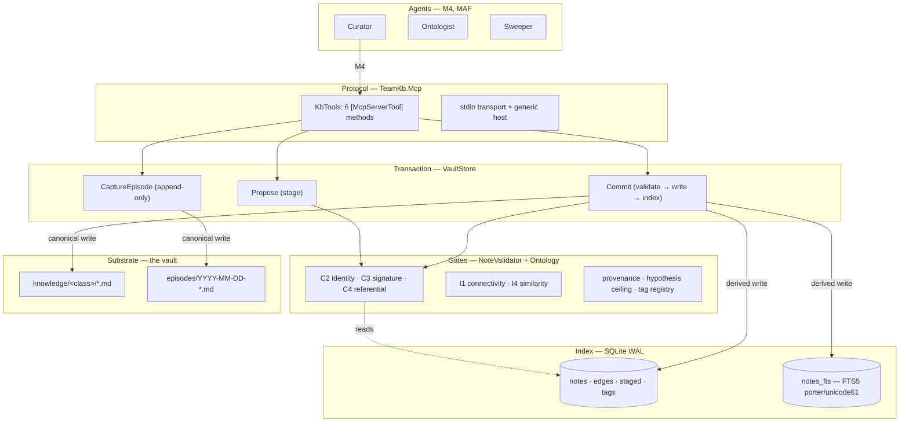
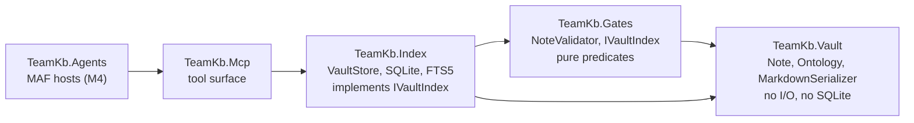
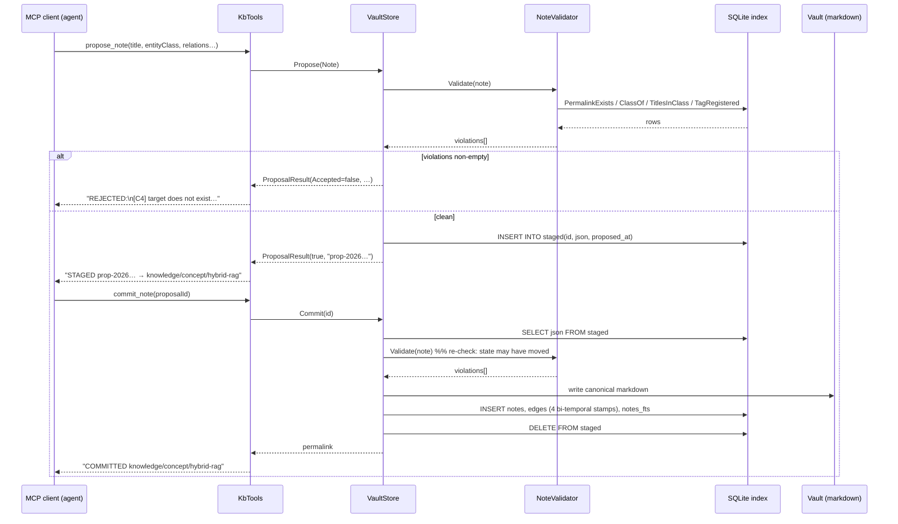
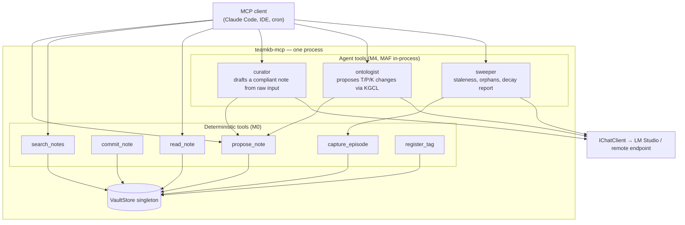

# The C#/MAF/MCP Implementation Architecture of team-kb

## 0. Abstract

team-kb is a knowledge base for a software team whose canonical storage is a directory of
markdown files and whose enforcement surface is a compiled .NET program. This paper explains
why that combination was chosen over the incumbent (a Python `basic-memory` server backed by
the same kind of markdown vault), how the layers are separated, what the Model Context
Protocol (MCP) server actually does, how Microsoft Agent Framework (MAF) agents will be
mounted behind that same protocol surface in milestone M4, and what has and has not been
verified as of 2026-08-11.

The single sentence that motivates the whole design: *the previous knowledge base failed not
because its rules were wrong, but because its rules were prose.* The v2 post-mortem is blunt
about it — `basic-memory` shipped a machine-checkable gate (Picoschema with
`validation: error`) and **zero schema notes were ever declared**. The gate existed and was
never switched on. Six hundred and fifty-three notes later the corpus measured 35.2% dangling
wikilinks, 53.8% orphans, three coexisting relation dialects, and 189 distinct observation
kinds with a long singleton tail. The graph was never a graph; it was a folder of documents
with decorative links. Everything below is an answer to that failure: a rule you cannot
express in a type is a rule you will eventually violate, so the vocabulary, the paths, the
inverses, and the referential checks all move into a compiled artifact that refuses the write.

---

## 1. Stack rationale and decision record

### 1.1 The incumbent and why it was retired

The prior system was `basic-memory`: Python, markdown-canonical, MCP-exposed, and — on
paper — governed by an ontology document (v0.2) with 15 entity classes, roughly 40 relation
types, and 36 observation kinds. The governance corpus was genuinely good. The problem was
entirely one of *enforcement locus*. Validation lived in documents that agents were asked to
read and honour. Nothing in the write path could reject a malformed note, so the write path
accepted everything, and the corpus drifted at exactly the rate at which it was curated.

Three properties of the incumbent made the drift structural rather than incidental. **Open
vocabularies at the API boundary**: verbs and observation kinds were strings, and a string
field accepts `PART_OF`, `part_of`, and `**Related**:` with equal enthusiasm — the corpus
contains all three. **Author-supplied paths**: folder placement was a convention, so
`project/` and `projects/` both exist and a class folder ended up nested inside an instance
folder (`project/document/`). **Hand-authored reciprocity**: relations were body text and the
inverse edge was a second piece of body text someone was supposed to write, so every sampled
relation was one-sided. None of these is fixable by writing a better ontology document; all
three are fixable by changing which program owns the write.

### 1.2 Why C# / .NET 10

The decision was locked by the user on 2026-08-11 ("C# MAF end-to-end"), but it holds on its
own merits, and the merits are worth stating because they are the whole point of the rebuild:

- **The type system is the enforcement mechanism.** `EntityClass`, `Verb`, and `ObsKind` are
  C# enums. `Note.Permalink` is a computed property with no setter. There is no constructor
  overload, no optional parameter, and no serialization path by which a caller supplies a
  folder or invents a verb. The failure classes are not *rejected*; they are
  *unrepresentable*. This is a stronger guarantee than validation, and it is the guarantee
  Python's `str`-typed API could not offer without a schema layer that, as observed, nobody
  turned on.
- **The enums propagate to the wire.** The MCP C# SDK generates JSON Schema from method
  signatures. An enum parameter becomes a JSON Schema `enum`. The calling model therefore
  sees the legal vocabulary *at call time*, in the tool description it is already reading.
  This is post-mortem countermeasure #7 discharged for free by the SDK.
- **First-party agent story.** MAF (`Microsoft.Agents.AI`) reached GA 1.0 on 2026-04-03 and
  sits at 1.17.0 as of 2026-08-04. Exposing a MAF agent as an MCP tool is a documented
  two-liner (`McpServerTool.Create(agent.AsAIFunction())`), shipped as sample
  `Agent_Step07_AsMcpTool`. The reverse direction — a MAF agent consuming MCP tools — needs
  no adapter at all, because MCP tools surface as `AIFunction`/`AITool`. The agent layer and
  the protocol layer are the same vendor's abstractions, which removes an integration seam
  that a Python/MAF hybrid would have to own forever.
- **Single deployable, no interpreter.** The target is a different machine and a team, not
  largo. A self-contained .NET binary plus a markdown directory is a simpler operational
  story than a Python environment with a resolver.

### 1.3 Version table (research-verified 2026-08-11)

| Component | Version | Role | Note |
|---|---|---|---|
| Target framework | `net10.0` (C# 14) | All three projects | SDK 10.0.302 used for verification |
| `ModelContextProtocol` | 2.1.0 (2026-08-05) | MCP server hosting + DI | Apache-2.0; native `net10.0` asset |
| `Microsoft.Data.Sqlite` | 10.0.10 | Index store (WAL, FTS5) | |
| `Microsoft.Extensions.Hosting` | 10.0.10 | Generic host for the stdio server | |
| `xunit.v3` | 3.2.2 | Gate suite | with `Microsoft.NET.Test.Sdk` 18.8.1, `xunit.runner.visualstudio` 3.1.5 |
| `Microsoft.Agents.AI` (MAF) | 1.17.0 | M4 agent layer (not yet referenced) | GA 1.0 2026-04-03; TFMs net8/9/10 |
| `Microsoft.Extensions.AI[.OpenAI]` | 10.8.3 | M1 embeddings (`IEmbeddingGenerator`) | not yet referenced |
| `Microsoft.SemanticKernel.Connectors.SqliteVec` | 1.74.0-preview | M1 vector store candidate | swappable via `Microsoft.Extensions.VectorData` |

Two version-hygiene facts belong in the record rather than in a footnote. First, the build
emits `NU1903` for a transitive `SQLitePCLRaw.lib.e_sqlite3` 2.1.11 high-severity advisory
(GHSA-2m69-gcr7-jv3q); the remediation is an explicit `SQLitePCLRaw.bundle_e_sqlite3` bump,
scheduled for M1. Second, MCP C# SDK 2.0 carried real breaking changes in August 2026 —
stateless HTTP is now the default (no `Mcp-Session-Id`), and server-initiated
elicitation/sampling was replaced by MRTR, in which a tool returns `InputRequiredResult`
carrying opaque `requestState`. team-kb's current stdio surface touches neither, but any
future HTTP transport work inherits both.

---

## 2. Layered architecture

### 2.1 The layers and their boundaries



Read the arrows carefully: the substrate is written by the transaction layer and read by
humans and by Git. The index is written by the transaction layer and read by the gates and
the search surface. Nothing reads the index as a source of truth about content — only about
*existence*, *class*, *title*, and *rank*.

**Substrate (markdown vault).** Canonical. One dialect, emitted by
`MarkdownSerializer.ToMarkdown` and never hand-written. Frontmatter carries title, type,
`kb_version`, `entity_class`, permalink, timestamps, status, confidence, aliases, tags,
isolation justification, and a provenance list. Body carries `## Overview`, `## Relations`
(`VERB :: [[target]] {since, mode, confidence}`), and `## Observations`
(`- [kind] text (provenance: …)`). The critical property is that the serializer is the *only*
producer. The previous corpus had three relation dialects because five parties were producers.

**Index (SQLite FTS5).** Derived and disposable. Four tables plus one virtual table:
`notes` (permalink PK, title, class, status, confidence, path, modified), `edges`
(src/verb/dst composite PK, `since`, `mode`, `confidence`, and the four Graphiti bi-temporal
stamps `t_valid`/`t_invalid`/`t_created`/`t_expired`, with a `dst` index for backlinks),
`staged` (proposal id → serialized note JSON), `tags` (the registry), and `notes_fts`
(FTS5 over title/overview/observations, `porter unicode61`). WAL journal mode.

**Gates (pure predicates).** `NoteValidator` takes an `IVaultIndex` and returns
`IReadOnlyList<GateViolation>`. It writes nothing, throws nothing, and has no I/O of its own.
Its dependency is a four-method interface — `PermalinkExists`, `ClassOf`, `TitlesInClass`,
`TagRegistered` — the entire surface the constitution needs in order to be decided. `Ontology`
is a static class of total functions: `PathFor`, `InverseName`, `Signature`, `NormalizeTitle`,
`InScope`. Both are testable without a filesystem, which is why the gate suite runs in
milliseconds.

**Transaction (propose/commit).** Write ≠ commit, borrowed from MemTX/TGMS. `Propose` runs
the gates and, on success, stages serialized JSON with a timestamped id. `Commit` deserializes,
**re-runs the gates** (state may have moved between propose and commit — this is why a stale
proposal cannot smuggle a now-colliding permalink into the vault), writes canonical markdown,
indexes, and deletes the staging row. `CaptureEpisode` deliberately bypasses staging: episodes
are immutable append-only Event-class notes, and the same-day identical-title case throws
rather than overwrites. **Protocol** (§3) and **agents** (§4) sit above.

### 2.2 The "delete the .db and nothing breaks" test

The single sharpest statement of the substrate/index boundary is an operational test:

> Delete `.teamkb.db`, restart the server, and the knowledge base must lose nothing but
> query latency.

The test forces a specific discipline — *no fact may exist only in the index*. If a relation's
`mode`, a note's confidence, or a tag registration lived only in SQLite, deleting the file
would silently destroy knowledge and the vault would quietly stop being canonical. Every field
in `edges` and `notes` is therefore a projection of something the serializer already wrote.

Honest current status: **the boundary holds by construction, and the rebuild path is not yet
implemented.** `VaultStore`'s constructor creates the schema and seeds the tag registry but
does not scan the vault; today a fresh database against an existing vault yields an empty
index rather than a rebuilt one. The invariant is real (nothing is index-only); the tooling
that exercises it is M1 work — a `reindex` that walks the vault under `Ontology.InScope`,
parses frontmatter, and replays `IndexNote`. Until that lands, the test is a design contract
rather than a green check, and this paper declines to claim otherwise.

The corollary: `Ontology.InScope` is the scope predicate C7, and it is what keeps a rebuild
from re-ingesting junk. The legacy corpus indexed roughly 40 `.bak`/conflict files as notes.
`InScope` rejects any filename containing `.bak`, `conflict`, `~`, or `.orig` anywhere in the
name — deliberately unanchored, because real conflict artifacts carry their markers at either
end (`x.md.bak`, `conflict-files-obsidian-git.md`, `y (conflicted copy).md`).

### 2.3 The planned assembly split

Today `TeamKb.Core` is one assembly holding substrate serialization, index, gates, and
transaction. The layering above is therefore *conventional* — enforced by discipline and code
review, not by the compiler. The planned split makes it structural:



The direction of every arrow is the point. `TeamKb.Vault` references nothing — SQLite is not
in its dependency closure, so no one can "just cache that in a table." `TeamKb.Gates`
references `Vault` and declares `IVaultIndex`; it cannot reach a database, so a gate cannot
quietly become a query. `TeamKb.Index` implements the interface and is the only assembly that
knows a `.db` file exists. Layer violations stop being review comments and become compile
errors — the same move the ontology made when it stopped being prose and became enums.

The split is deferred, not abandoned: M0's goal was a usable vertical slice, and a
three-assembly skeleton around 500 lines of logic would have been premature. It is scheduled
before M4, the first point at which a second consumer of `Core` exists and the temptation to
reach across layers becomes real.

---

## 3. MCP server anatomy

### 3.1 Hosting and transport

`Program.cs` is eleven lines and every one of them is a decision:

```csharp
var vaultRoot = Environment.GetEnvironmentVariable("TEAMKB_VAULT")
    ?? throw new InvalidOperationException("Set TEAMKB_VAULT to the vault root directory.");

var builder = Host.CreateApplicationBuilder(args);
builder.Logging.AddConsole(o => o.LogToStandardErrorThreshold = LogLevel.Trace);
builder.Services.AddSingleton(new VaultStore(vaultRoot));
builder.Services.AddMcpServer().WithStdioServerTransport().WithToolsFromAssembly();
await builder.Build().RunAsync();
```

**Config SSoT.** The vault root comes from `TEAMKB_VAULT` and nowhere else. There is no
default, no fallback to the current directory, and no path constant. A missing variable is a
startup crash with a sentence that says what to do. This is project rule C-2 applied to the
one piece of configuration M0 has.

**stdout is protocol, stderr is logs.** The discipline that most often bites stdio MCP
servers, and it bit this one during bring-up: host logging polluted the protocol channel until
`LogToStandardErrorThreshold = LogLevel.Trace` forced every record — including `Trace` — to
stderr. The rule is absolute: a single stray `Console.WriteLine` corrupts the JSON-RPC stream
and the client sees a parse error rather than your debug message. Relatedly, the .NET 10 CLI
itself writes chatter to stderr; harmless precisely because the protocol lives on stdout.

**DI of `VaultStore`.** Registered as a singleton and injected into static tool methods as
their first parameter. `WithToolsFromAssembly()` discovers `[McpServerToolType]` classes, and
the parameter binder resolves non-schema parameters from the service provider — so
`VaultStore store` never appears in the JSON Schema the client sees. One store, one open
SQLite connection, one process.

### 3.2 The tool surface as the enforcement point

Six tools compose the M0 surface:

| Tool | Contract |
|---|---|
| `propose_note` | Stage a note; run all gates; return proposal id **or** the violation list |
| `commit_note` | Re-validate, write markdown, index edges + FTS, return permalink |
| `capture_episode` | Append immutable Event-class record; bypasses staging |
| `search_notes` | FTS5/BM25 over title/overview/observations; verdict `ok` \| `absent` |
| `read_note` | Canonical markdown **plus** computed backlinks with inverse verb names |
| `register_tag` | Add a namespaced tag to the registry; closed namespace set |

The schema is where the ontology becomes enforceable against an LLM caller. `propose_note`
takes `EntityClass entityClass`, and `RelationArg` takes `Verb Verb`, and `ObservationArg`
takes `ObsKind Kind`. Those are C# enums, so the generated JSON Schema carries `enum` arrays
listing exactly the ten classes, fourteen verbs, and twelve observation kinds. A model reading
`tools/list` sees the legal vocabulary before it composes a call; a model that invents
`part_of` fails deserialization rather than writing a fourth dialect into the corpus.

Two absences are as deliberate as the enums. There is **no path parameter** — the folder is
`Ontology.PathFor(entityClass)`, so folder anarchy is not a thing a caller can do. There is
**no inverse-relation parameter** — direction is stored once and `Ontology.InverseName`
computes the reverse at read time, so the one-sided-relation failure class cannot recur.

Tool *descriptions* carry the parts of the contract a schema cannot express, written for a
model reading them under time pressure. `search_notes` does not merely return an empty list;
it returns `verdict: absent — no notes match. The knowledge likely does not exist yet.` That
phrasing is lifted from jcodemunch's honesty contract and exists to stop the synonym-retry
spiral in which an agent searches five ways for something never written down.

### 3.3 The propose/commit sequence



The rejection path returns *actionable* text, not a boolean: `[C4] Relation target
'knowledge/concept/does-not-exist' does not exist. Create it first or request an auto-stub.`
An agent that receives that can repair its own call. An agent that receives `false` writes
the note somewhere else.

### 3.4 The open handshake defect

**This is unresolved and the paper will not soften it.** Feeding a verified-clean, file-based
sequence of `initialize`, `initialized`, and `tools/list` JSON-RPC lines into
`dotnet TeamKb.Mcp.dll` produces **zero stdout lines**. stderr shows the transport reading and
then shutting down cleanly at EOF. The expected `initialize` response never appears.

Three hypotheses are live:

1. **EOF race.** The response may require the client to hold stdin open until the reply is
   flushed; a file-redirect pipeline closes stdin immediately and the process may be racing
   its own shutdown.
2. **Tool discovery / DI.** `WithToolsFromAssembly()` over a *static* tool class with a
   DI-injected `VaultStore` parameter follows the SDK 2.x sample pattern, but parameter
   binding for static methods has not been observed working in this configuration. If
   discovery throws during capability construction, a silent server is a plausible symptom.
3. **Protocol version negotiation.** SDK 2.x preserves v2↔v1 handshake fallback; a
   `protocolVersion` mismatch could be dropping the exchange silently.

The debug plan is ordered by information yield: raise stderr to `Debug`, run
`npx @modelcontextprotocol/inspector` (a real client that keeps the pipe open, discriminating
hypothesis 1 immediately), run the SDK's `QuickstartWeatherServer` sample on the same box as a
known-good control, and log the discovered tool count at startup to settle hypothesis 2.

What the defect does and does not invalidate is worth stating precisely, because "the MCP
server doesn't answer" sounds fatal and is not. The gate suite exercises `VaultStore` directly
and passes 18/18; the gates, the transaction path, the serializer, the index, and the search
surface are verified. What is unverified is one protocol-layer edge. Per VERIFY.md, MCP
conformance is not claimed until an inspector session shows `tools/list` returning all six
tools with the enum schemas visible.

---

## 4. Agents as tools (M4)

### 4.1 The pattern

MAF's contribution is that an agent and a tool are the same shape. `AsAIFunction()` (in
`AgentExtensions`) wraps `agent.RunAsync(query)` behind a single `query: string` parameter,
and the agent's `Name` and `Description` become the MCP tool's name and description. Mounting
it is two lines:

```csharp
McpServerTool tool = McpServerTool.Create(agent.AsAIFunction());
builder.Services.AddMcpServer().WithStdioServerTransport().WithTools([tool]);
```

An optional `AgentSession` overload pins a session, which matters for the consolidator: a
nightly run that should see its own prior reasoning wants a durable session, while a curator
invoked per-write wants a fresh one.

### 4.2 The specialists and how they compose



The composition rule is a rule about *privilege*, not convenience. **Agents draft; gates
decide.** The curator is a MAF `ChatClientAgent` that turns a paragraph of raw session text
into a well-formed `propose_note` call. It has no privileged write path — it calls the same
tool a human would and receives the same violation list. If it hallucinates a relation target,
C4 rejects it and the curator repairs from the rejection text. An agent that could bypass the
validator would reintroduce exactly the failure mode the rebuild exists to eliminate, so the
curator's authority is rhetorical (it drafts well) and never structural.

The ontologist is the one specialist whose output is *not* a note. Following AutoSchemaKG it
re-induces vocabulary from the corpus quarterly and emits change proposals in KGCL — the typed
change language with reverse patches — which a human gates. Vocabulary change is a MAJOR
version event with a migration shim, not something an agent applies.

The sweeper runs on a schedule rather than on request: staleness by per-class mean-update age,
confidence decay, orphan queue, and a `capture_episode` write of its own report so maintenance
history lands in the knowledge base. This is countermeasure #6 — the previous sweeper was a
runbook nobody executed, and the fix is that a job runs and writes evidence.

### 4.3 Process topology

Two topologies were considered:

**A — one process, in-process agents (chosen for M4).** MAF host and MCP server are the same
executable; agent tools and deterministic tools share the `VaultStore` singleton, so an
agent's read of the index is by definition consistent with the gate that will judge its write.
One deployable, one config surface, no inter-process serialization. The cost: a long agent
turn occupies the same process as latency-sensitive `search_notes` calls, and an agent crash
takes the protocol surface with it.

**B — separate processes.** `teamkb-mcp` stays deterministic and fast; `teamkb-agents` runs
MAF and consumes the MCP surface as a *client* via `McpClientFactory.CreateAsync` with a
`StdioClientTransport`. Isolation is real — agents cannot corrupt server state except through
the protocol — at the price of two deployables, two configs, and a transport hop per write.

M4 takes A, on the greenfield principle that the shortest path to a working stable system
wins, and because the split is cheap later precisely *because* agents already reach the vault
only through tools. B is the migration target if agent turns start starving interactive
reads — a measurable trigger, not a taste question.

---

## 5. Cross-platform reality

### 5.1 The authoring/build split

The development topology produced most of the bring-up defects. Source is authored on
**largo** (macOS), which has no .NET SDK and is permanently disk-constrained — the boot volume
sat between 200 and 500 MB free twice during the genesis session. Builds and tests run on
**adagio** (Windows, .NET SDK 10.0.302, PowerShell default shell) at
`C:\Users\me\dev\team-kb`. The ritual: edit locally, `scp` to adagio, `ssh adagio` and run
`dotnet test TeamKb.sln`. Consequently *every* commit crosses a platform boundary before it is
ever compiled — unusual exposure for an M0, and it paid for itself immediately.

### 5.2 The defects the crossing found

**AppleDouble files break the C# compiler.** macOS `tar` writes `._Foo.cs` resource-fork
sidecars. Extracted under Windows they land in the project directory, the SDK's default glob
picks up `._KbTools.cs` as a compilation item, and `csc` fails on binary garbage. Fix:
`COPYFILE_DISABLE=1 tar`, or a purge pass on extract. A pure packaging artifact — invisible on
macOS, invisible on Linux, fatal on Windows — that no code review on largo would surface.

**SQLite connection pooling holds the database file open on Windows.** `GateTests` creates a
temp-directory vault per test and deletes it in `Dispose`. On POSIX, deleting an open file is
routine; on Windows it is a sharing violation, and `Microsoft.Data.Sqlite`'s pool keeps the
handle alive past `SqliteConnection.Dispose()`. One line in `VaultStore.Dispose` fixes it:

```csharp
SqliteConnection.ClearPool(_db);
_db.Dispose();
```

This is a genuine production bug, not a test artifact. Any code path that disposes a store and
then moves, deletes, or backs up the vault directory would fail the same way in the field — on
Windows only, intermittently, under load.

**PowerShell here-string quoting corrupts JSON.** Feeding JSON-RPC lines to the server via a
double-quoted PowerShell here-string leaves `\"` literal, producing a malformed payload.
Standing rule: ship JSON via file, never inline. Note the second-order cost — this *masked*
the handshake investigation for a while, because a malformed request and a silent server look
identical from outside. Verifying the input was clean before believing the null result is what
turned "the JSON is probably wrong" into a genuine open defect worth three hypotheses.

**C7 regex anchoring** (not platform-specific, same pass): the scope predicate was
end-anchored and missed `conflict-files-obsidian-git.md`. Now unanchored, with a `[Theory]`
pinning five shapes. **FTS5 hyphen syntax**: FTS5 treats `-` and `:` as query syntax, so
`hybrid-rag` raised `no such column: topic`; `Search` now quotes each token, preserving
implicit AND.

### 5.3 What this case study argues

Three of the five bring-up defects were invisible on the authoring platform, and two of those
— the pool lock and the AppleDouble glob — were *build- and teardown-time* failures no unit
test written on macOS could express. The argument for cross-platform CI is therefore not
"portability is nice." It is that a single-platform pipeline systematically cannot observe an
entire class of defect, and the class includes real production bugs (file-handle lifetime)
alongside merely annoying ones (resource forks). team-kb got this coverage accidentally,
because largo cannot build. A team that can build everywhere must choose it deliberately, and
the M1 exit criterion should be a CI matrix rather than a ritual.

### 5.4 Embeddings on the target machine

The M1 retrieval layer needs embeddings, and the constraint landscape differs per machine.
largo forbids local model weights outright — it is disk-constrained to single-digit GB and the
prohibition is absolute. The **target machine runs LM Studio with an ONNX engine**, where
local inference is permitted, so the deployment story is a local OpenAI-compatible endpoint.

The design keeps this a configuration question, not an architectural one.
`IEmbeddingGenerator<string, Embedding<float>>` from `Microsoft.Extensions.AI` 10.8.3 is the
only interface the index layer sees. Behind it sits either an `OpenAIClient` pointed at an
arbitrary base URI — LM Studio locally, or the `ollama2.braisenly.com` tunnel from largo — or
`OllamaSharp` 5.4.30 against the native Ollama API; both download zero weights into the
process. The vector store is likewise abstracted: `Microsoft.Extensions.VectorData` lets
`SqliteVec` (same file as the FTS index) and the in-memory connector swap by configuration.
Endpoint and model name are pinned in `.env` per C-2, so the same binary runs on a laptop with
LM Studio and on largo against the tunnel with no recompilation and no `#if`.

---

## 6. Testing doctrine

### 6.1 Defect replay, not coverage

`GateTests` is not a unit-test suite in the usual sense and does not aim at line coverage. It
is a **defect-replay gate suite**: each test reconstructs a failure actually measured in the
legacy corpus during the 2026-08-11 audit and asserts that the new write path refuses it.

| Test | Replayed defect | Enforcing mechanism |
|---|---|---|
| `MissingProvenance_Rejected` | provenance-free notes | `PROV` gate |
| `PlaceholderProvenance_Rejected` | `source: TBD` in real notes | `PROV` gate, placeholder blacklist |
| `HypothesisWithHighConfidence_Rejected` | speculation shelved as fact | `HYP` ceiling (conf < 0.7) |
| `DanglingRelationTarget_Rejected` | 35.2% dangling wikilinks | `C4` write-time resolution |
| `Backlinks_AreComputed` | every sampled relation one-sided | `C5` computed inverses |
| `Path_IsDerivedFromClass` | `project/` vs `projects/`, nested class folders | `C1`, structural |
| `ExactPermalinkCollision_Rejected` | 31 duplicate slugs | `C2` identity key |
| `NearDuplicateTitle_…_Rejected` | the real `Agent Specialist- Color Theory` twin | `I4`, trigram θ=0.85 |
| `UnlinkedUnjustified_Rejected` | 53.8% orphans | `I1` connectivity-or-justify |
| `EdgeSignatureViolation_Rejected` | untyped edges | `C3` σ(p)=(dom,rng) |
| `UnregisteredTag_Rejected` | free-form tag sprawl | tag registry, C-3 |
| `ScopePredicate` (5 cases) | ~40 `.bak`/conflict files indexed | `C7` scope |
| `EpisodeCapture_AppendOnly` | mutable session logs | append-only, same-day throw |
| `Search_FindsCommitted` | — | FTS5 round-trip + `absent` honesty |

Note what the fixtures are: `NearDuplicateTitle_TitleCaseVsSlug_Rejected` uses the literal
title pair found in master-kb, resolved there by appending `-1` instead of merging. A test
whose fixture is a real defect cannot rot into a tautology, because the defect is a fact about
history rather than a hypothesis about the code.

`Path_IsDerivedFromClass` asserts something stronger than rejection: `Note` has no path input
at all, so there is nothing to reject because there is nothing to supply. Enum-typed verbs and
kinds are likewise untested for rejection — they fail at deserialization, never reaching the
validator. The suite tests what remains *representable*, the correct scope for a validator
whose companion strategy is making illegal states unconstructible.

### 6.2 What "verified" means here

The project uses the word narrowly. Verified means: **`dotnet build TeamKb.sln` → 0 errors and
`dotnet test TeamKb.sln` → 18/18 pass, on adagio, .NET SDK 10.0.302, 2026-08-11**, with the
three bring-up fixes in place. It does not mean the MCP handshake works; VERIFY.md carries
that as an open issue with a named debug plan. It does not mean the vault-rebuild path is
exercised; §2.2 says so plainly. It does not mean the package advisory is cleared; NU1903 is
logged against M1.

That discipline is itself a countermeasure. The predecessor's fatal property was a gap between
claimed state and measured state — an ontology describing a corpus that did not exist. A
verification document recording "18/18 pass **and** the handshake is silent" is worth more
than one recording only the green number, because the second kind is how a knowledge base
starts lying to its owners.

---

## 7. Open items

1. **MCP handshake** (blocking M0 sign-off) — silent on `initialize`; four ordered debug steps
   in VERIFY.md; inspector run discriminates the leading hypothesis fastest.
2. **`SQLitePCLRaw.bundle_e_sqlite3` bump** — clears NU1903 / GHSA-2m69-gcr7-jv3q. M1.
3. **Vault→index rebuild** — makes the delete-the-db test executable rather than contractual.
4. **Assembly split** — `TeamKb.Vault` / `.Gates` / `.Index`, before M4 adds a second consumer.
5. **Cross-platform CI matrix** — replace the scp-and-ssh ritual with a pipeline that builds
   on macOS, Linux, and Windows.
6. **M1 retrieval** — `IEmbeddingGenerator` against LM Studio, sqlite-vec, RRF fusion, PPR
   tiebreak, verdict contract on every tool, `plan_turn`-style router.

---

## 8. Conclusion

The architecture reduces to one claim: constraints belong in the layer that can refuse the
write. team-kb puts the closed vocabularies in enums that reach the wire as JSON Schema, the
folder layout in a total function, the inverse edges in a computed read, the referential check
in a validator that runs twice, and the whole write behind a propose/commit pair whose second
half re-validates against the world as it now is. The markdown vault stays canonical and
human-readable; the SQLite index stays derived and disposable; the agents, when they arrive,
get the same tool surface and the same rejections as everyone else.

Two things are true at once as of 2026-08-11: eighteen of eighteen defect-replay gates pass on
a real Windows build, and the MCP server does not yet answer a handshake. Both belong in the
record. The first is why the design is worth writing up; the second is why it is not yet
finished.
