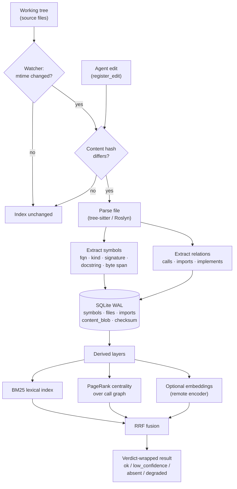
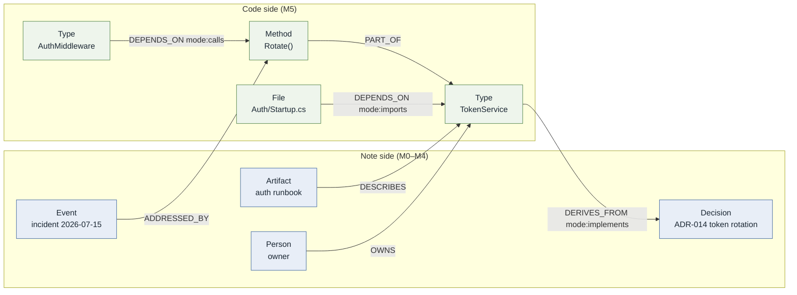

# Code Cartography

*The Code-Cartographer subsystem of team-kb, milestone M5.*

## 0. Summary

team-kb is a typed property graph of team knowledge stored as markdown and mirrored into an index.
Its milestones M0 through M4 build the note side of that graph: a constitution, a gated write path,
hybrid retrieval, a graph mirror, a self-learning loop, and a set of specialist agents. M5 — the
last milestone — extends the same graph over source code.

The thesis of this paper is narrow and, we think, load-bearing: **a code index and a knowledge base
are the same artifact viewed through two extraction pipelines.** Both are typed property graphs.
Both answer "what is this, what does it touch, what breaks if I change it." Both fail in the same
way — by inventing an answer when the honest answer is *nothing here matches*. If team-kb has
already paid the cost of a typed graph, a verdict contract, and a hybrid retriever, then indexing
code is not a new system: it is a new node kind and three new edge kinds entering machinery that
already exists.

The empirical model is jcodemunch, a production code-intelligence MCP server whose internals we
surveyed from source (R4). That survey is the specification for what "good" looks like; this paper
argues why its shape belongs inside team-kb rather than beside it.

---

## 1. The problem: exploration is the dominant cost

An agent asked to change code in an unfamiliar repository begins by looking. The default toolkit for
looking is a text search (`grep`) and a file reader (`read`), and both are, in the sense that
matters, *unbudgeted*.

Consider a routine question — "where is CSRF protection implemented?" Search for `csrf`. Get
forty-three hits across tests, fixtures, comments, and a changelog. Read four files in full because
the hits do not disambiguate themselves. Find nothing conclusive. Search for `xsrf`, then
`antiforgery`, then `token`, each broadening query returning more noise than the last. Read the auth
middleware because it is *near* the answer. Conclude, on the strength of proximity, that the
middleware probably handles it.

Three failures are stacked there, and only the first is about tokens.

**Cost.** Reading a file to answer a question about one symbol pays for the entire
file. A 900-line module read to inspect a 12-line method is a 75× overpayment, and it recurs on
every turn that forgets it already read the file.

**Recall.** Text search finds strings, not meaning. It cannot answer "who calls
this," "what implements this interface," or "which files import this module" except by
string-matching that misses aliased imports, generic instantiations, and inherited members. The
questions an agent needs answered are graph questions posed to a tool that has no graph.

**Truth.** The serious one. A failed search returns an empty result set, and an
empty result set is *ambiguous* — it means either "this does not exist" or "you searched badly." An
agent under pressure to be useful resolves that ambiguity toward usefulness, and infers that the
nearby auth middleware must be doing the job. That is a hallucinated feature, produced not by a
careless model but by a
*tool contract that cannot express absence*.

The indexed-code-intelligence answer addresses all three at once. Parse the repository ahead of time
into a symbol graph. Store each symbol with its exact byte span, so retrieval seeks rather than
re-reads. Store the relationships — calls, imports, inheritance — as edges, so relationship
questions become traversals rather than searches. Rank results by a fusion of lexical, identity, and
structural signals, so the top five results are usually the answer. And, critically, make the
retriever report its own coverage, so an empty result can say *"I scanned 4,812 symbols across 311
files and nothing matched"* — a claim with enough force behind it to stop the inference.

jcodemunch reports the payoff in the shape you would expect: fewer tool calls, an order-of-magnitude
reduction in tokens spent per answered question, and — from the adjacent Codebase-Memory MCP work
(arXiv:2603.27277, 31 repositories) — measurably higher answer quality at 10× fewer tokens and 2.1×
fewer tool calls. We treat these numbers as directionally sound and independently unverified; the
architecture does not depend on their precision.

---

## 2. Functional decomposition

The R4 survey enumerated roughly ninety-five tools across seven capability groups. Most of that
surface is analytics built atop a much smaller core. The core decomposes into six functions, and it
is the six functions — not the ninety-five tools — that M5 must reproduce.

### 2.1 Indexing

Indexing turns a directory of source files into rows. jcodemunch uses tree-sitter with a 2,226-line
extension-to-language map carrying real disambiguation heuristics (`.m` is MATLAB or Objective-C
depending on content; Ansible by path shape; OpenAPI by basename). Each parsed file yields symbols —
functions, types, methods, fields — recorded with a fully-qualified name, kind, language, signature,
docstring, complexity score, and a **byte offset span** into cached file content.

The byte span is the quiet centrepiece. Because a symbol knows exactly where it lives, retrieving
its source is a seek and a read of *n* bytes, not a parse and not a whole-file load. Because the
cached content carries a checksum, retrieval can detect that the file changed underneath the index
and report drift rather than serving a stale span.

Storage is SQLite in WAL mode, one database per repository, with sidecars: a `.meta` for cheap
listing without opening the database, a SHA-256 `.checksum` for staleness. Incrementality is
mtime-then-hash — a watcher notices a changed file, re-parses only that file, replaces only its
symbols — and an edit hook (`register_edit`) reindexes after the agent's own writes, closing the
window in which an agent edits code and then queries an index that predates the edit.

### 2.2 Search

Three distinct search modalities, deliberately not collapsed into one:

- **Symbol search** — the symbol table by name with structured filters: `kind`, `language`,
  `file_pattern`, `decorator`. Decorator-awareness makes *set-difference* queries expressible —
  "which HTTP endpoints lack the authorization attribute" is the difference of two filtered symbol
  sets, a question no text search answers well.
- **Text search** — regex over raw content with configurable context lines. The escape hatch for
  comments, configuration, and string literals carrying no symbol identity.
- **AST search** — structural pattern matching over the parse tree, for questions about code *shape*
  rather than code *names*.

Ranking fuses several channels. A BM25 score over symbol text fields is combined with identity
signals (exact match, substring, word overlap, signature match, docstring match) and a log-scaled
PageRank centrality bonus computed over the call graph, used as a tiebreaker so that when two
symbols match equally, the one more things depend on wins. Above these sits **reciprocal rank
fusion** — `score(s) = Σ_c weight[c] / (k + rank(c,s))` — combining identity, lexical, and semantic
channels with tunable, persistable weights. RRF is the right primitive here precisely because it
needs no score calibration between channels; it consumes only ranks.

### 2.3 Relationship queries

The functions that justify the index:

- `find_references` — every use site of an identifier.
- `find_importers` — every file that imports this one.
- `get_dependency_graph` / `get_dependency_cycles` — the module-level graph and its
  strongly-connected components.
- `get_call_hierarchy` / `get_class_hierarchy` — callers and callees; supertypes and subtypes.
- `get_blast_radius` — the transitive closure of things affected by changing a given symbol, which
  is the question "what breaks if I touch this" made answerable.
- `check_edit_safe` / `check_rename_safe` / `check_delete_safe` — blast radius packaged as a
  pre-flight assertion rather than a report.

The last three matter disproportionately for agent safety. An agent that deletes a symbol because it
looked unused has caused an outage; an agent that calls `check_delete_safe` first and receives
fourteen references has not.

### 2.4 Session-aware routing

`plan_turn` is called before exploration begins. It scores the query against the index and returns a
**confidence tier** with an attached hard read budget:

| Tier | Meaning | Supplementary read budget |
|---|---|---|
| `high` | Strong symbol matches; go straight to them | 2 |
| `medium` | Plausible region identified; explore it | 5 |
| `low` | Weak matches; the feature may not exist | 10 |
| `none` | The index says this does not exist | 0 — report the gap and stop |

It also returns recommended symbols and files, a `session_overlap` computed from the session journal
(so the agent does not re-read what it read three turns ago), and, when confidence is low or none,
an *insertion-point suggestion* — where the missing thing would go if it were written.

The tier is a contract about *how much doubt is warranted*, converted into a resource limit. It is
the mechanism that stops the broadening-query death spiral described in §1, because the spiral is
exactly the behaviour of an agent with unlimited reads and no permission to conclude absence.

### 2.5 Token budgeting

Turn boundaries are inferred from inter-call gaps. Output is recorded per turn; a `budget_warning`
fires above 80% consumption and again on exhaustion; a `should_compact()` predicate drives automatic
compaction. A session journal — thread-safe, capped, LRU-evicted — tracks reads, queries and their
result counts, edits, tool-call counts, and a log of negative-evidence events. Budgeting is not
hygiene; it is what makes the confidence tiers *binding*. A budget the agent cannot exceed is a
budget; one it can talk itself past is a suggestion.

### 2.6 The verdict contract

Every retrieval returns a state from a closed set — `ok`, `low_confidence`, `absent`, `degraded` —
and on `absent` or `degraded` attaches a coverage disclosure: symbols and files scanned, scope,
pinned heuristic version, plus a `did_you_mean` list of near misses. See §4; it is the single most
important thing to port.

### Index pipeline

---

## 3. Cartography as knowledge graph

Here is the architectural claim, stated plainly.

team-kb's ontology (v1.0.0) defines a typed property graph `G = (V, E, τ, π, ω)`: ten entity
classes, fourteen verbs with computed inverses, twelve observation kinds, constraints C1–C8 enforced
as validatable shapes, and bi-temporal edge properties following the Graphiti four-timestamp model.
Notes are nodes. Links are typed edges. Folder paths are computed from class, never authored.

A code index is *also* a typed property graph. Symbols are nodes with a class (function, type,
method), properties (signature, language, complexity, span), and typed edges (calls, imports,
implements). Nothing about it is structurally foreign.

The Code-Cartographer therefore does not build a second graph. It runs a second
**extraction pipeline** into the first.

### 3.1 What code contributes

Code symbols enter as a node kind under the existing `Codebase` class — the ontology already
reserves `knowledge/codebase/` with a 60-day freshness half-life, which is roughly the right decay
for a claim about a moving repository. A symbol is a `PART_OF` a codebase; the ontology's computed
inverse gives `HAS_PART` for free, with no authored reciprocity to drift out of sync (the abolition
of authored reciprocity, invariant I-7 rev2, is what makes this cheap).

Three edge types arrive with the code:

| Code relation | Ontology mapping | Notes |
|---|---|---|
| calls | `DEPENDS_ON` with `mode: calls` | Directed; inverse `REQUIRED_BY` computed |
| imports | `DEPENDS_ON` with `mode: imports` | File- and module-level |
| implements / inherits | `IS_A` (interface/base) | Domain widened to symbol nodes |

The `mode` property is already the ontology's designated carrier for collapsed nuance — it is how
fourteen verbs absorb forty. Code relations use it the same way note relations do. No new verbs are
required, which means no ontology version bump and no KGCL evolution operation to admit code. That
is not a lucky coincidence; it is a consequence of having collapsed the verb set aggressively enough
that it generalises.

### 3.2 Where the graphs join

The interesting edges are the ones that cross:

- `DESCRIBES` — an architecture note describes a namespace; a runbook describes a service entry
  point. Inverse `DESCRIBED_BY` computed.
- `DERIVES_FROM` with `mode: implements` — a symbol implements a `Decision`. The ontology explicitly
  reserves this mode for exactly this collapse.
- `ADDRESSES` — a fix symbol addresses an `Event` of kind `incident`.
- `SUPERSEDES` — the new handler supersedes the old one; the old one is stamped `t_invalid` and
  retained, never deleted, per the settled bi-temporal core.
- `OWNS` — a `Person` or `Agent` owns a module.

Once those edges exist in one store, questions become answerable that neither half can answer alone.
*Which decisions have no implementing code?* — a `DERIVES_FROM` outer join. *Which incident
postmortems point at symbols that no longer exist?* — a dangling-target scan against the code index.
*What is the documentation blast radius of deleting this class?* — the ordinary `get_blast_radius`
traversal, continued one hop further across `DESCRIBED_BY` into notes.

That last one is the whole argument in one query. It is not a code query with a documentation
feature bolted on; it is a single traversal over a single graph that happens to contain both kinds
of node.

### 3.3 Same gates, same math, same contract

Three things follow from the join, and each is a saving rather than a cost.

**Same gates.** Code-derived edges pass through the M0 staged write path — `propose`, validate,
`commit` — exactly like note edges. A cartographer that has re-indexed a repository proposes a diff
of nodes and edges; the gates check class membership, verb signatures `σ(p)`, closed-enum
conformance, and referential integrity; only then does it commit. An indexer that wrote directly
would be a second write path, and a second write path is a second place for the corpus to rot.

**Same math.** Retrieval over code uses the M1 stack unmodified: FTS5 lexical, the embedding channel
for semantic, RRF for fusion, personalized PageRank for structural proximity. The code graph simply
increases the node population PPR walks. A query seeded at an incident note can walk through
`ADDRESSED_BY` into the symbol that fixed it and out through `DEPENDS_ON` into its callers, and the
ranking function need not know it crossed a boundary.

**Same contract.** Code retrieval returns the same four-state verdict with the same coverage
disclosure. An agent consuming team-kb learns one contract, not two.

There is one deliberate deviation from the jcodemunch reference. Its optional embedding path lazily
downloads a local ONNX MiniLM encoder (~23 MB) into the machine's cache. On this hardware that is a
rule violation, and it is the wrong dependency in any case. M5 mirrors the *interface* — an
`IEmbeddingGenerator` producing float32 vectors stored as BLOBs in the same SQLite database — and
points it at the remote OpenAI-compatible endpoint already configured for M1. The vector column is
shared; only the producer differs.

---

## 4. Negative evidence

Section 1 named the failure: an empty result set is ambiguous, and agents resolve ambiguity toward
usefulness. This section formalises the fix, because the fix is the part most likely to be dropped
as a nicety during implementation, and it is not a nicety.

### 4.1 The verdict is a speech act

`negative_evidence` with `verdict: no_implementation_found` is not the absence of an answer. It is
an answer — a positive assertion with a truth condition, a scope, and evidence attached. Its content
is roughly:

> Within the indexed scope *S*, having scanned *n* symbols across *m* files under
> heuristic version *v*, no symbol satisfies the query. The nearest misses are
> *{x, y, z}*. Files related to the query's apparent subject, which do **not**
> implement it, are *{f₁, f₂}*.

That last clause earns its keep. The reference returns `related_existing` precisely so the agent
knows those files are *nearby*, not *responsible* — pre-empting the exact inference (auth middleware
is close to CSRF, therefore it handles CSRF) that produces hallucinated features. Downstream
behaviour is specified rather than hoped for: do not re-query with synonyms, do not attribute the
capability to an adjacent file, report the gap, and if the task is to build the thing, use the
returned insertion point.

### 4.2 Absence under a closed world, scoped

Formally, this is **closed-world negation relative to the indexed scope**. The index does not claim
`¬∃x. P(x)`. It claims `¬∃x ∈ S. P(x)`, where `S` is the set of symbols currently in the index. That
qualification is what makes the claim honest and what makes the coverage disclosure mandatory rather
than decorative — the disclosure *is* the definition of `S` at the moment of the query.

Three conditions must hold for the assertion to be sound, and each maps to a mechanism already
specified:

1. **Scope is stated.** Which repositories, which languages, which paths. Reported in the coverage
   block.
2. **Scope is fresh.** A stale index yields false absence — handled by mtime→hash incremental
   reindex, the checksum sidecar, the watcher, and the `register_edit` post-write hook. When
   freshness cannot be established the verdict is `degraded`, not `absent`: the four-state contract
   exists so that "I don't know" and "it isn't there" are different strings.
3. **Scope is honest about partiality.** A C#-only indexer must not assert absence about a Python
   service it never parsed. Language coverage belongs in the disclosure; an out-of-scope query
   returns `degraded`, never `absent`.

This is the same discipline the note side already applies. The KG research convergence is unanimous
that contradiction is a *write-time* concern and that losing claims are stamped invalid rather than
deleted (Graphiti, TOKI, TGMS, MemTX). Negative evidence is the retrieval-side twin of that
discipline: the system declines to fabricate presence for the same reason it declines to erase the
past.

And it feeds the loop. The SAGE pattern — retrieval failures replayed as repair instructions to the
writer — needs a signal that a retrieval failed. The negative-evidence log in the session journal is
that signal. A query that returned `absent` and was followed by the human writing the missing thing
is a curation instruction. A query that returned `absent` about something that demonstrably exists
is an indexer bug with a reproduction attached.

---

## 5. Implementation sketch for M5

M5 is scoped deliberately small. It is the last milestone, it lands after M0–M4 have proven the
substrate, and its job is to demonstrate the join — not to reimplement ninety-five tools.

### 5.1 Roslyn first, and self-hosting

The reference uses tree-sitter across many languages. M5 starts with **Roslyn over C#**, for three
reasons.

First, team-kb *is* a .NET solution — `teamkb-mcp` (the MCP server) and `teamkb-agents` (the
Microsoft Agent Framework host). Indexing C# means indexing ourselves: the cartographer's first
corpus is the codebase that contains the cartographer. If the index cannot answer questions about
`teamkb-mcp`, we find out on day one, using it.

Second, Roslyn is a *semantic* compiler API, not a syntactic parser. It resolves symbols through the
type system, so `DEPENDS_ON mode:calls` edges derive from resolved symbol identity rather than name
matching. The Codebase-Memory MCP work needed a second LSP-based pass to refine the call edges its
tree-sitter pass produced; with Roslyn the first pass is already type-aware — less machinery for
better edges.

Third, it removes a dependency. `Microsoft.CodeAnalysis.CSharp` is a NuGet package in a solution
that already consumes NuGet. No native grammars, no build step, no downloaded binaries.
Multi-language support is explicitly deferred (§6).

### 5.2 Storage

The same SQLite database as the rest of team-kb. Not a sibling file, not a second store. New tables
— `code_symbols`, `code_files`, `code_edges` — sit beside the note tables and join to them through
the existing edge table, since a symbol-to-note edge is an ordinary typed edge and belongs where
ordinary typed edges live.

Concrete shape:

- `code_symbols(id, codebase, fqn, kind, language, signature, doc, file_id, byte_start, byte_end,
  complexity, t_created, t_expired)`
- `code_files(id, codebase, path, content_hash, mtime, indexed_at)`
- `code_edges(src, dst, verb, mode, weight, t_valid, t_invalid, t_created, t_expired)` — the same
  bi-temporal quartet the note edges carry, so a symbol deleted in commit *n* is invalidated rather
  than dropped, and "what did this codebase look like as of T" stays answerable.
- FTS5 virtual table over symbol name, signature, and doc — the M0 pattern.
- Embeddings into the existing vector table, tagged by node kind.

WAL mode is already in force. The watcher pattern, the checksum sidecar, and the LRU cache with
mtime invalidation port directly.

### 5.3 MCP tool surface

Mirrors the retrieval tools rather than adding a parallel vocabulary. The M5 surface is
intentionally short:

| Tool | Function |
|---|---|
| `index_codebase` | Full or incremental Roslyn index of a solution/project |
| `search_symbols` | Name + `kind`/`language`/`file_pattern` filters; verdict-wrapped |
| `get_symbol_source` | Exact byte-span retrieval with drift verification |
| `get_file_outline` | Symbol tree before body — outline-first reading |
| `find_references` / `find_importers` | Relationship traversals |
| `get_blast_radius` | Transitive impact, extended one hop into notes |
| `link_symbol_to_note` | Propose a cross-graph edge through the M0 gates |
| `plan_turn` (extended) | Existing router, now scoring code nodes too |

`plan_turn` is extended, not duplicated. One router, one confidence tier, one read budget, whether
the turn's subject is a note, a symbol, or both. Two routers would mean two budgets, and two budgets
mean neither binds.

### 5.4 What is reused verbatim

The economy of M5 is almost entirely in this list. Reused unchanged from earlier milestones:

- **From M0** — SQLite/WAL conventions; the staged `propose`/`commit` write path and gates G-1..G-7;
  closed enums surfaced in tool JSON Schema (so an off-vocabulary edge type is unrepresentable at the
  API, not rejected afterward); FTS5 search; path-computed-from-class; provenance; episode capture.
- **From M1** — the embedding interface and remote endpoint; RRF fusion with tunable weights; the
  four-state verdict contract with coverage disclosure and `did_you_mean`; the `plan_turn` router
  with tiers and read budgets; the turn-budget accountant and session journal.
- **From M2** — the Neo4j mirror and PPR retrieval, which gain code nodes without schema change
  because the verbs are the same fourteen.
- **From M3** — decay and utility scoring (a symbol not retrieved in ninety days decays like any
  other node); usage-signal edge reweighting; the retrieval-miss replay loop that consumes the
  negative-evidence log.
- **From M4** — the MAF agent-as-MCP-tool hosting pattern. Code-Cartographer is one more specialist
  beside Curator, Ontologist, Consolidator, Sweeper, Contradiction-Resolver, and Librarian; no new
  hosting infrastructure.

**Genuinely new in M5:** the Roslyn extraction pass, three tables, the eight tools above, and the
cross-graph edge proposals. That is the whole delta. If the estimate grows much past it, the reuse
claim has broken somewhere, and the response is to find where rather than accept the growth.

### 5.5 Verification

Consistent with the project's rule that implementation is not success:

1. **Self-hosting round-trip.** Index `teamkb-mcp`; query a symbol known to exist; assert `ok`,
   correct byte span, retrieved source matching the file on disk.
2. **Negative evidence.** Query a capability known to be absent (Kerberos, say); assert `absent`,
   non-zero scanned counts, correct scope, and `related_existing` populated with files that do not
   implement it.
3. **Degradation, not false absence.** Query a Python symbol against a C#-only index; assert
   `degraded`, never `absent`.
4. **Drift detection.** Edit a file outside the watcher, then retrieve a symbol from it; assert
   checksum mismatch is reported rather than a stale span served.
5. **Gate conformance.** Propose a code edge with an off-vocabulary verb; assert schema-layer
   rejection with an actionable error.
6. **Cross-graph traversal.** Link a symbol to a `Decision` via `DERIVES_FROM mode:implements`;
   assert the note is reachable from a blast-radius query rooted at that symbol, and that the
   inverse `SOURCE_OF` resolves without an authored reciprocal edge.

---

## 6. Honest scope

M5 is the last milestone in the rebuild plan and the least specified. Some of this paper is design;
some is intention. The line between them:

**Specified — grounded in read sources.** The jcodemunch functional decomposition (R4, read from
source, not documentation). The ontology's classes, verbs, edge properties, and constraint model
(`_meta/ontology.md` v1.0.0). The milestone sequence and the Code-Cartographer's role within
`teamkb-agents` (the rebuild plan). The bi-temporal core, invalidate-never-delete, write≠commit,
and retrieval-feedback conventions (R1 synthesis).

**Designed here — coherent with the above, not yet ratified.** The mapping of code relations onto
ontology verbs via `mode` (§3.1); Roslyn over tree-sitter for the first indexer (§5.1); the
three-table storage shape (§5.2); the eight-tool surface (§5.3); the formalisation of negative
evidence as scoped closed-world negation (§4.2). Each follows from the sources but is this paper's
construction, and any can be revised without disturbing the thesis.

**Speculative — flagged as such.** That the cross-graph queries of §3.2 are the ones teams actually
want is a hypothesis; the honest test is to build the join and see which get used. That code nodes
will not degrade note retrieval is untested — a repository contributes far more symbols than the
vault contributes notes, and a PPR walk seeded in note space could drown in code space. Mitigations
exist (node-kind-aware weighting, scope filters) but are contingency, not design. Multi-language
indexing is deferred with no committed design beyond shaping the extraction interface to accept a
tree-sitter backend. The analytics tier — hotspots, churn, coupling, layer violations, dead code —
is out of M5 scope; its knowledge-side analogues (stale notes, orphans, circular link loops) are M3
concerns wearing code clothes, and belong there once rather than twice.

**Explicitly excluded.** Any local model download, including the reference implementation's ONNX
encoder. Any second write path bypassing the M0 gates. Any second index file. Any code-side verb
not already in the fourteen.

---

## 7. Closing

The Code-Cartographer is the smallest interesting milestone in team-kb, and the reason it is small
is the reason it is worth building. Four milestones of graph machinery — typed edges with computed
inverses, a gated staged write path, RRF hybrid retrieval with PPR, a four-state verdict contract,
budgeted session routing — were built for notes, and none of it is note-specific. Pointing a second
extraction pipeline at source code and letting the output land in the same tables is the cheapest
available test of whether that machinery was general or merely worked.

If it was general, the payoff is a single graph in which "why does this code exist" and "what does
this decision cost to reverse" are one traversal apart. If it was not, M5 is where we find out — on
a corpus we wrote ourselves, with a verdict contract honest enough to say so.
